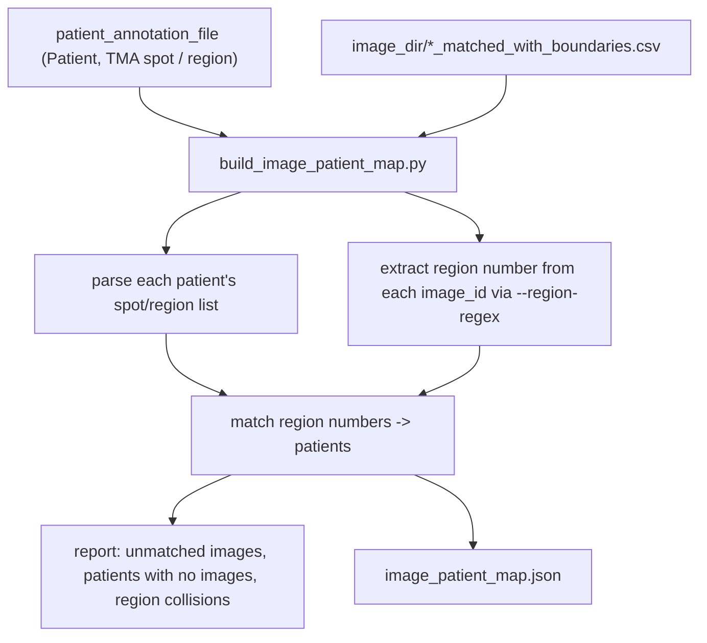

# `build_image_patient_map.py`

**Pipeline position:** Optional, one-time prep step before `survival` (Step 6b) for TMA-style cohorts only. `triads` → **build_image_patient_map** (optional, TMA cohorts) → `survival`

## Purpose

Generates the `{image_id: patient_id}` JSON file `survival.py`'s `analysis.survival.image_patient_map` config key can point at. `survival.py` was rewritten to be dataset-agnostic and no longer auto-derives image→patient from a "TMA spot / region"-shaped annotation column (that assumption doesn't hold for non-TMA cohorts — see `docs/spatia_analysis_survival.md`). For a real TMA cohort you still need that mapping; this script builds it once from your annotation file instead of hand-typing potentially 100+ entries or baking TMA-specific parsing back into the generic survival module.

Not specific to CRC or to this repo's exact column names — the patient-ID column, the spot/region column, the separator within it, and the image-ID region-number pattern are all CLI arguments.

## Usage

```bash
python build_image_patient_map.py \
    --annotation-file /path/to/patient_with_tls_class.csv \
    --patient-id-col Patient \
    --spot-col "TMA spot / region" \
    --image-dir /path/to/matched_cells_dir \
    --output image_patient_map.json
```

Then in your experiment YAML:

```yaml
analysis:
  survival:
    image_patient_map: "image_patient_map.json"
```

## Flow



## Arguments

- `--annotation-file` (required) — patient-level annotation CSV
- `--patient-id-col` (default `"Patient"`)
- `--spot-col` (default `"TMA spot / region"`) — column listing this patient's core/region numbers
- `--region-sep` (default `","`) — separator within `--spot-col`
- `--image-dir` (required) — directory of `*_matched_with_boundaries.csv` files (`triads.py`'s `input_dir`)
- `--file-suffix` (default `"_matched_with_boundaries.csv"`) — stripped to get each `image_id`
- `--region-regex` (default `r"reg(\d+)"`) — first capture group = region number, applied to each `image_id`
- `--output` (default `image_patient_map.json`)

## Inputs / Outputs

- **In:** patient annotation CSV, directory of per-image matched-cells CSVs
- **Out:** one JSON file, `{image_id: patient_id}`

## Dependencies

`pandas` only.

## Notes / risks

- **Three-way coverage check, not just a happy-path match (confidence: high, verified live).** Reports (1) images whose `image_id` didn't match `--region-regex` at all, (2) images that parsed a region number but no patient's spot list claims it, (3) patients with a spot-list entry but zero matching images, and (4) region numbers claimed by more than one patient (a likely annotation-file data problem — last-writer-wins, flagged loudly rather than silently overwritten). Verified against a synthetic fixture exercising cases (2) and (3) simultaneously — both warnings fired correctly, and the resulting map had exactly the expected 5 entries (not 6, correctly excluding the unclaimed image; not 4, correctly excluding only the genuinely unmatched patient).
- **Region-number matching, not the whole `image_id` (confidence: high, by design).** This only recovers the *core-number* part of the mapping — if your `image_id`s also encode something else your spot-list can't disambiguate (e.g. two different experiment_groups sharing the same region numbers on different slides), double check the output JSON before trusting it blindly on a new dataset shape you haven't used this script on before.
- **`survival.py`'s `image_patient_map` accepts either an inline YAML dict or a path to a JSON file like this one's output (confidence: high, verified live).** The string-path branch was added specifically to support this script's output without requiring ~100+ entries pasted directly into an experiment YAML.
