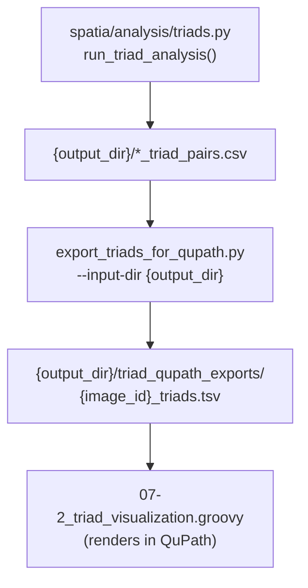

# `export_triads_for_qupath.py`

**Pipeline position:** Downstream, standalone — converts Step 5 (`triads`) output into the input `07-2_triad_visualization.groovy` needs. Not wired into `run_pipeline.py`.

## Purpose

Converts every `*_triad_pairs.csv` written by `spatia/analysis/triads.py`'s `run_triad_analysis()` into a QuPath-importable `*_triads.tsv` file — one row per cell, per triad, per role (anchor/partner1/partner2) — ready for `07-2_triad_visualization.groovy` to render in QuPath. This is the deterministic, CLI-driven replacement for `07-1_triad_visualization_tsv.ipynb` (and its automatic-typing counterpart, `07-1_a`), matching the same pattern already established by `prepare_matched_cells.py` and `prepare_crc_data.py` — arguments instead of hand-edited notebook variables, same output every time for the same input.

Same core export logic as the notebook it replaces, plus three fixes made during the conversion:

1. Reads `experiment_group`, not the stale `condition` column the notebook used to read (the whole pipeline was renamed `condition` → `experiment_group` before this script existed; the notebooks have also been patched to match, but this script never had the bug).
2. Anchor/partner1/partner2 cell-type display labels (`--anchor-cell-type` etc.) are CLI arguments, not hardcoded `"Dendritic cells"`/`"CD4 T cells"`/`"CD8 T cells"` — they still default to those exact values, so existing DC–CD4–CD8 runs behave identically unchanged.
3. Role values written are the generic `anchor`/`partner1`/`partner2` (matching `triads.py`'s own terminology) instead of the dataset-specific `DC_anchor`/`CD4_partner`/`CD8_partner` the notebook wrote. `07-2_triad_visualization.groovy`'s role-color matching already handles both forms (substring match), so this isn't a breaking change for that script.

## Usage

```bash
python export_triads_for_qupath.py --input-dir /path/to/triad_analysis_output

python export_triads_for_qupath.py \
    --input-dir /path/to/triad_analysis_output \
    --output-dir /path/to/triad_qupath_exports \
    --anchor-cell-type "Dendritic cells" \
    --partner1-cell-type "CD4 T cells" \
    --partner2-cell-type "CD8 T cells"
```

## Flow



## Arguments

- `--input-dir` (required) — directory containing `*_triad_pairs.csv` files (`triads.py`'s `output_dir`)
- `--output-dir` (optional) — where to write `*_triads.tsv` files. Default: `{input-dir}/triad_qupath_exports/`
- `--anchor-cell-type` / `--partner1-cell-type` / `--partner2-cell-type` (optional) — display labels written to the `cell_type` column, defaulting to `"Dendritic cells"`/`"CD4 T cells"`/`"CD8 T cells"`

## Inputs / Outputs

- **In:** `{input_dir}/*_triad_pairs.csv` (from `triads.py`; required columns: `anchor_x`/`anchor_y`/`partner1_x`/`partner1_y`/`partner2_x`/`partner2_y`; optional: `dist_anchor_p1_um`/`dist_anchor_p2_um`/`dist_p1_p2_um`, `experiment_group`, `anchor_cell_id`/`partner1_cell_id`/`partner2_cell_id`)
- **Out:** `{output_dir}/{image_id}_triads.tsv` per image (columns: `triad_id`, `role`, `cell_type`, `centroid_x`, `centroid_y`, `experiment_group`, `cell_id`, `dist_anchor_p1_um`, `dist_anchor_p2_um`, `dist_p1_p2_um`)

## Notes / risks

- **Not yet run against a real `triads.py` output file (confidence: high on the tested logic, medium on real-world edge cases).** Logic is exercised for the cases that matter (correct `experiment_group` values, default and custom cell-type labels, missing-required-columns handling, empty/nonexistent input directory), but not yet against an actual multi-thousand-triad real output file.
- **A malformed or unreadable `*_triad_pairs.csv` is skipped with a printed error, not silently ignored and not a hard stop for the whole run (confidence: high, by design).** Other images in the same `--input-dir` still get exported; check the console output for any `⚠️` lines before assuming every image was exported.
