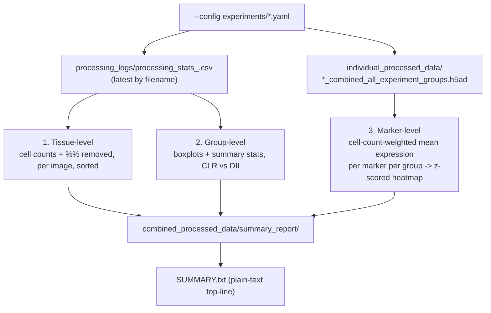

# `generate_preprocessing_summary.py`

**Pipeline position:** Downstream, dataset-agnostic, read-only — runs after Step 3 (`preprocessing`) has completed at least once. Does not re-run any pipeline step; it only reads outputs `run_preprocessing()` already wrote.

## Purpose

`processing_stats_<timestamp>.csv` (per-image QC row) and the per-tissue `*_combined_all_experiment_groups.h5ad` files are the only records of a preprocessing run, but neither is easy to read at a glance across 100+ images, and neither answers "how do CLR and DII compare?" or "which markers actually differ between groups?" on its own. This script reads both and produces three complementary summaries — tissue-level, group-level, and marker-level — as PNGs + CSVs, so a completed run can be reviewed or dropped into a talk/demo without re-deriving anything by hand.

Driven entirely by the same `--config` used for the pipeline run: group names, group count, and colors all come from `cfg["experiment"]["groups"]`, not hardcoded to `CLR`/`DII` — works unmodified on a dataset with a different number or naming of experiment groups.

## Workflow



## Usage

```bash
python generate_preprocessing_summary.py --config experiments/crc_tma_full_pipeline.yaml
```

Run from the repo root, in the same environment `run_pipeline.py` runs in (the `spacec` venv) — the marker-level report needs `anndata`, which is not necessarily on a plain `python3`. If `anndata` isn't importable, the script prints a warning and skips only that one report; the tissue-level and group-level reports (which only need `pandas`) still run.

## Key functions

- **`_latest_stats_csv(log_dir)`** — globs `processing_stats_*.csv` and returns the lexically-last one (the timestamp format sorts correctly as a string). If `run_preprocessing()` has been run more than once for this config, this always reads the *most recent* run's stats, not a merge of all runs.
- **`make_tissue_level_report(stats, groups_in_order, out_dir)`** — filters to `status == "PROCESSED"` rows, sorts by `total_percent_removed` descending, writes `tissue_level_qc.csv` (the key columns only) and a two-panel bar chart (`tissue_level_qc.png`): original vs. final cell counts, and % removed, both colored by `experiment_group`. X-axis tick labels (image IDs) are shown only when ≤60 images, since more than that becomes unreadable.
- **`make_group_comparison_report(stats, groups_in_order, out_dir)`** — `groupby("experiment_group")` on the same PROCESSED rows, aggregates `count`/`mean`/`median`/`std` for five QC metrics into `group_comparison_qc.csv`, and renders boxplots (with jittered individual points) for `final_cells` and `total_percent_removed` into `group_comparison_qc.png`. Returns the summary DataFrame so `main()` can fold it into `SUMMARY.txt`.
- **`make_marker_level_report(tissues_dir, groups_in_order, out_dir)`** — the only function touching h5ad files directly, since `processing_stats.csv` has no per-marker columns at all. For each `*_combined_all_experiment_groups.h5ad`, computes each present `experiment_group`'s per-marker mean (`adata.to_df().groupby("experiment_group").mean()`), then combines across tissues into one cell-count-weighted mean per group per marker (`np.average(..., weights=n_cells)`, not a plain mean-of-means, so a tissue with more cells has proportionally more influence). Writes `marker_level_by_group.csv` (markers × groups) and a row-z-scored heatmap (`marker_level_by_group.png`) so markers with very different absolute intensity scales are still visually comparable side by side.
- **`main()`** — resolves all paths from the config the same way `run_preprocessing()` does (`output_dir/combined_processed_data/{processing_logs,individual_processed_data}`), runs all three reports in order, and writes a plain-text `SUMMARY.txt` combining the top-line counts and the group comparison table.

## Inputs / Outputs

- **In:** `{output_dir}/combined_processed_data/processing_logs/processing_stats_*.csv`, `{output_dir}/combined_processed_data/individual_processed_data/*_combined_all_experiment_groups.h5ad` — both produced by `run_preprocessing()`, read only, never modified.
- **Out (all under `{output_dir}/combined_processed_data/summary_report/`):** `tissue_level_qc.png` / `.csv`, `group_comparison_qc.png` / `.csv`, `marker_level_by_group.png` / `.csv`, `SUMMARY.txt`.

## Dependencies

`pandas`, `numpy`, `matplotlib` (required); `anndata` (optional — only the marker-level report needs it, and that report is skipped with a printed warning, not a crash, if it's missing).

## Notes / risks

- **Not yet run against real data (confidence: medium overall — see per-report breakdown).** Written and syntax-checked (`py_compile`) but not executed against an actual completed run, since this development environment has no `spacec`/`anndata`/real h5ad files. The tissue-level and group-comparison reports are higher-confidence (~85%) since their only input is `processing_stats.csv`, whose exact column names (`original_cells`, `final_cells`, `percent_removed_by_filter`, `percent_removed_by_noise`, `total_percent_removed`, `status`, `experiment_group`, `tissue_id`, `image_id`) were confirmed directly from `run_preprocessing()`'s source (`tissue_stats.update({...})` calls), not guessed. The marker-level report is lower-confidence (~70%): it assumes `adata.to_df()` returns a clean cells × markers DataFrame from `spacec`'s `make_anndata()` output, inferred from how `cell_typing.py` reads the same h5ad files (`adata.var_names`, numeric `.X`) rather than from `spacec`'s own source. If it errors, the traceback is worth sharing rather than assuming the data is at fault.
- **Weighted marker means, not a naive average-of-tissue-means (confidence: high, by design).** A simple mean across tissues would let a 200-cell tissue and a 20,000-cell tissue pull the group average equally. Weighting by each tissue's cell count for that group avoids that — but it also means a single very large tissue can dominate the group's reported marker profile; worth keeping in mind when interpreting the heatmap for a group with highly uneven tissue sizes.
- **Reads only the *latest* stats CSV, not a merge across multiple runs (confidence: high, by design).** If preprocessing was run more than once (e.g., first a partial run, then a full resume), only the most recent `processing_stats_<timestamp>.csv` is read. Since `run_preprocessing()` writes a fresh stats CSV every run (not append-only) and images already processed are logged again with `status: "SKIPPED - Already processed"` on a resume, the latest file should already reflect the full cumulative picture — but this hasn't been verified against an actual multi-run resume scenario.
