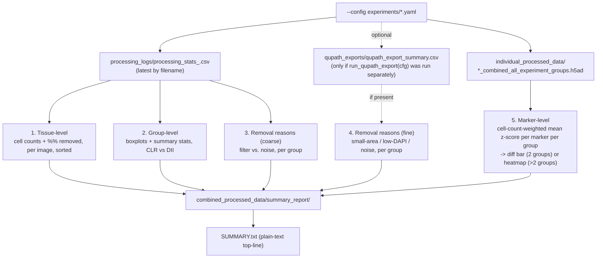

# `generate_preprocessing_summary.py`

**Pipeline position:** NOT part of `run_pipeline.py`'s `ALL_STEPS` / `--steps` registry — it is a standalone, downstream, read-only reporting script, run manually after Step 3 (`preprocessing`) has completed at least once. It never modifies pipeline outputs and is never invoked automatically by `run_pipeline.py` or `run_preprocessing()`; the user runs it by hand when they want a report.

## Purpose

`processing_stats_<timestamp>.csv` (per-image QC row) and the per-tissue `*_combined_all_experiment_groups.h5ad` files are the only records of a preprocessing run, but neither is easy to read at a glance across 100+ images, and neither answers "how do CLR and DII compare?", "why were cells removed?", or "which markers actually differ between groups?" on its own. This script reads both (plus, optionally, `run_qupath_export()`'s output if that separate step has also been run) and produces five complementary summaries — tissue-level, group-level, removal-reasons (coarse + fine), and marker-level — as PNGs + CSVs, so a completed run can be reviewed or dropped into a talk/demo without re-deriving anything by hand.

Driven entirely by the same `--config` used for the pipeline run: group names, group count, and colors all come from `cfg["experiment"]["groups"]`, not hardcoded to `CLR`/`DII` — works unmodified on a dataset with a different number or naming of experiment groups.

## Relationship to the rest of the pipeline

`run_pipeline.py`'s `ALL_STEPS` is `["tif_conversion", "roi_masking", "segmentation", "preprocessing", "cell_typing", "triads", "functional", "survival"]` — this script's name is not in that list, and it has no `_step_enabled_in_config()` entry. Nothing about running it is config-driven in the way pipeline steps are; there's no `analysis.summary_report.enabled` key and no way to trigger it via `python run_pipeline.py --steps ...`. It is invoked directly:

```bash
python generate_preprocessing_summary.py --config experiments/crc_tma_full_pipeline.yaml
```

It sits downstream of, and depends only on, `run_preprocessing()`'s own outputs (`processing_stats_*.csv`, `*_combined_all_experiment_groups.h5ad`) — resolved from the same `cfg["paths"]["output_dir"]` the pipeline itself uses, so it always reads the real, current output tree rather than a copy. One report (the fine-grained removal-reasons breakdown) additionally depends on `run_qupath_export(cfg)`'s output (`qupath_exports/qupath_export_summary.csv`) — that function is itself *also* not in `ALL_STEPS`, so it has to be called directly:

```bash
python -c "import yaml; from spatia.analysis.preprocessing import run_qupath_export; run_qupath_export(yaml.safe_load(open('experiments/crc_tma_full_pipeline.yaml')))"
```

If that hasn't been run, the fine-grained report is skipped with an explanatory message (not an error) — the other four reports run regardless.

## Workflow



## Usage

```bash
python generate_preprocessing_summary.py --config experiments/crc_tma_full_pipeline.yaml
```

Run from the repo root, in the same environment `run_pipeline.py` runs in (the `spacec` venv) — the marker-level report needs `anndata`, which is not necessarily on a plain `python3`. If `anndata` isn't importable, the script prints a warning and skips only that one report; the other four reports (which only need `pandas`/`numpy`/`matplotlib`) still run.

## Key functions

- **`_latest_stats_csv(log_dir)`** — globs `processing_stats_*.csv` and returns the lexically-last one (the timestamp format sorts correctly as a string). If `run_preprocessing()` has been run more than once for this config, this always reads the *most recent* run's stats, not a merge of all runs.
- **`make_tissue_level_report(stats, groups_in_order, out_dir)`** — filters to `status == "PROCESSED"` rows, sorts by `total_percent_removed` descending, writes `tissue_level_qc.csv` (the key columns only) and a two-panel bar chart (`tissue_level_qc.png`): original vs. final cell counts, and % removed, both colored by `experiment_group`. X-axis tick labels (image IDs) are shown only when ≤60 images.
- **`make_group_comparison_report(stats, groups_in_order, out_dir)`** — `groupby("experiment_group")` on the same PROCESSED rows, aggregates `count`/`mean`/`median`/`std` for five QC metrics into `group_comparison_qc.csv`, and renders boxplots (with jittered individual points) for `final_cells` and `total_percent_removed` into `group_comparison_qc.png`.
- **`make_removal_reasons_report(stats, groups_in_order, out_dir)`** — always available (needs only `processing_stats.csv`). Sums `final_cells` (kept), `cells_removed_by_filter`, and `cells_removed_by_noise` per group, writes `removal_reasons_qc.csv`, and renders a two-panel stacked bar (`removal_reasons_qc.png`): absolute counts and % of raw cells, per group. This is the coarsest split the pipeline tracks by default — size and DAPI filtering are combined into one "filter" bucket, since `run_preprocessing()`'s own `tissue_stats` never separates them.
- **`make_fine_removal_reasons_report(output_dir, groups_in_order, out_dir)`** — optional. Reads `qupath_exports/qupath_export_summary.csv` (from `run_qupath_export()`'s `_classify_cells()`, which *does* separate `Excl_SmallArea` / `Excl_LowDAPI` / `Excl_SmallArea_LowDAPI` / `Excl_Noise` / `Included`), sums per group, writes `removal_reasons_fine_qc.csv` and a 100%-stacked bar (`removal_reasons_fine_qc.png`) using the same color palette `run_qupath_export()`'s own QC plots use. Skips cleanly (prints the exact command to generate the missing file) if that CSV doesn't exist.
- **`make_marker_level_report(tissues_dir, groups_in_order, out_dir)`** — the only function touching h5ad files directly, since `processing_stats.csv` has no per-marker columns at all. For each `*_combined_all_experiment_groups.h5ad`, computes each present `experiment_group`'s per-marker mean (`adata.to_df().groupby("experiment_group").mean()`), then combines across tissues into one cell-count-weighted mean per group per marker (`np.average(..., weights=n_cells)`, so a tissue with more cells has proportionally more influence). These values are already per-cell **z-scores**, not raw intensities (`run_preprocessing()` z-score-normalizes every marker before this h5ad is ever written), so no further re-normalization across markers is needed. For exactly 2 groups, plots a signed group-mean-difference bar chart (`Δ mean z-score`, sorted by magnitude); for >2 groups, a heatmap of the raw (not re-normalized) group means. See Notes/risks for why this replaced an earlier, broken version.
- **`main()`** — resolves all paths from the config the same way `run_preprocessing()`/`run_qupath_export()` do, runs all five reports in order, and writes a plain-text `SUMMARY.txt` combining the top-line counts, the group comparison table, and both removal-reasons tables (or a note that the fine one wasn't available).

## Inputs / Outputs

- **In (required):** `{output_dir}/combined_processed_data/processing_logs/processing_stats_*.csv`, `{output_dir}/combined_processed_data/individual_processed_data/*_combined_all_experiment_groups.h5ad` — both produced by `run_preprocessing()`, read only, never modified.
- **In (optional):** `{output_dir}/qupath_exports/qupath_export_summary.csv` — produced by the separate `run_qupath_export(cfg)`, only used by the fine-grained removal-reasons report.
- **Out (all under `{output_dir}/combined_processed_data/summary_report/`):** `tissue_level_qc.png` / `.csv`, `group_comparison_qc.png` / `.csv`, `removal_reasons_qc.png` / `.csv` (always), `removal_reasons_fine_qc.png` / `.csv` (only if the optional input exists), `marker_level_by_group.png` / `.csv`, `SUMMARY.txt`.

## Dependencies

`pandas`, `numpy`, `matplotlib` (required); `anndata` (optional — only the marker-level report needs it, and that report is skipped with a printed warning, not a crash, if it's missing).

## Notes / risks

- **Fixed 2026-09-10 — the marker-level heatmap's per-row re-z-scoring was mathematically degenerate for the common 2-group case (confidence: high, verified against synthetic data — see below).** The values written into `*_combined_all_experiment_groups.h5ad` are already per-cell z-scores (`run_preprocessing()` z-score-normalizes before writing). The first version of this report took the cell-count-weighted group means of those already-z-scored values and re-z-scored them AGAIN, per marker row, across groups, "so markers with very different absolute scales are still visually comparable." That reasoning no longer applied once the inputs were already on one common scale, and it broke outright for exactly 2 groups: z-scoring any 2 points always produces the same magnitude (±1/√2 ≈ ±0.71) regardless of how different the two groups' real values are — only the *sign* carried information. The heatmap the user saw showed every tile at the same visual intensity, which is exactly what this bug predicts. Fixed by dropping the re-z-scoring entirely: for 2 groups, the actual group-mean difference is plotted directly (a real, magnitude-preserving quantity, since the inputs are already z-scores on a common scale); for >2 groups, a heatmap of the raw group means (still not re-normalized). Verified with a synthetic AnnData test (`pip install anndata` in this dev environment) injecting a known +0.3 mean shift between two groups across 8 markers — the fixed version recovered per-marker differences clustered around −0.3 with real variation between markers, versus the old code's uniform ±0.71 regardless of the injected shift's actual size. Also verified the >2-group heatmap path and the fine-grained removal-reasons report against synthetic 3-group data and a synthetic `qupath_export_summary.csv`.
- **Two removal-reasons tiers exist because the pipeline tracks removal reasons at two different granularities depending on which optional step has run (confidence: high, by design).** `run_preprocessing()` itself only ever records two buckets in `processing_stats.csv` — combined size+DAPI filter, and noise removal — because `sp.pp.filter_data()` applies both size and DAPI thresholds in one call and only reports a combined removed-count. The finer split (small-area vs. low-DAPI vs. both vs. noise, individually) only exists if `run_qupath_export()` has also been run, since that function's `_classify_cells()` is the only place in the codebase that classifies cells into those five categories. Most runs (including the one that prompted this addition) will have the coarse report but not the fine one, since `run_qupath_export()` isn't wired into `run_pipeline.py --steps` and has to be called directly.
- **Weighted marker means, not a naive average-of-tissue-means (confidence: high, by design).** A simple mean across tissues would let a 200-cell tissue and a 20,000-cell tissue pull the group average equally. Weighting by each tissue's cell count for that group avoids that — but it also means a single very large tissue can dominate the group's reported marker profile; worth keeping in mind when interpreting the marker-level output for a group with highly uneven tissue sizes.
- **Reads only the *latest* stats CSV, not a merge across multiple runs (confidence: high, by design).** If preprocessing was run more than once (e.g., first a partial run, then a full resume), only the most recent `processing_stats_<timestamp>.csv` is read. Since `run_preprocessing()` writes a fresh stats CSV every run (not append-only) and images already processed are logged again with `status: "SKIPPED - Already processed"` on a resume, the latest file should already reflect the full cumulative picture — but this hasn't been verified against an actual multi-run resume scenario.
- **Run against real data 2026-09-09 (confidence: now high across all five reports, not just tissue/group-level).** The original version (tissue-level, group-level, marker-level only) ran cleanly end-to-end against the real 138-image CRC TMA run — 130/130 h5ad files read, all outputs saved, no exceptions, only cosmetic pandas/matplotlib deprecation warnings. The removal-reasons and fixed marker-level logic added 2026-09-10 have been verified against synthetic data (both use the same `processing_stats.csv` columns and h5ad structure already confirmed real) but not yet re-run against this dataset's actual output — worth a real run before trusting the specific numbers for a talk.
