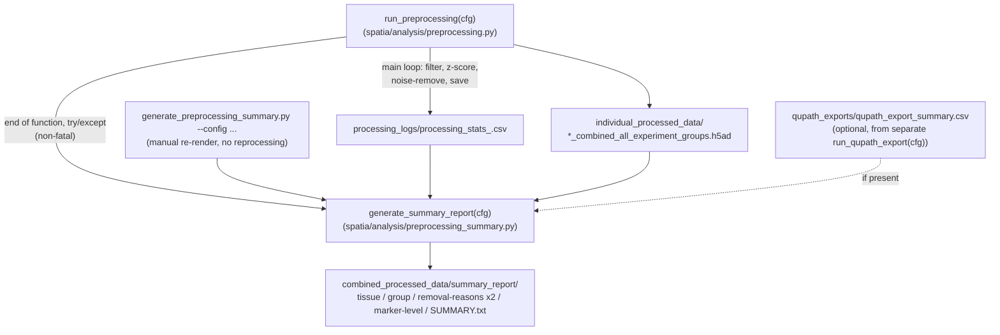

# QC summary report — `spatia/analysis/preprocessing_summary.py` + `generate_preprocessing_summary.py`

**Pipeline position (changed 2026-09-09):** The report generation logic now lives in `spatia/analysis/preprocessing_summary.py`, and is called **automatically at the end of every `run_preprocessing()` call** — so `python run_pipeline.py --steps preprocessing` alone regenerates `summary_report/`, with nothing extra to run. It is still not a separate entry in `run_pipeline.py`'s `ALL_STEPS` list (there's no `--steps summary` and no config-enable flag) — it's folded *inside* the `preprocessing` step itself, called from the tail end of `run_preprocessing()`, wrapped in `try/except` so a report bug can never fail the core step or block downstream steps (`cell_typing`, `triads`, ...) that depend on `run_preprocessing()`'s actual return value, not on the report.

`generate_preprocessing_summary.py` at the repo root is now a **thin CLI wrapper** around the same library function (`generate_summary_report(cfg)`). Use it when you want to **cheaply re-render the report without re-running image processing** — e.g. right after a report-code fix, or to regenerate a report folder you deleted. It reads only `run_preprocessing()`'s already-written outputs and never touches raw images, so re-running it takes seconds, not the hours a full preprocessing run takes.

## Purpose

`processing_stats_<timestamp>.csv` (per-image QC row) and the per-tissue `*_combined_all_experiment_groups.h5ad` files are the only records of a preprocessing run, but neither is easy to read at a glance across 100+ images, and neither answers "how do CLR and DII compare?", "why were cells removed?", or "which markers actually differ between groups?" on its own. `generate_summary_report(cfg)` reads both (plus, optionally, `run_qupath_export()`'s output if that separate step has also been run) and produces five complementary summaries — tissue-level, group-level, removal-reasons (coarse + fine), and marker-level — as PNGs + CSVs.

Driven entirely by the same `cfg` used for the pipeline run: group names, group count, and colors all come from `cfg["experiment"]["groups"]`, not hardcoded to `CLR`/`DII` — works unmodified on a dataset with a different number or naming of experiment groups.

## Relationship to the rest of the pipeline



`run_pipeline.py`'s `ALL_STEPS` is `["tif_conversion", "roi_masking", "segmentation", "preprocessing", "cell_typing", "triads", "functional", "survival"]` — `generate_summary_report` has no entry of its own there, because it doesn't need one: it now runs as a side effect of the existing `preprocessing` step. `run_qupath_export(cfg)` is still a genuinely separate, optional function (not called by `run_preprocessing()`) — it has to be run by hand if you want the fine-grained removal-reasons report:

```bash
python -c "import yaml; from spatia.analysis.preprocessing import run_qupath_export; run_qupath_export(yaml.safe_load(open('experiments/crc_tma_full_pipeline.yaml')))"
```

If that hasn't been run, the fine-grained report is skipped with an explanatory message (not an error) — the other four reports run regardless.

## Usage

**Normal case — nothing to do.** Just run preprocessing as usual:

```bash
python run_pipeline.py --config experiments/crc_tma_full_pipeline.yaml --steps preprocessing
```

`summary_report/` is written automatically at the end, alongside the existing `individual_processed_data/`, `processing_logs/`, and `marker_visualizations/` output folders.

**Manual re-render** (report-only, no reprocessing — cheap, seconds not hours):

```bash
python generate_preprocessing_summary.py --config experiments/crc_tma_full_pipeline.yaml
```

Run from the repo root, in the same environment `run_pipeline.py` runs in (the `spacec` venv) — the marker-level report needs `anndata`, which is not necessarily on a plain `python3`. If `anndata` isn't importable, the report is skipped with a printed warning, not a crash; the other four reports (which only need `pandas`/`numpy`/`matplotlib`) still run either way (auto or manual).

## Key functions

- **`generate_summary_report(cfg)`** (`spatia/analysis/preprocessing_summary.py`) — the single entry point both the auto-hook in `run_preprocessing()` and the CLI call. Resolves all paths from `cfg` the same way `run_preprocessing()`/`run_qupath_export()` do, runs all five reports in order, and writes a plain-text `SUMMARY.txt` combining the top-line counts, the group comparison table, and both removal-reasons tables (or a note that the fine one wasn't available). Returns the `summary_report/` output directory path.
- **`_load_stats(log_dir)`** — globs and merges **every** `processing_stats_*.csv` for this config, not just the latest (fixed 2026-09-10, see Notes/risks below). For each `(image_id, experiment_group)`, a `status == "PROCESSED"` row (carries the full QC breakdown) is preferred over a `"SKIPPED - Already processed"` row (doesn't) whenever either exists across any prior run. This is what makes a full-resume run — every image already on disk, nothing new to process — still produce a complete report instead of an empty one.
- **`make_tissue_level_report(stats, groups_in_order, out_dir)`** — filters to `status == "PROCESSED"` rows, sorts by `total_percent_removed` descending, writes `tissue_level_qc.csv` and a two-panel bar chart (`tissue_level_qc.png`): original vs. final cell counts, and % removed, both colored by `experiment_group`. X-axis tick labels (image IDs) are shown only when ≤60 images.
- **`make_group_comparison_report(stats, groups_in_order, out_dir)`** — `groupby("experiment_group")` on the same PROCESSED rows, aggregates `count`/`mean`/`median`/`std` for five QC metrics into `group_comparison_qc.csv`, and renders boxplots (with jittered individual points) for `final_cells` and `total_percent_removed` into `group_comparison_qc.png`.
- **`make_removal_reasons_report(stats, groups_in_order, out_dir)`** — always available (needs only `processing_stats.csv`). Sums `final_cells` (kept), `cells_removed_by_filter`, and `cells_removed_by_noise` per group, writes `removal_reasons_qc.csv`, and renders a two-panel stacked bar (`removal_reasons_qc.png`): absolute counts and % of raw cells, per group.
- **`make_fine_removal_reasons_report(output_dir, groups_in_order, out_dir)`** — optional. Reads `qupath_exports/qupath_export_summary.csv` (from `run_qupath_export()`'s `_classify_cells()`), sums per group, writes `removal_reasons_fine_qc.csv` and a 100%-stacked bar (`removal_reasons_fine_qc.png`). Skips cleanly (prints the exact command to generate the missing file) if that CSV doesn't exist.
- **`make_marker_level_report(tissues_dir, groups_in_order, out_dir)`** — the only function touching h5ad files directly. Computes each present `experiment_group`'s per-marker mean per tissue, then combines across tissues into one cell-count-weighted mean per group per marker (`np.average(..., weights=n_cells)`). These values are already per-cell **z-scores** (`run_preprocessing()` z-score-normalizes before this h5ad is ever written). For exactly 2 groups, plots a signed group-mean-difference bar chart; for >2 groups, a heatmap of the raw (not re-normalized) group means.

## Inputs / Outputs

- **In (required):** `{output_dir}/combined_processed_data/processing_logs/processing_stats_*.csv`, `{output_dir}/combined_processed_data/individual_processed_data/*_combined_all_experiment_groups.h5ad` — both produced by `run_preprocessing()` earlier in the *same* call (auto path) or an earlier call (manual CLI path), read only, never modified.
- **In (optional):** `{output_dir}/qupath_exports/qupath_export_summary.csv` — produced by the separate `run_qupath_export(cfg)`, only used by the fine-grained removal-reasons report.
- **Out (all under `{output_dir}/combined_processed_data/summary_report/`):** `tissue_level_qc.png` / `.csv`, `group_comparison_qc.png` / `.csv`, `removal_reasons_qc.png` / `.csv` (always), `removal_reasons_fine_qc.png` / `.csv` (only if the optional input exists), `marker_level_by_group.png` / `.csv`, `SUMMARY.txt`.

## Dependencies

`pandas`, `numpy`, `matplotlib` (required, already hard dependencies of `run_preprocessing()` itself); `anndata` (optional — only the marker-level report needs it, and that report is skipped with a printed warning, not a crash, if it's missing).

## Notes / risks

- **Fixed 2026-09-10 — a full-resume run (everything already processed, nothing new to do) used to produce an EMPTY report, confirmed by direct testing (confidence: high).** Found while directly answering the user's question "does a resume run skip reprocessing, or does the report generation still work?" — the mechanics said it should skip cleanly, but a synthetic test of the actual code path showed the report didn't. `_load_stats()` previously read only the single latest `processing_stats_<timestamp>.csv`. On a resume where every image takes the fast `_processed_files_exist()` skip branch, that latest file logs every row as `status == "SKIPPED - Already processed"` — the skip branch's `tissue_stats` dict never gets the QC breakdown columns (`cells_removed_by_filter`, `percent_removed_by_filter`, `cells_removed_by_noise`, `total_percent_removed`, ...), since those are only ever set inside the filter/normalize/noise-removal code the skip branch jumps over. Since `make_tissue_level_report`, `make_group_comparison_report`, and `make_removal_reasons_report` all filter to `status == "PROCESSED"`, a synthetic all-SKIPPED stats CSV produced only `SUMMARY.txt`, reading `Images processed: 0 / 6` — actively misleading, since all 6 were in fact fully processed and sitting on disk. Fixed by having `_load_stats()` merge every `processing_stats_*.csv` for the config and, per image, keep whichever row has `status == "PROCESSED"` if one exists in ANY prior run's file, falling back to the latest `SKIPPED` row only if the image genuinely has no processed record in any surviving stats file. Verified with a synthetic two-run scenario (a real run with full QC columns, then an all-skipped resume run with none) — the merged report correctly recovered `Images processed: 6 / 6` and the full QC breakdown, sourced from the older PROCESSED run's file even though it wasn't the latest one.
- **Folded into `run_preprocessing()` 2026-09-09, per explicit request, rather than kept as a separate manual step (confidence: high on the mechanics, verified by synthetic execution — see below).** Previously this was a standalone script the user had to remember to run after preprocessing finished. The report-generation code itself (all five `make_*_report` functions) moved unchanged into `spatia/analysis/preprocessing_summary.py`, sliced directly out of the old script rather than retyped, so none of that already-tested logic changed. What changed is only *how* it's invoked: `run_preprocessing()` now calls `generate_summary_report(cfg)` itself at the end, inside `try/except`, right after writing `processing_stats_<timestamp>.csv`. **Trade-off worth knowing:** because this runs on *every* `run_preprocessing()` call, including a resume that only reprocesses a handful of skipped images, the summary report is regenerated every time preprocessing runs at all — that's the intended behavior (it always reflects the latest complete run), but it does mean the report-generation cost (a few seconds to ~1 minute for the marker-level report's h5ad reads, per the 138-image run) is paid on every preprocessing invocation, not just the first. If that ever becomes a real cost at much larger scale, it'd be worth gating behind a `cfg["preprocessing"].get("skip_summary_report")` flag — not needed yet.
- **A bug in the report must never fail preprocessing itself (confidence: high, by design and now load-bearing).** The auto-hook is wrapped in `try/except Exception`, printing `"WARNING: Summary report generation failed (non-fatal -- preprocessing itself succeeded): {e}"` rather than propagating. This matters more now than when the script was standalone: previously a report bug only failed a manual, separate command; now, without this guard, a report bug would fail the `preprocessing` *pipeline step itself* and could block `cell_typing`/`triads` from ever running, over something with no bearing on the actual processed data. Verified: the hook is a local `import` + `try/except` inside `run_preprocessing()`, not a module-level import of `preprocessing.py` — so even an import-time failure inside `preprocessing_summary.py` (e.g. a missing dependency) can't break `run_preprocessing()` at *load* time, only at the point this one line runs.
- **Verified by direct synthetic execution of `generate_summary_report(cfg)` 2026-09-09 (confidence: high for the wiring; the report logic itself was already verified against real 138-image data and, for the marker-level fix, synthetic AnnData — see below).** Built a synthetic `processing_stats.csv` (6 images, 2 groups, all required columns including `slide_folder`) and called `generate_summary_report(cfg)` directly — confirmed it produces `tissue_level_qc.*`, `group_comparison_qc.*`, `removal_reasons_qc.*`, and `SUMMARY.txt`, and skips the fine-grained and marker-level reports cleanly (no `qupath_exports/` present, no `anndata` installed in this dev environment) with the expected explanatory messages, not crashes. Also ran the rewritten `generate_preprocessing_summary.py` CLI end-to-end against the same synthetic config and confirmed it produces identical output via the same underlying function. Not yet re-run against the real 138-image dataset with this new wiring — recommend doing a real `--steps preprocessing` resume run (or the manual CLI) to confirm before trusting the auto-generated report for a talk.
- **Two removal-reasons tiers exist because the pipeline tracks removal reasons at two different granularities depending on which optional step has run (confidence: high, by design).** `run_preprocessing()` itself only ever records two buckets in `processing_stats.csv` — combined size+DAPI filter, and noise removal — because `sp.pp.filter_data()` applies both size and DAPI thresholds in one call and only reports a combined removed-count. The finer split (small-area vs. low-DAPI vs. both vs. noise, individually) only exists if `run_qupath_export()` has also been run, since that function's `_classify_cells()` is the only place in the codebase that classifies cells into those five categories.
- **Weighted marker means, not a naive average-of-tissue-means (confidence: high, by design).** A simple mean across tissues would let a 200-cell tissue and a 20,000-cell tissue pull the group average equally. Weighting by each tissue's cell count for that group avoids that — but it also means a single very large tissue can dominate the group's reported marker profile; worth keeping in mind when interpreting the marker-level output for a group with highly uneven tissue sizes.
- **The marker-level heatmap's original per-row re-z-scoring bug (fixed 2026-09-10, before this refactor) — see git history for `spatia/analysis/preprocessing_summary.py` / the prior `generate_preprocessing_summary.py` for the full writeup.** In short: the h5ad values are already per-cell z-scores, so re-z-scoring the group means a second time was mathematically degenerate for exactly 2 groups (always ±1/√2 regardless of real magnitude). Fixed by plotting the raw signed difference (2 groups) or raw means (>2 groups) instead. That fix's logic was carried into this refactor unchanged.
