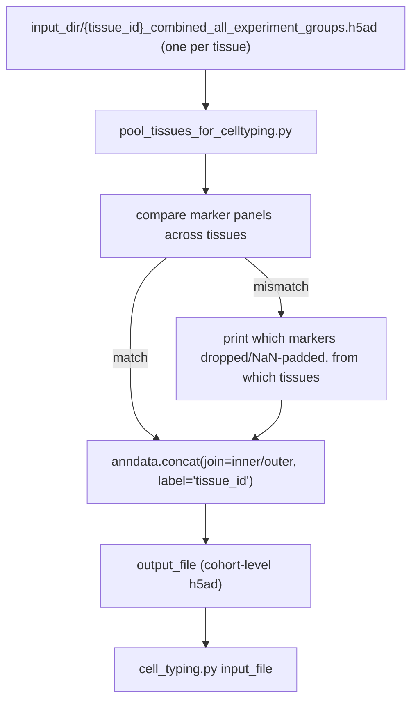

# `pool_tissues_for_celltyping.py`

**Pipeline position:** Optional, between `preprocessing` and Step 4 (`cell_typing`). `preprocessing` → **pool_tissues_for_celltyping** (optional) → `cell_typing`

## Purpose

`preprocessing.py` pools cells *within* a tissue — across experiment_groups/crops that share one `tissue_id` (see `extract_tissue_identifier()`, which strips the experiment_group label and coordinate block off `image_id`) — writing one `{tissue_id}_combined_all_experiment_groups.h5ad` per tissue. It does **not** pool *across* tissues. If your cohort spans multiple distinct tissues (different timepoints, patients, TMA blocks, etc.), you get multiple separate h5ad files and nothing in the pipeline merges them further.

`cell_typing.py`'s `input_file` is a single hardcoded path — no glob, no loop. Point it at one tissue's file and GMM thresholds (and, in `semi_automatic` mode, Leiden clusters) are fit only on that tissue's cells. Run this script first if you want thresholds/clusters fit jointly across every tissue in your cohort — so cell-type calls are comparable across tissues instead of each tissue getting its own independent calibration — then point `cell_typing.input_file` at this script's `--output-file`.

Dataset-agnostic: pools however many tissue files are in `--input-dir`, whatever they're named. Not tied to any one study's timepoint/patient naming scheme.

## Entry point

```bash
python pool_tissues_for_celltyping.py \
    --input-dir /path/to/combined_processed_data/individual_processed_data \
    --output-file /path/to/combined_processed_data/cohort_pooled.h5ad
```

## Flow



## Arguments

- `--input-dir` (required) — directory containing `{tissue_id}_combined_all_experiment_groups.h5ad` files (`preprocessing.py`'s `combined_processed_data/individual_processed_data/`)
- `--output-file` (required) — path to write the pooled cohort-level h5ad
- `--glob-pattern` (default `*_combined_all_experiment_groups.h5ad`) — override if your tissue files are named differently
- `--join` (`inner` default, or `outer`) — how to handle differing marker panels across tissues:
  - `inner`: keeps only markers present in **every** tissue file. Safe default for GMM threshold fitting — no NaNs enter `cell_typing.py`.
  - `outer`: keeps the union of all markers, NaN-padded for tissues missing a given one. Only use this if you'll handle the NaNs yourself before running `cell_typing.py` — GMM fitting was not tested against NaN-padded input and will likely error or silently misbehave.

## Inputs / Outputs

- **In:** `{input_dir}/*_combined_all_experiment_groups.h5ad` (one or more, from `preprocessing.py`)
- **Out:** one pooled h5ad at `--output-file`, with a new `tissue_id` obs column (derived from each input filename) added for provenance — lets you later check whether cell-type composition or QC metrics differ by tissue even after joint typing.

## Dependencies

`anndata` (uses `anndata.concat`, tested against `anndata==0.11.4`).

## Notes / risks

- **Marker panel mismatches are reported, not silently handled (confidence: high).** If tissues have different marker panels (e.g. one tissue's panel includes a marker another lacks), the script prints exactly which marker(s) and which tissue(s) before pooling. `join=inner` drops the mismatched marker(s) so no NaNs reach `cell_typing.py`; `join=outer` keeps them, NaN-padded for the tissues that lack them.
- **Cell index collisions across tissues are avoided via `index_unique="-"` (confidence: high).** If two tissues happen to reuse the same per-cell index (e.g. both start at `"0"`), `anndata.concat` suffixes each cell's index with its tissue_id so no cells silently overwrite each other in the pooled object.
- **Single-tissue input is allowed, not an error (confidence: high).** If `--input-dir` only has one tissue file, the script proceeds and prints a warning that pooling is a no-op — the output is just a copy with `tissue_id` added. Useful if you want a consistent `input_file` path regardless of cohort size.
- **This does not change how `cell_typing.py` itself behaves (confidence: high, by design).** `cell_typing.py` is unmodified — it still reads whatever single `input_file` path you give it via `sc.read()`. This script exists purely to make that one file represent your full cohort instead of a single tissue when that's what you want. Whether to actually use pooled vs. per-tissue typing is a methodological choice — pooling assumes staining/imaging is comparable enough across tissues that joint thresholds/clusters make sense; if tissues have real batch effects that joint calibration would wash out or distort, per-tissue typing (or a batch-correction step, e.g. scVI/scANVI — see the `scvi-tools` skill) may be more appropriate instead. This script doesn't make that call for you.
