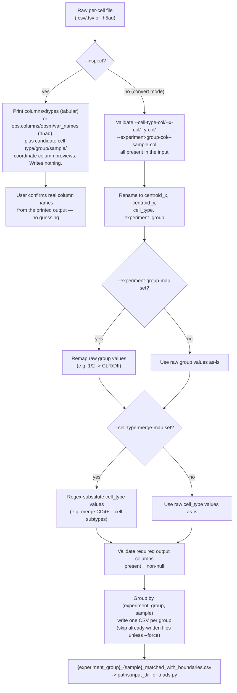

# `prepare_matched_cells.py`

**Pipeline position:** Upstream, dataset-agnostic — feeds directly into Step 5 (`triads`), same slot as `prepare_crc_data.py`/`prepare_matusiak_data.py` but for any new dataset instead of one hardcoded one.

## Purpose

Generic, dataset-agnostic prep step: converts a raw per-cell data file (CSV/TSV, or an AnnData `.h5ad`) into the `{experiment_group}_{sample}_matched_with_boundaries.csv` files `spatia/analysis/triads.py` reads from `paths.input_dir`. `triads.py` never creates its own input — it only reads whatever's already there — so every dataset needs some prep step producing that file/column contract. `prepare_crc_data.py` and `prepare_matusiak_data.py` each did this by hand for one specific dataset, with hardcoded column names and relabeling logic. This script generalizes both into one reusable, fully CLI-driven tool, so a **new** dataset never needs its own bespoke prep script — only its real column names (and, optionally, label-remapping rules) passed as arguments. Deterministic: same input + same arguments always produces the same output files.

`prepare_crc_data.py` and `prepare_matusiak_data.py` are left as-is (already validated against real runs). Use this script for any dataset that isn't one of those two.

## Workflow



## Usage

```bash
# Phase 1 — always first, on the real file
python prepare_matched_cells.py --inspect --input /path/to/data.csv

# Phase 2 — after confirming real column names from Phase 1's output
python prepare_matched_cells.py \
    --input  /path/to/data.csv \
    --output data/my_dataset/matched_cells \
    --cell-type-col cell_type_name \
    --x-col X_centroid --y-col Y_centroid \
    --experiment-group-col tissue_type \
    --sample-col unique_region \
    --experiment-group-map '{"1": "CLR", "2": "DII"}' \
    --cell-type-merge-map '{"^CD4\\+ T cells.*": "CD4+ T cells"}'
```

Works identically for `.h5ad` input (auto-detected by extension; override with `--format h5ad`) — marker intensities from `adata.X` are merged into the output the same way `prepare_matusiak_data.py` did, for downstream functional-marker analysis.

## Key logic

- **Format auto-detection** (`_detect_format`) — `.csv`/`.tsv`/`.txt` → tabular path; `.h5ad`/`.h5` → AnnData path. Override with `--format` if extensions are non-standard.
- **`CANDIDATE_COLS`** — the same fuzzy candidate-name dictionary `prepare_matusiak_data.py --inspect` used, generalized to also cover CRC-style names (`X:X`, `ClusterName`, `File Name`, etc.) so `--inspect` is useful on either dataset family.
- **`--experiment-group-map`** — optional JSON `{raw_value: label}`, generalizes `prepare_crc_data.py`'s hardcoded `GROUP_LABELS = {1: "CLR", 2: "DII"}` into a CLI argument. Omit to keep raw values.
- **`--cell-type-merge-map`** — optional JSON `{regex: replacement}`, generalizes `prepare_crc_data.py`'s hardcoded CD4+ T-cell-subtype merge into a declarative, reusable mechanism. Applied via a full regex substitution on `cell_type`, in the order given; original (pre-merge) labels are not separately preserved.
- **Grouping by `(experiment_group, sample)`, not `sample` alone** — same fix `prepare_matusiak_data.py` already had for the case where a sample/region identifier (e.g. `"reg005"`) is reused across two different experiment_groups; grouping on sample alone would silently merge unrelated tissue into one file.
- **`_validate_required_columns`** — fails loudly (exit 1) if `centroid_x`/`centroid_y`/`cell_type`/`experiment_group` are missing after renaming, and warns (doesn't fail) if any required column has null values in some rows, since a large null count usually indicates a column-name or source-data problem worth checking before trusting triad counts downstream.
- **Resumable** — like `prepare_matusiak_data.py`, skips a sample's output file if it already exists and is non-empty, unless listed in `--force`.

## Inputs / Outputs

- **In:** one raw per-cell file (CSV/TSV or `.h5ad`)
- **Out:** `{output}/{experiment_group}_{sample}_matched_with_boundaries.csv`, one per (experiment_group, sample) — consumable directly by `run_pipeline.py --steps triads` (or any step reading `paths.input_dir`) with `paths.input_dir` pointed at `--output`

## Notes / risks

- **Not yet run against a second real dataset beyond CRC/Matusiak (confidence: high on the logic, medium on real-world column-name edge cases).** What it hasn't been exercised against yet: a real `.h5ad` beyond the code reused from `prepare_matusiak_data.py`'s already-validated logic, and any dataset where coordinates live in `adata.obsm` rather than `adata.obs` (the h5ad path only reads `obs` columns today — `--inspect` will show you if that's the case, but the convert path would need a small extension to pull from `obsm` directly if so).
- **`--cell-type-merge-map` doesn't preserve the pre-merge label separately (confidence: high, by design, worth confirming it's acceptable).** `prepare_crc_data.py` kept the original `ClusterName` column around (unrenamed) alongside the merged `cell_type`, since it wasn't the same column being overwritten. This script overwrites `cell_type` in place after merging — if you need the pre-merge label preserved for later auditing, add a duplicate column to your source data (or pass a modified copy) before running, since this script doesn't do that automatically.
