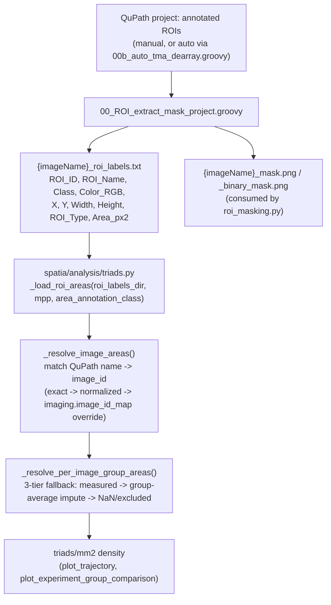

# `00_ROI_extract_mask_project.groovy`

**Pipeline position:** Upstream of Step 1 (`roi_masking`) — QuPath-side manual step. Its output feeds `roi_masking.py` directly, and (via the `Area_px2` column) also feeds Step 5 (`triads`) for per-image tissue-area density.

## Purpose

QuPath Groovy script that exports mask PNGs from annotations that **already exist** in an open QuPath project — it does not detect tissue/cores itself, only renders existing manual ROI annotations to disk. This is the manual counterpart to `00b_auto_tma_dearray.groovy` (which detects TMA cores automatically, then hands off to this same export logic). Its output directory contract (`{slide}_binary_mask.png`, `{slide}_roi_labels.txt`, `individual_masks/{slide}/`) is exactly what `spatia/analysis/roi_masking.py`'s `find_related_files()` expects as input — and, as of the addition below, `{slide}_roi_labels.txt` is also a direct input to `spatia/analysis/triads.py`'s per-image tissue-area resolution.

## Workflow

Interactive (runs inside QuPath's Script Editor, prompts the user for): which annotations to include (all vs. selected), downsample factor (default 1.0 — full resolution), point-ROI rendering size (default 10px), output directory, whether to create individual per-ROI masks, and ROI padding (default 10px). Then, for every image in the open project: renders a color-coded mask (unique RGB per ROI, supports up to ~16.7M ROIs), a binary mask (all ROIs white on black), a `roi_labels.txt` TSV, and optionally cropped individual masks per annotation.

### End-to-end workflow: QuPath ROI → triad density denominator

This is only active when `imaging.roi_labels_dir` is set in the experiment config — see `docs/spatia_analysis_triads.md` for the full config-key reference and fallback rules. If `imaging.roi_labels_dir` is unset, `Area_px2` is simply an unused column in `roi_labels.txt` and area comes from the static `imaging.experiment_group_areas_um2` config constant instead, exactly as before this addition.

## Key functions

| Function | Role |
|---|---|
| `drawPointROI(Graphics2D g, PointsROI roi, int pointSize)` | Point-type ROIs don't have a `getShape()`, so they're rendered as a filled circle at the bounding-box center instead. |
| `promptForDirectory(String title)` | Opens a JavaFX `DirectoryChooser` safely from a background thread via `Platform.runLater` + `FutureTask`. |

## Inputs / Outputs

- **In:** an open QuPath project with annotated images
- **Out:** `{output_dir}/{imageName}_mask.png`, `{imageName}_binary_mask.png`, `{imageName}_roi_labels.txt` (columns: `ROI_ID, ROI_Name, Class, Color_RGB, X, Y, Width, Height, ROI_Type, Area_px2`), `{output_dir}/individual_masks/{imageName}/{annotationName}_x{X}_y{Y}_w{W}_h{H}.png`

## Notes / risks

- **`Area_px2` is raw pixels², computed via `roi.getArea()` — not `getScaledArea()`, and not yet confirmed against a real QuPath project (confidence: high on what the column means, medium on real-world behavior).** Unit conversion to µm² happens downstream in `triads.py`, using the pipeline's own `imaging.microns_per_pixel` — not any calibration inside QuPath. `PointsROI` annotations get `0` (no polygon area). This script does not filter by annotation `Class` — every annotation's area is written; class-based filtering (e.g. "only count `Class == Tissue`") happens later, in `triads.py`, via `imaging.area_annotation_class`. It hasn't yet been confirmed that `roi.getArea()` behaves as expected inside a real running QuPath instance, or that QuPath's project image names line up with the pipeline's `image_id` convention (see `docs/spatia_analysis_triads.md`'s note on `imaging.image_id_map`) — **spot-check the first real run's `Area_px2` values and image names before trusting any density numbers derived from them.**
- **Downsample now defaults to 1.0 (full resolution), which removes the individual-mask coordinate risk at the default — but not if you change it.** Individual per-ROI mask filenames encode coordinates in *downsampled* space, while `roi_labels.txt` always uses full-resolution coordinates. At `downsample = 1.0` those are the same number, so this is currently a non-issue. If you enter a downsample factor other than 1.0 at the prompt, double-check which resolution `roi_masking.py`'s `extract_roi_coordinates()` assumes before trusting the individual-mask crops — a mismatch there would silently mis-crop ROIs rather than error.
- **No way to run this without a person clicking through QuPath — no headless/command-line mode.** "Interactive" means: you open QuPath's Script Editor, paste this script in, click Run, and then answer a series of QuPath popup dialogs (which annotations to include, downsample factor, output folder, etc.) before anything happens. There's no way to invoke it from a terminal with fixed arguments and no GUI — contrast with `00b_auto_tma_dearray.groovy`, which was deliberately written to run headlessly (all settings as in-script constants, invoked from the command line) for reproducible/automated runs. This means this script can't currently be wired into an unattended pipeline run — every run needs a human present at QuPath.
