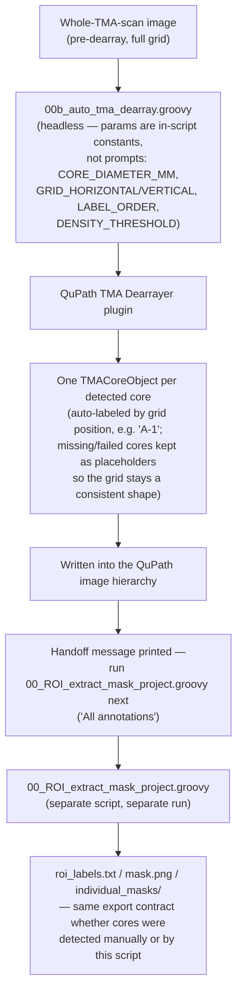

# `qupath_scripts/00b_auto_tma_dearray.groovy`

**Pipeline position:** Upstream of Step 1 (`roi_masking`) — automatic counterpart to manual QuPath annotation, run before `00_ROI_extract_mask_project.groovy` in the same slot. Never run against a real slide yet (see Notes/risks).

## Purpose

Automates TMA (Tissue MicroArray) core detection using QuPath's built-in TMA Dearrayer plugin, run **headlessly** (no dialogs, all parameters set as script constants) so it fits the same Cirro-reproducibility standard as the rest of the pipeline. This closes a specific gap: `00_ROI_extract_mask_project.groovy` exports masks from annotations that already exist, but doesn't detect TMA cores itself — until this script, TMA cores were being defined by hand. Whole-slide images are explicitly out of scope here (their ROI detection is assumed to happen elsewhere in the WSI workflow); this is TMA-only.

After running QuPath's dearrayer and writing the detected grid into the image hierarchy, this script deliberately does **not** duplicate the mask-export logic — it hands off to `00_ROI_extract_mask_project.groovy` (run separately, "All annotations" selected) to produce the same `binary_mask.png`/`roi_labels.txt`/`individual_masks/` output `roi_masking.py` expects, regardless of whether cores were detected manually or automatically. As of the `Area_px2` addition documented in `docs/qupath_00_roi_extract_mask_project.md`, that same handoff also produces the per-core area feeding `spatia/analysis/triads.py`'s triad-density calculation (`imaging.roi_labels_dir`) — so a real run of this script is now a prerequisite for measured (rather than hand-typed constant) tissue area, not just for mask export.

### Workflow



## Usage

Via QuPath's command-line interface (confidence: high — verified against QuPath's own official CLI docs, not guessed). The executable name is version-specific (e.g. `QuPath-0.7.0`, or the console/`.app` variant on Windows/Mac), and the script path is the **last** argument, after the `script` subcommand and its flags:

```bash
QuPath-<version> script --image /data/TMA_A_full_scan.tif 00b_auto_tma_dearray.groovy
```

Or inside QuPath: Automate → Script Editor → paste → Run. No dialogs either way — all parameters are constants at the top of the script, edited directly rather than prompted for.

## Parameters (edit in-script, not passed as arguments)

- `CORE_DIAMETER_MM` — physical core diameter from the TMA's construction spec. The script's own comment is emphatic: "do NOT guess; a wrong diameter silently mis-detects cores."
- `GRID_HORIZONTAL` / `GRID_VERTICAL` — column/row label ranges (e.g. `"1-16"`, `"A-J"`)
- `LABEL_ORDER` — `"Row first"` or `"Column first"`, must match the array's physical labeling
- `DENSITY_THRESHOLD` — controls how strictly QuPath's dearrayer decides whether a candidate circular region is a real tissue core versus empty array background (part of an automatic thresholding step that separates tissue from background pixels within each candidate region). **Confidence: medium on the direction (higher = stricter, based on standard threshold-parameter convention and the script author's own comment), low on the exact scale/formula** — after checking QuPath's own documentation, its GitHub wiki tutorials, and community forum discussion, no source gives a precise definition of what unit or range this value is measured in. What is confirmed: `5` is the same default value used in QuPath's own official example scripts, so it's a reasonable starting point, not an arbitrary guess — but it has not been tuned or verified against this project's actual TMAs, and its precise meaning is genuinely not well documented anywhere, including by QuPath itself. Do not treat `5` as validated; treat it as the standard starting point that still needs empirical checking against a real slide (see Notes/risks).

## Inputs / Outputs

- **In:** a single whole-TMA-scan image (the full grid, pre-dearray) — see risk below, this input may not currently exist on disk anywhere in this project
- **Out:** one `TMACoreObject` per detected core in the image hierarchy (missing/failed cores kept as "missing" placeholders so the grid stays a consistent shape), auto-labeled by grid position (e.g. `"A-1"`). Handoff message printed pointing at `00_ROI_extract_mask_project.groovy` as the next step.

## Notes / risks

- **This script has never been run — the file itself says so (confidence: high, directly stated in its own header, under a "STATUS" section).** "Written but NOT executed against a real slide — this sandbox has no QuPath installation to run it in." This is meaningfully different from the Python modules in this repo, all of which have at least been exercised. Treat this as a design draft that needs a real validation run before trusting its output, not as tested pipeline code.
- **The script itself flags that its own input file may not exist yet (confidence: high, directly stated).** It notes the per-core files already in the project's OneDrive folder "appear to be POST-dearray," meaning the true pre-dearray whole-TMA-scan input this script needs "may need to be located or re-exported" — an open question the script author explicitly declined to guess at. This is worth resolving before the first real test run, since without the right input file the script can't be validated at all.
- **`DENSITY_THRESHOLD = 5` is an unverified starting point, not a tuned value — and its precise meaning isn't well documented even by QuPath itself (confidence: high on "not tuned," see Parameters above for the semantics caveat).** Worth treating any first real run's core-detection results with extra scrutiny — a threshold that's too permissive or too strict would misdetect cores in a way that's easy to miss unless someone visually spot-checks the grid against the actual slide.
