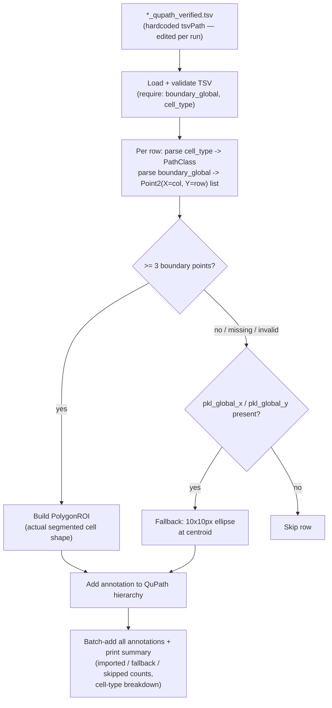

# `05-4-1_cell-typing_segmentation-boundries_visualization.groovy`

**Pipeline position:** Downstream, standalone — visualizes output after Step 2 (`segmentation`) and Step 4 (`cell_typing`) have both run. Not wired into `run_pipeline.py`. QuPath-side full-fidelity (polygon) counterpart to `05-4-2_cell-typing_visualization.groovy`.

Found in `pipeline with semi-automatic cell typing/` only (no duplicate — unlike `00_ROI_extract_mask_project.groovy`).

## Purpose

Imports cell segmentation + cell-typing results from a `*_qupath_verified.tsv` file and renders each cell in QuPath as a **polygon annotation** using precomputed global cell-boundary coordinates — i.e. the actual segmented cell shape, not just a dot at the centroid. Falls back to a small ellipse at the cell centroid if boundary data is missing or invalid for a given row. This is the full-fidelity counterpart to `05-4-2_cell-typing_visualization.groovy`, which renders centroids only.

## Workflow

1. Load and validate the TSV (`boundary_global`, `cell_type` required columns).
2. Per row: parse `cell_type` → QuPath `PathClass`; parse `boundary_global` (a `"row,col;row,col;..."` string, converted to `Point2(X=col, Y=row)` pairs) into a `PolygonROI` if ≥3 points are present.
3. If the polygon can't be built (missing/invalid boundary, or <3 points), fall back to a 10×10px ellipse at `(pkl_global_x, pkl_global_y)`; if even the centroid is missing, skip the row.
4. Add all resulting annotations to the QuPath hierarchy in one batch, print a summary (total imported, fallback count, skipped count, cell-type breakdown).

## Required / optional TSV columns

- Required: `boundary_global`, `cell_type`
- Optional: `pkl_global_x`, `pkl_global_y` (centroid fallback), `cell_id` (used as the annotation's display name)

## Coordinate handling

All coordinates (`boundary_global`, `pkl_global_x`/`y`) are assumed already in **global slide space** — used directly for ROI placement, no offset transformation applied. This matches the convention `spatia/analysis/visualization.py`'s Python port documents for its own centroid-based rendering.

## Inputs / Outputs

- **In:** `*_qupath_verified.tsv` (path hardcoded at the top of the script as `tsvPath` — see risk below)
- **Out:** polygon (or ellipse-fallback) annotations added directly to the currently-open QuPath image's hierarchy; no file output, only console summary stats

## Notes / risks

- **`tsvPath` is a hardcoded absolute path pointing at one specific file on Afrouz's OneDrive (confidence: high, directly observable at line 207).** `/Users/ajahedi/Library/CloudStorage/OneDrive-InsideMDAnderson/Qptiff_files/.../KO_Day14_Slide7_...tsv` — this script must be hand-edited before every run to point at whatever TSV you're currently visualizing. The script's own header comments flag this with a warning banner (`⚠️ USER CONFIGURATION`), so it's a known, intentional per-run edit point rather than an oversight — but worth turning into a QuPath script parameter or CLI argument if this ever needs to run unattended.
- **`PathClassFactory.getPathClass(cellType)` vs. `05-4-2`'s `PathClass.fromString` + explicit color map — the two visualization scripts use different QuPath APIs and neither one assigns colors here (confidence: medium).** This script (`05-4-1`) doesn't register any color mapping for cell types at all, unlike `05-4-2` which has an explicit 15-entry color map. If both scripts are meant to produce visually comparable output for the same dataset, cell types would render in whatever default color QuPath assigns here versus the deliberately chosen palette in `05-4-2` — worth deciding if that inconsistency matters for your workflow, or if `05-4-1` is only ever used for boundary-accuracy QC (where color doesn't matter as much as shape).
- **Only the first 10 row-level parse errors get printed, not a full list (confidence: low, by design — a reasonable console-noise tradeoff, not a defect).** If parsing systematically fails for many rows (e.g. a boundary-format mismatch from an upstream TSV schema change), you'd see "Skipped: N" in the summary but not which N rows or why, beyond the first 10 — worth grepping the source TSV directly if the skipped count looks unexpectedly high.
