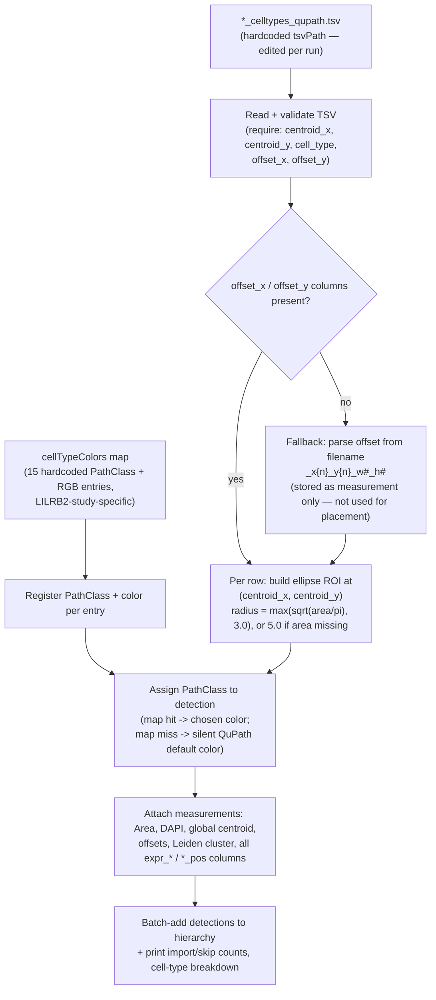

# `05-4-2_cell-typing_visualization.groovy`

**Pipeline position:** Downstream, standalone — visualizes output after Step 2 (`segmentation`) and Step 4 (`cell_typing`) have both run. Not wired into `run_pipeline.py`; same status as its Python port, `spatia_analysis_visualization.md` ("NOT YET WIRED IN").

Found in `pipeline with semi-automatic cell typing/` only. **This is the script `spatia/analysis/visualization.py` is a Python port of** — see that doc for the full story of what was and wasn't carried over.

## Purpose

Imports cell-type classification data from a `*_celltypes_qupath.tsv` file (generated by the upstream Python pipeline) and renders each cell as a colored ellipse detection object at its centroid in QuPath — colored by a hardcoded cell-type → RGB map, sized by cell area, with marker expression and metadata attached as QuPath measurements for later inspection.

## Workflow

1. Register a `PathClass` + color for each of the 15 cell types in `cellTypeColors` (hardcoded map — see risk below, this is LILRB2-study-specific).
2. Read and validate the TSV (`centroid_x`, `centroid_y`, `cell_type`, `offset_x`, `offset_y` required).
3. Resolve a fallback offset from the filename pattern `_x{n}_y{n}_w\d+_h\d+` if `offset_x`/`offset_y` columns are absent (in practice unused for placement — see below).
4. Per row: build an ellipse ROI at `(centroid_x, centroid_y)` with radius `max(sqrt(area/π), 3.0)` (or `5.0` if area missing), assign the `PathClass`, attach measurements (`Area`, `DAPI`, global centroid, offsets, Leiden cluster, all `expr_*` and `*_pos` columns found in the TSV header).
5. Add all detections to the hierarchy in one batch; print import/skip counts and a cell-type breakdown.

## Cell-type color map

15 hardcoded entries (`CD8 T cells`→blue, `CD4 T cells`→green, `Macrophages`→orange, `Dendritic cells`→red, `Unknown`→dark grey, etc.) — this is the exact map preserved in `spatia/analysis/visualization.py` as `LEGACY_LILRB2_COLOR_MAP`, kept there for reference only because it doesn't match the CRC TMA study's cell-type vocabulary.

## Coordinate handling

`centroid_x`/`centroid_y` are documented as already-global coordinates — used directly, offsets are **not** reapplied at placement time; `offset_x`/`offset_y` are stored purely as measurements for traceability, with a filename-regex fallback if the columns are missing.

## Inputs / Outputs

- **In:** `*_celltypes_qupath.tsv` (path hardcoded as `tsvPath` — same pattern as `05-4-1`, see that doc's note)
- **Out:** ellipse detection objects added to the currently-open QuPath image's hierarchy; console summary only, no files written

## Notes / risks

- **The 15-entry `cellTypeColors` map is specific to the LILRB2 mouse triad study and will silently mislabel any other dataset's cell types (confidence: high — this is exactly why `spatia/analysis/visualization.py`'s docstring calls this out explicitly when explaining why it didn't port this map as-is).** Any cell type not in the map falls through to QuPath's own default class coloring rather than erroring — so running this against, say, CRC TMA cell types (`"tumor cells"`, `"CD68+ macrophages GzmB+"`, etc., from `cell_type_definitions/crc_tma.yaml`) would render with no meaningful color coding and no warning that the map didn't match. Worth treating this script as LILRB2-specific and not reusing it unmodified on another dataset — which is exactly the judgment call already correctly made in the Python port.
- **Hardcoded `tsvPath` requiring manual per-run edits, same as `05-4-1` (confidence: high, same pattern, same caveat).**
- **`expr_*` / `*_pos` column auto-detection means this script silently adapts to whatever marker panel is in the TSV (confidence: high — a good design choice worth confirming as intentional, not a gap).** Unlike the hardcoded color map, the marker-expression attachment logic is fully dynamic (`headers.findAll { it.startsWith('expr_') }`), so it correctly generalizes across panels without edits. Flagging the contrast: the *marker* handling in this script already does what the *cell-type color* handling doesn't — worth using as the template if the color map is ever generalized similarly (e.g. an auto-palette fallback, matching what `visualization.py`'s Python port already does with `build_color_map`).
