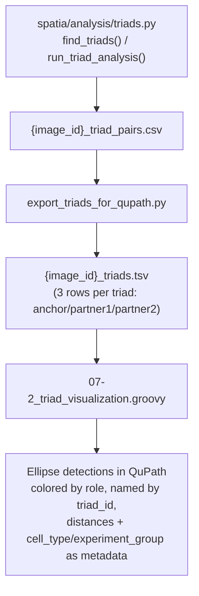

# `07-2_triad_visualization.groovy`

**Pipeline position:** Downstream, standalone — visualizes output after `triads` (Step 5) and `export_triads_for_qupath.py` (the TSV-export step) have both run. Not wired into `run_pipeline.py`.

## Purpose

Imports the `*_triads.tsv` file produced by `export_triads_for_qupath.py` (canonical — see that doc; the older `07-1_triad_visualization_tsv.ipynb`/`07-1_a` notebooks still produce a compatible file) and renders each triad member as a colored ellipse detection object at its centroid, directly in the open QuPath project — so detected triads can be visually cross-checked against the real tissue image, not just against `triads.py`'s numeric CSV output. Closes the gap left by `05-4-2_cell-typing_visualization.groovy`'s own header, which already named this script as a planned downstream step that didn't exist yet.

Each cell is colored by role (gold = anchor, blue = partner1, red = partner2 — matching `plot_triad_qc()`'s color scheme in `triads.py`), named after its `triad_id` (so all 3 members of one triad are findable in QuPath by name), and tagged with `cell_type`/`experiment_group`/`cell_id` as metadata plus the 3 pairwise distances as numeric measurements.

### Workflow

## Usage

Interactive only (no headless/CLI mode, same limitation as `00_ROI_extract_mask_project.groovy` and `05-4-2`): open the target image's QuPath project, Automate → Script Editor → paste → edit `tsvPath` at the top → Run.

## Parameters (edit in-script, not passed as arguments)

- `tsvPath` — full path to the `*_triads.tsv` file for the image currently open in QuPath (must match the same image — there's no automatic cross-check that the TSV belongs to the open image).
- `pointRadius` — ellipse radius in pixels for each rendered cell. Default `6.0` (no cell-area data is available from `triad_pairs.csv`, unlike `05-4-2`'s TSV which has one).

## Inputs / Outputs

- **In:** `{image_id}_triads.tsv` (columns: `triad_id`, `role`, `cell_type`, `centroid_x`, `centroid_y`, optionally `experiment_group`, `cell_id`, `dist_anchor_p1_um`, `dist_anchor_p2_um`, `dist_p1_p2_um`)
- **Out:** ellipse detection objects added to the open QuPath project's image hierarchy — not written to disk; save the QuPath project afterward to persist them.

## Notes / risks

- **Never run against a real QuPath project (confidence: high, stated directly — same status `00b_auto_tma_dearray.groovy` discloses).** Written and logic-reviewed, but this sandbox has no QuPath installation to execute it in. Spot-check the first real run's rendered triad count against `export_triads_for_qupath.py`'s own printed count before trusting the QuPath view.
- **`storeMetadataValue()` is a new API for this repo's QuPath scripts, verified against QuPath's own public javadoc but not run here (confidence: high that the method exists, medium on real-world behavior at scale).** QuPath's own documentation specifically cautions that storing metadata on many detection objects can raise memory use — relevant here since each triad becomes 3 detections, so a few hundred triads means a few hundred to a few thousand metadata-carrying objects in one image.
- **Role-to-color matching is substring/order-based, not an exact hardcoded list (confidence: high, by design).** This makes the script tolerant of role-label changes in `07-1`, but also means an unexpected role name containing the substring "partner" could be mis-bucketed into the partner1/partner2 slot rather than falling through to the generic fallback palette — only matters if you rename `07-1`'s role labels to something unusual.
- **No cross-check that `tsvPath` actually matches the open image (confidence: high, not guarded).** If you point this script at the wrong image's TSV by mistake, it will happily render triads from a different image onto the wrong tissue with no warning.
