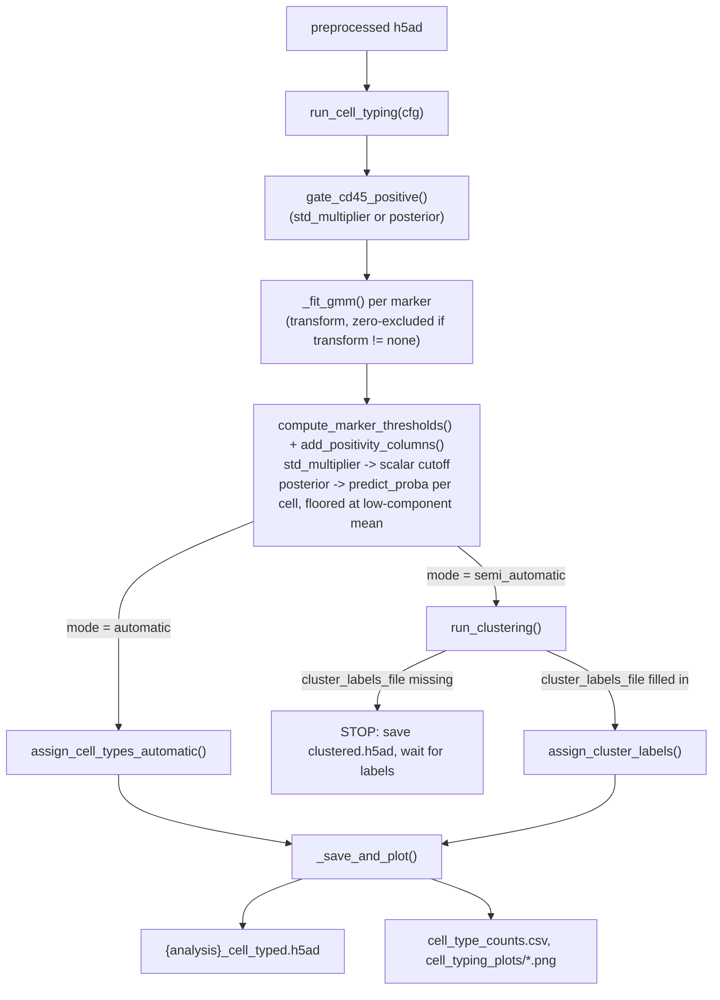
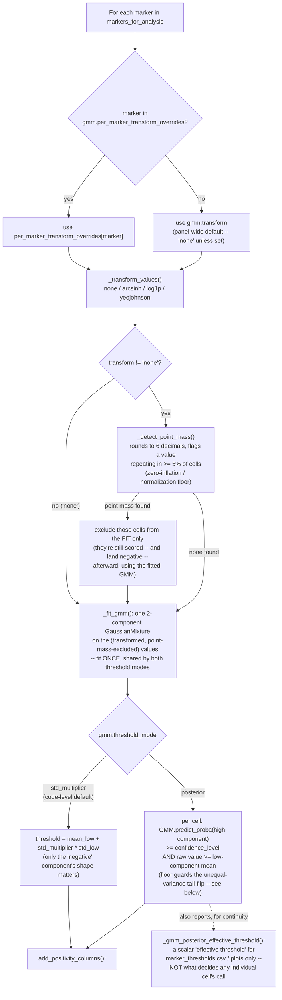

# `spatia/analysis/cell_typing.py`

**Pipeline position:** Step 4. `preprocessing` → **cell_typing** → `triads` → `functional`/`survival`

## Purpose

Assigns a cell type to every cell, in one of two modes set by config:

- **`automatic`** — GMM-thresholds each marker to determine positivity, then scores each cell against rules in a `cell_type_definitions.yaml` file. No human input required.
- **`semi_automatic`** — GMM-thresholds each marker, then runs PCA → KNN → Leiden clustering. **Intentionally stops** after clustering if `cluster_labels_file` isn't filled in yet, so a human (or the agentic layer in `agentic.py`) can inspect UMAPs and assign cluster→cell-type labels. Re-running with a filled-in `cluster_labels_file` resumes and finishes.

## Entry point

```python
from spatia.analysis.cell_typing import run_cell_typing
run_cell_typing(cfg)
```

## Flow



## Key concepts (added 2026-09-14, at Afrouz's request for a plain explanation of the threshold/transform machinery)

### The per-marker threshold decision, in detail



This is the same logic `gate_cd45_positive()` runs for the CD45 gate itself (one marker, gating cells in/out before the loop above starts on the remaining panel) -- same transform/point-mass/GMM/threshold-mode machinery, just applied once up front instead of per analysis marker.

### What "zero-inflated" means here, and how it's detected (confidence: high -- grounded directly in `_detect_point_mass()`, `cell_typing.py` lines 236-271)

A marker is zero-inflated when a large share of cells sit at exactly the same floor value instead of forming a smooth "negative population" distribution -- e.g. 30-50% of cells at exactly 0 raw intensity for a genuinely dim/rare marker (documented for 14 of the 55 CRC markers). That's a real biological/technical floor (detector noise floor, true absence of the marker), not measurement error, but it breaks the 2-component GMM: with a third of the mass sitting on a single point, one Gaussian component collapses onto that spike instead of modeling the actual negative population, and the fitted threshold lands near zero -- calling almost everything positive.

Detection (`_detect_point_mass`, `min_frac=0.05` default): round every value to 6 decimals, find whichever single value repeats most often, and flag it only if it accounts for >= 5% of that marker's cells. It is **not** hardcoded to look for literal `0.0` -- that was the original 2026-08-19 design, generalized on 2026-09-11 specifically because `crc_tma_full_pipeline.yaml`'s real data path runs through `preprocessing.py`'s per-image z-score normalization before `cell_typing` ever sees it. Z-scoring is a linear shift-and-scale, so a floor that was exactly 0 pre-normalization lands at some other marker-specific constant (`-mean/std`) afterward -- still a point mass, just not at zero anymore. The literal `== 0` check would have silently stopped catching it on exactly the config this pipeline actually runs (it would still have worked, by coincidence, on `crc_tma_celltyping.yaml`'s un-normalized validation CSV). This only ever matters when a transform is in use (`gmm.transform != "none"` or a per-marker override) -- `"none"`-transform markers were never point-mass-excluded either way.

### arcsinh vs. Yeo-Johnson (you asked "instead of arcsinh, should we use Yeo-Johnson?")

**My recommendation (confidence: ~75%, a judgment call rather than a settled fact): keep arcsinh as the default for the per-marker overrides, don't blanket-switch to Yeo-Johnson.** Reasoning:

- **arcsinh** is a *fixed-shape* transform (divide by a cofactor, then `asinh`) -- the same function, same parameter, every time you run it. For a methods paper, that's a real advantage: a reviewer or another lab can reproduce your exact transform from the cofactor alone, and it can never change behavior between runs or datasets.
- **Yeo-Johnson** is *data-adaptive* -- `scipy.stats.yeojohnson` fits its own power parameter (lambda) from each marker's own value distribution, every time it's fit (see below for how). That's a genuine statistical advantage when markers have meaningfully different skew shapes that one fixed cofactor can't serve well. But for reproducibility it cuts the other way: refit on a slightly different cell population (a different core subset, a re-run after adding more data) and lambda can drift, so "the same config" can silently produce a slightly different transform run to run. That's exactly the kind of thing a Nature Protocols reviewer would ask about.
- This tradeoff is already implemented and available (`gmm.transform: "yeojohnson"` or a per-marker override), it's just not yet validated against real CRC data -- see the 2026-09-12 addendum below: the 24.5%/26.8% accuracy number was produced with **arcsinh** on the 14 flagged markers, not Yeo-Johnson. Nobody has run `compare_expert_vs_auto.py` with Yeo-Johnson at full scale yet. So the honest answer is: switching is untested, not wrong -- if you want to actually decide this empirically rather than on my reasoning above, that comparison run is the fast way to find out (same script, swap the override values).

### Yeo-Johnson, explained (confidence: high on the mechanics, `cell_typing.py` lines 150-231)

Yeo-Johnson is a power transform family (Box-Cox's generalization to handle zero and negative values, which Box-Cox itself can't). For a single parameter lambda:

- x >= 0: y = ((x+1)^lambda - 1) / lambda  (or ln(x+1) when lambda=0)
- x < 0: y = -((-x+1)^(2-lambda) - 1) / (2-lambda)  (or -ln(-x+1) when lambda=2)

"Data-driven" means lambda isn't something you choose -- `scipy.stats.yeojohnson(values)` finds, by maximum likelihood, the single lambda that makes *that specific marker's* distribution as close to a symmetric Gaussian as possible, then applies the transform with that lambda. lambda=1 is close to a no-op (identity-ish); lambda=0 behaves like log1p; other values interpolate between compressing the right tail (skewed-right data, lambda<1) or the left tail. This is why it's the only transform here that's well-defined for negative values with adaptive shape (arcsinh also handles negatives fine, but has no adaptive shape) -- it matters if this pipeline ever fits a GMM on already-z-scored data with negative values, which is exactly what `crc_tma_full_pipeline.yaml` does.

Because lambda is fit fresh from the data every time, `_fit_gmm`/`_transform_values` returns it in `transform_params["lambda"]` and it's written per-marker to `marker_thresholds.csv` -- the one output artifact you'd check to confirm two runs actually used the same effective transform, not just the same `transform: "yeojohnson"` config string.

### `per_marker_transform_overrides`: when does it take effect? (you asked "if we select a transformation, is there a check and can we override it -- after the first run, or while cell typing is running?")

**It is a static, config-time (YAML) choice -- confidence: high, directly from the code (`run_cell_typing()`, `cell_typing.py` ~line 952).** There is no runtime check, no adaptive re-selection, and no override that happens *during* a run. The sequence is:

1. You edit the YAML before running anything: `gmm.transform` sets the panel-wide default, `gmm.per_marker_transform_overrides: {marker: transform}` lists exceptions.
2. `run_cell_typing()` reads both once, at the very top of the function, before any GMM is fit.
3. For each marker, one dict lookup decides its transform for that entire run: `transform_overrides.get(marker, transform)`.
4. That resolved transform is fixed for every cell of that marker for the rest of that run -- it cannot change mid-run, and there's no mechanism that inspects results partway through and revises the choice.

So "after the first run" is the right mental model: you'd run once, look at `marker_thresholds.csv` and the diagnostic GMM-distribution plots (`cell_typing_plots/*.png`) to see which markers still look zero-inflated or poorly separated, hand-edit `per_marker_transform_overrides` in the YAML, and re-run. That's exactly how the current 14-marker arcsinh override list was built (`marker_shape_diagnosis.py`, a standalone one-off script, not part of `run_cell_typing()` itself).

### "Can we make it automatic?" -- a proposal, not built (confidence: n/a -- this is a design question, not a factual claim)

Auto-detecting per-marker transform need and picking one is a real, buildable feature, but I haven't built it, and I don't think I should without you weighing in on the design calls it requires first:

- **Trigger rule:** e.g. "if `_detect_point_mass` finds a point mass covering >= X% of cells, auto-apply arcsinh (or auto-fit yeojohnson) to that marker" -- X is a free parameter with no obviously-correct value; the existing 14-marker list used a hand-picked 30% zero-fraction cutoff from a separate diagnostic script, not this rule.
- **Which transform to auto-pick:** arcsinh (simple, fixed, but needs its own cofactor choice) vs. yeojohnson (adaptive, but re-fits every run -- see the reproducibility tradeoff above). An automatic system would need to pick one of these consistently, or add a second automatic decision on top of the first.
- **Reproducibility for the paper:** an automatic per-marker choice that can change if the input cell population changes even slightly (a different core subset, more cells pooled in) is a moving target for a methods section that needs to state one fixed procedure. A hand-curated, reviewed override list (the current approach) is slower to build but easier to defend as "this is exactly what we did."

If you want this built, I'd suggest treating it as its own reviewed change (a `detect_and_apply_transforms()` helper, run once, printing its picks for your sign-off before they're used) rather than a silent auto-behavior inside `run_cell_typing()` -- happy to build that if you decide the tradeoffs above are worth it.

## Key functions

| Function | Role |
|---|---|
| `_fit_gmm(values, ..., transform, yeojohnson_lambda)` | Fits a 2-component GMM once per marker on (optionally transformed) values; shared by both threshold modes so a marker's GMM is never fit twice. When `transform != "none"`, exact-zero raw values are excluded from the fit first — see Notes/risks. Returns the fitted GMM plus which component index is "low"/"high". |
| `_gmm_threshold_from_fit(fit, std_multiplier, ...)` | `std_multiplier` mode: threshold = mean of the "low" component + `std_multiplier` × its std, on the raw (inverse-transformed) scale. Bit-identical to the pre-2026-08-19 `_gmm_threshold` formula for `transform="none"`. |
| `_gmm_posterior_effective_threshold(fit, confidence_level, ...)` | `posterior` mode: numerically finds the raw-scale value where the posterior probability of positive-component membership first crosses `confidence_level`, for reporting only (not the actual per-cell decision — see `add_positivity_columns`). Grid search starts at the low component's own mean, not the data minimum — see Notes/risks for why. |
| `compute_marker_thresholds(adata, markers, std_multipliers, ..., threshold_mode, confidence_level, confidence_overrides, transform_overrides)` | Runs `_fit_gmm` + the appropriate threshold function per marker. Returns `(thresholds, fit_info)` — `thresholds` is always a `{marker: float}` dict for backward-compatible reporting; `fit_info` carries the fitted GMM, mode/confidence needed by `add_positivity_columns`, and (2026-09-11) the actual per-marker `transform` used, which may differ from the global default via `transform_overrides`. |
| `add_positivity_columns(adata, thresholds, fit_info, transform, arcsinh_cofactor)` | Adds `<marker>_pos` (bool) and `<marker>_intensity` (0–3 tertile bins of positive cells) columns to `adata.obs`, all in one `pd.concat` to avoid DataFrame fragmentation. In `posterior` mode also adds `<marker>_posterior` (the raw per-cell probability) and applies a floor (see Notes/risks) so a cell can never be called positive below the negative component's own mean. |
| `gate_cd45_positive(adata, cd45_std_multiplier, ..., threshold_mode, confidence_level)` | Filters to CD45+ cells only (immune-cell gate); saves a threshold histogram. Can be skipped via config (`gmm.skip_cd45_gate`) for panels spanning immune + non-immune types. Now shares the same `threshold_mode`/`transform` machinery as per-marker thresholds, for consistency. |
| `assign_cell_types_automatic(adata, cell_type_definitions)` | Vectorized (no per-row Python loop) scoring of every cell against every rule in the definitions file: `required` (must all be positive), `required_any` (at least one), `excluded` (must all be negative), `preferred` (bonus points, breaks ties). Highest-scoring type wins; `"Unassigned"` if nothing matches. |
| `run_clustering(adata, n_neighbors=15, leiden_resolution=0.5, ...)` | Standard scanpy PCA → neighbors → UMAP → Leiden pipeline; saves UMAP plots + a `cluster_sizes.csv`. |
| `assign_cluster_labels(adata, cluster_labels)` | Maps each cell's Leiden cluster to a human- (or agent-) supplied label; unmapped clusters become `"Unassigned"` with a warning. |
| `run_cell_typing(cfg)` | Top-level dispatcher implementing the automatic/semi_automatic branching described above. |
| `_save_and_plot(...)` | Shared output logic: writes the cell-typed h5ad, cell-type count CSV/bar chart, UMAP-by-cell-type plot, and experiment_group-comparison plot/CSV if a `experiment_group` column exists. |

## Config keys

- `cell_typing.mode` — `"automatic"` or `"semi_automatic"`
- `cell_typing.input_file`, `.analysis_name`
- `cell_typing.markers.panel`, `.gating_only` (default `["CD45"]`)
- `cell_typing.gmm.cd45_std_multiplier`, `.default_std_multiplier`, `.per_marker_overrides`, `.n_components`, `.random_state`, `.n_init`, `.max_cells_gmm`, `.skip_cd45_gate`
- `cell_typing.gmm.transform` (default `"none"`) — `"none"` | `"arcsinh"` | `"log1p"` | `"yeojohnson"`; `.arcsinh_cofactor` (default `5.0`, only used by `"arcsinh"`)
- `cell_typing.gmm.per_marker_transform_overrides` (added 2026-09-11, default `{}`) — `{marker: transform}`, lets individual markers use a different transform than the global `gmm.transform` default in the same run. See Notes/risks below.
- `cell_typing.gmm.threshold_mode` (default `"std_multiplier"`) — `"std_multiplier"` | `"posterior"`; `.confidence_level` (default `0.8`, only used by `"posterior"`); `.per_marker_confidence_overrides`
- **`crc_tma_full_pipeline.yaml` sets `threshold_mode: "posterior"` explicitly (2026-09-14)** — the code-level default (`"std_multiplier"`) is unchanged, and `crc_tma_celltyping.yaml` (the validation config) still relies on that default too. See the dated note in Notes/risks below before treating this as validated.
- `cell_typing.clustering.n_neighbors` (default 15), `.leiden_resolution` (default 0.5)
- `cell_typing.cell_type_definitions_file` (automatic mode)
- `cell_typing.cluster_labels_file` (semi_automatic mode — `null` on first run)

## Inputs / Outputs

- **In:** preprocessed h5ad (from `preprocessing.py`), `cell_type_definitions.yaml` (automatic) or `cluster_labels.yaml` (semi_automatic, phase 2)
- **Out:** `cell_typing_data/marker_thresholds.csv` (now one row per marker with `threshold`, `threshold_mode`, `transform`, `transform_lambda` columns — `transform_lambda` populated only for `"yeojohnson"`, blank otherwise), `{analysis}_clustered.h5ad` (semi_auto phase 1), `{analysis}_cell_typed.h5ad` (in `threshold_mode="posterior"`, gains a `<marker>_posterior` float column per marker alongside the existing `<marker>_pos` boolean), `cell_type_counts.csv`, `cell_type_by_experiment_group_pct.csv`; `cell_typing_plots/*.png`

## Dependencies

`scanpy` (optional — module degrades gracefully with a warning if missing, but `semi_automatic` mode and even `automatic` mode's `run_cell_typing` both hard-require it via `HAS_SCANPY` check), `scikit-learn` (`GaussianMixture`), `matplotlib`, `seaborn`.

## Notes / risks

- **Added 2026-09-14 — `crc_tma_full_pipeline.yaml` (the production config) now sets `gmm.threshold_mode: "posterior"` explicitly, at Afrouz's request (confidence: high on the mechanism, this is a config-only change with no code-level effect; confidence: low on whether it should feed the paper's accuracy number as-is — see the gap below).** Before this, the key was simply absent from this config, so it silently inherited `cell_typing.py`'s own fallback (`gmm_cfg.get("threshold_mode", "std_multiplier")`) — this file has always run std_multiplier mode, it just never said so out loud. This change only touches `crc_tma_full_pipeline.yaml`; the code-level fallback default and `crc_tma_celltyping.yaml` (and any other experiment config, e.g. the LILRB2 mouse configs) are untouched, so nothing else in the repo changes behavior from this. **The gap worth flagging directly: the 24.5%/26.8% (all/core) accuracy number in the 2026-09-12 addendum two notes above was produced entirely under `threshold_mode=std_multiplier`** (its default, never overridden in `crc_tma_celltyping.yaml`) — nobody has re-run `compare_expert_vs_auto.py` with `threshold_mode=posterior` against the expert-labeled validation set. If the manuscript's methods section states "posterior thresholding" as this pipeline's cell-typing procedure, that 24.5%/26.8% figure is not (yet) evidence for *that* procedure's accuracy — it's evidence for std_multiplier's accuracy. Re-running the same comparison script with `crc_tma_celltyping.yaml`'s `threshold_mode` also set to `"posterior"` is the direct way to close this gap before the number goes in the paper.

- **Merged into cell_typing.py 2026-09-10 (was briefly a separate spatia/analysis/cell_typing_plots.py -- Afrouz asked for it to live in the cell-typing portion of the pipeline instead).** GMM fitting, cell-type assignment, and the diagnostic plots are now all in one file. `generate_cell_typing_diagnostics()` is called directly (no import) from `run_cell_typing()`, same try/except-per-section behavior as before. Still dataset-agnostic -- the merge didn't change any logic, just moved it.
- **UMAP: no PCA step, matches Afrouz's own reference notebook (2026-09-10 change).** Originally ran `sc.pp.pca` before `sc.pp.neighbors`; changed to call `sc.pp.neighbors` directly on the marker matrix (no PCA), after Afrouz pointed at her LILRB2 mouse study's `05_1_a` notebook, which does the same -- confirmed by grep (zero occurrences of `pca` anywhere in that 2296-line notebook). Reasonable for this kind of panel either way: dozens of markers, not thousands of genes, so PCA isn't doing the same load-bearing work it does for scRNA-seq. No cell subsampling for UMAP either, per Afrouz's earlier explicit choice to run on the full pooled cohort.

- **Added 2026-09-10 -- diagnostic plot suite (`spatia/analysis/cell_typing_plots.py`), requested after the first real automatic-mode run produced only 2 plots (confidence: high, verified against a synthetic dataset -- see below).** Automatic mode previously made only `cell_type_counts.png` and `cell_type_by_experiment_group.png`; there was no way to visually sanity-check a GMM threshold, see marker positivity by cell type, or look at the data in UMAP space. New: one GMM-distribution plot per marker (histogram + the ACTUAL fitted GMM reused from `fit_info[marker]["gmm"]", not a re-fit, so it reflects this panel's zero-inflation handling), a marker-positivity-% heatmap and a mean-expression heatmap by cell type, a restyled (horizontal, sorted, value-labeled) `cell_type_counts.png` replacing the original vertical/rotated-label version, a 100%-stacked cell-type-by-group bar chart (alongside, not replacing, the existing grouped-bar version), and UMAP (computed fresh for automatic mode, which never computed one before) colored by cell_type / experiment_group / tissue_id. Every section is independently wrapped in try/except -- a failure in one plot never blocks cell_typing itself or the rest of the suite, matching this pipeline's established non-fatal-diagnostics convention. All figures save both PNG and PDF (Afrouz's choice, 2026-09-10) for manuscript use.
- **Dataset-agnostic by construction, not just for this CRC config (confidence: high, grep-verified -- confirmed 2026-09-10 at Afrouz's explicit request to check, since this is pipeline-test work, not a one-off).** No marker names, cell-type names, or group names are hardcoded anywhere in `cell_typing_plots.py` -- every function is driven by `thresholds`/`fit_info`/`column_map`/`adata` passed in from `run_cell_typing()`. Verified end-to-end against a synthetic 6-marker/4-core/2-group dataset (not the real 55-marker CRC panel) built specifically to prove this. The one real scope boundary: plots keyed to `experiment_group`/`tissue_id`/`cell_type` column names, matching this pipeline's own pre-existing convention (written by `preprocessing.py` and `pool_tissues_for_celltyping.py` respectively, not something this change introduced) -- any dataset run through *this* pipeline's own preprocessing has them named consistently; an h5ad from a different pipeline with different column names (e.g. the separate LILRB2 mouse notebook stack's `condition` column) would need those names passed explicitly rather than relying on the defaults.
- **UMAP is computed on all pooled cells, not a subsample (confidence: high on the tradeoff, untested for wall-clock time at 300k+ cells since that only exists on JupyterHub).** Afrouz's explicit choice (2026-09-10) over subsampling to the GMM fit's existing 50,000-cell cap. `sc.pp.neighbors`/`sc.tl.umap` scale worse than the GMM fitting does -- worth watching wall-clock time on the next real run; if it's problematic, the fix is a one-line subsample before `compute_and_plot_umaps`'s PCA call, not a redesign.
- **`compute_and_plot_umaps` deliberately does NOT reuse `run_clustering()`'s (semi_automatic mode) normalize/log1p/scale preprocessing before PCA -- found to be a real latent bug in that function, not fixed there (confidence: high on the math, this dataset's own real GMM output is the evidence).** This pipeline's preprocessing already per-cell z-scores every marker -- Afrouz's actual cell_typing run produced legitimately negative thresholds (CD7=-0.0039, CD3=-0.0393, CD163=-0.0552, CD31=-0.0341, CD34=0.0070), confirming real per-cell values routinely fall below -1. `sc.pp.log1p` on any value <= -1 produces NaN/-inf. `run_clustering()` (used by `semi_automatic` mode, untouched by this change) calls `sc.pp.normalize_total` + `sc.pp.log1p` + `sc.pp.scale` unconditionally before PCA -- on this already-z-scored data, that would silently corrupt a meaningful fraction of cells before clustering. Not a problem for Afrouz's current `automatic`-mode config (which never calls `run_clustering()`), but worth fixing before anyone switches this config to `semi_automatic` mode. Flagged here rather than fixed, since it's out of scope for a diagnostics-plot request and changes actual clustering behavior.
- **Stacked-bar orientation bug caught during verification, before it reached Afrouz (confidence: 100%, reproduced and fixed with the synthetic test).** A first draft put cell_type on the x-axis and stacked `experiment_group` values on top of each other per type -- since `pd.crosstab(..., normalize="index")` normalizes each GROUP to sum to 100% (not each cell type), that arrangement made bar totals meaningless (e.g. one bar totaling ~96%, another ~28%). Fixed by putting `experiment_group` on the x-axis with cell types as the stacked segments instead -- the only arrangement where each bar's stack actually sums to 100%. Verified against the synthetic test's own CSV output before and after the fix.

- **Added 2026-09-10 — `markers.column_map` resolves marker names that don't match the real adata columns (confidence: high, verified against the actual CRC panel's data).** This panel's real h5ad/CSV columns are the CODEX export's full `"<name> - <description> (C<n>)"` strings (e.g. `"CD45 - hematopoietic cells (C14)"`), not the clean short names (`"CD45"`) used throughout `markers.panel`, `gating_only`, `gmm.per_marker_overrides`, and `cell_type_definitions.yaml`'s `*_pos` rules -- confirmed by diffing `crc_tma_full_pipeline.yaml`'s panel against a real `*_combined_all_experiment_groups.csv` header. Every marker was present in the data, just under this different name -- nothing was actually missing. `compute_marker_thresholds`, `add_positivity_columns`, and `gate_cd45_positive` (new `cd45_col` param) all now accept an optional `column_map: {short_name: real_column_name}`, resolved only at the point of indexing into `adata` -- every dict/column key (`thresholds`, `fit_info`, `<marker>_pos`) stays keyed by the SHORT name throughout, so `cell_type_definitions.yaml`'s existing rules keep working unchanged. A config with no `column_map` (the default, `{}`) resolves every marker to itself -- identical to prior behavior, zero risk to any other config (e.g. the LILRB2 mouse panel). Four of this panel's 55 mappings are a real name substitution, not just punctuation, and were resolved by elimination rather than an exact stated equivalence -- worth Afrouz's own eyes: `CK`->`Cytokeratin`, `GzmB`->`Granzyme B`, `ChromoA`->`Chromogranin A`, `CCR4`->`CD194` (CCR4 only appears in that column's description, `"CD194 - CCR4 chemokine R"`). Verified two ways: (1) every one of the 55 `column_map` values matched the real CSV header verbatim via a programmatic diff, zero transcription errors; (2) the resolution logic itself (`compute_marker_thresholds`/`add_positivity_columns`/`gate_cd45_positive`) was exercised end-to-end against a mock adata shaped like the real columns (sklearn/seaborn temporarily installed in the dev environment, then removed) -- confirmed markers resolve, `_pos` columns come out short-named, and the CD45-not-found warning reproduces exactly as expected when `column_map` is omitted, proving the fix actually closes the gap rather than just looking plausible.
- **Same date -- `cell_type_definitions_file` was empty in `crc_tma_full_pipeline.yaml`, guaranteed `FileNotFoundError` on any `automatic`-mode run (confidence: 100%, read directly from `run_cell_typing`'s `if not defs_file or not os.path.exists(defs_file): raise ...`).** Now set to `cell_type_definitions/crc_tma.yaml` -- the file `crc_tma_celltyping.yaml` already validated against expert labels (2026-07-01, `crc_accuracy_report.csv`). The other candidate in the repo, `spatia/cell_type_definitions.yaml`, is NOT a safe default for this dataset: its rules reference mouse markers (`B220`, `Ly-6C`, `Ly6g`, `NKP46`, `SIGLEC F`) that don't exist anywhere in this CRC panel -- it's the LILRB2 mouse study's definitions file, wrong species entirely. Pointing there would have made `cell_typing` run without crashing, while silently producing near-empty or meaningless cell-type calls.
- **Same date -- `cell_typing.input_file` was also empty, a third independent crash cause on the same run (confidence: 100%, confirmed by Afrouz's actual JupyterHub traceback: `ValueError: Reading with filekey ... write/..h5ad does not exist`, from `sc.read(input_file)`).** Root cause is architectural, not a typo: this is a TMA, so `preprocessing.py`'s `extract_tissue_identifier()` gives each core (reg069, reg070, ...) its own `tissue_id`, and `run_preprocessing()` writes one h5ad per tissue_id -- never a single cohort-wide file. `cell_typing.py`'s `input_file` is one hardcoded path (`sc.read(input_file)`, no glob/loop), so it needs a single file spanning every core. `pool_tissues_for_celltyping.py` (already written, previously undocumented as a required step for this config -- see [pool_tissues_for_celltyping.md](pool_tissues_for_celltyping.md)) concatenates every core's h5ad into one cohort-level file via `anndata.concat`. `input_file` now points at `combined_processed_data/cohort_pooled.h5ad`, with the exact pooling command that must be run first left in the yaml comment above it. **This is a methodological choice, not just a plumbing fix (confidence: high on the mechanics, a judgment call on whether it's the right call for TMA cores specifically):** pooling fits GMM thresholds jointly across every core/patient, which is standard practice for a TMA cohort study and avoids each core getting its own independent (and noisier, since a single core has fewer cells) threshold calibration -- but it also assumes staining/imaging is comparable enough across cores that one joint threshold per marker is appropriate. If any core is a clear staining outlier, joint pooling could pull its cells toward the wrong side of a threshold rather than being calibrated separately. Worth a quick look at how many distinct cores `pool_tissues_for_celltyping.py` reports finding, and whether it prints any marker-panel mismatches across them, before trusting the pooled result.

- **Two threshold modes available: `std_multiplier` (default) and `posterior` (confidence: high).** `std_multiplier` only looks at the negative component's mean/std; `posterior` uses both components' full shape (mean, std, and relative population size) via `GaussianMixture.predict_proba` — the more statistically complete way to decide positivity, particularly when the positive population is more spread out than the negative one. Config-only switch (`gmm.threshold_mode`); `std_multiplier` remains the default so no existing config's output changes unless you opt in.
- **Posterior probability isn't always monotonic in raw intensity when the two GMM components have unequal variance — guarded, not just noted (confidence: high).** The broader component's tail decays more slowly, so at extreme values far below *both* component means, the posterior of belonging to the wider (usually positive) component can tick back up — a real mathematical property, not a bug. The fix is a floor: `add_positivity_columns` and `gate_cd45_positive`'s `posterior` branch both require the raw value to be at or above the negative component's own mean, in addition to a high posterior, before calling a cell positive. `_gmm_posterior_effective_threshold`'s grid search (the reported scalar threshold only) applies the same floor.
- **`gmm.transform` gains `"yeojohnson"`, a data-driven alternative to the fixed-shape `"arcsinh"`/`"log1p"` (confidence: high).** Fits an actual power-transform parameter (lambda) per marker via `scipy.stats.yeojohnson` instead of assuming one fixed shape works for every marker; the fitted lambda is logged and saved to `marker_thresholds.csv`. Well-defined for zero and negative values too (unlike `log1p`).
- **Important: a transform alone does not fix true zero-inflation — exact zeros are now excluded from the GMM fit whenever a transform is used (confidence: high).** `experiments/crc_tma_celltyping.yaml`'s Q16 config comment documents that `arcsinh`/`log1p` were tried against real CRC data and made accuracy *worse* (19.0% → 10.8% and → 8.9% respectively): a genuine point mass at exactly zero survives any monotonic transform unchanged (every transform maps 0 → 0), so the GMM's "low" component still collapses onto it. The fix, now implemented in `_fit_gmm`: whenever `transform != "none"`, exact-zero values are excluded from the GMM fit (still classified as negative automatically, since the resulting threshold stays well above zero). **This has not yet been re-validated against real CRC data** — `experiments/crc_tma_celltyping.yaml` is deliberately left at `transform: "none"` / `threshold_mode: "std_multiplier"` (the validated 19.0%-accuracy baseline) rather than auto-switched, since that number feeds the paper directly. Re-running `compare_expert_vs_auto.py` with `transform: "arcsinh"` or `"yeojohnson"` now that the root cause has a real fix is the natural next step. **2026-09-12 addendum (Day 46, scheduled run):** ran this exact next step — `run_pipeline.py --steps cell_typing` then `compare_expert_vs_auto.py` against the full 258,385-cell real CRC dataset, using the config as committed (global `transform: "none"`, `per_marker_transform_overrides` applying `arcsinh` to the 14 flagged markers, per the addendum below). Result: **24.5% overall / 26.8% core-category accuracy, up from 19.0%.** Real improvement, not a full fix — several cell types still score near-zero F1 (see `NATURE_PROTOCOLS_OUTLINE.md` Procedure Step 5 for the full breakdown). Not re-tested with `yeojohnson` (the other candidate this note names) at full scale. Not yet Afrouz-confirmed as the number for the paper.
- **Documented, intentional asymmetry in CD45 gating strictness (confidence: high — explicitly called out in the module docstring).** `semi_automatic` historically used `cd45_std_multiplier=8` (tight gate), `automatic` used `3` (permissive). This is now an explicit config value rather than a hidden default, which is good practice — but it's worth double-checking your current config actually sets these deliberately per experiment rather than inheriting a stale default, since the two modes are not directly comparable without matching this parameter.
- **`assign_cell_types_automatic` first-match-wins via `>` not `>=` (confidence: medium).** When two cell-type rules tie in score, whichever was processed first in `cell_type_definitions` dict iteration order keeps the assignment (`update_mask = cell_scores > scores`, strict greater-than). Dict order in YAML is insertion order, so this is deterministic, but the tie-breaking behavior isn't documented — if two cell types are meant to be mutually exclusive but a cell matches both equally, the "winner" depends on YAML ordering, not domain logic.
- **GMM `n_init=1` default risks a bad local optimum (confidence: medium).** `n_init=1` (single restart) trades reproducibility/speed for a chance of an unstable fit on noisy markers, especially with `random_state` fixed — the same "unlucky" fit will recur deterministically. If a marker's threshold ever looks visibly wrong, bumping `gmm.n_init` before assuming a data problem is a fast diagnostic.
- **The "intentional stop" in semi_automatic mode is easy to trip over programmatically (confidence: medium).** `run_cell_typing` just `return`s (no exception, no explicit status) after Phase 1 clustering when labels aren't ready. Anything orchestrating this (e.g. `run_pipeline.py`) needs to distinguish "step ran fine but stopped early on purpose" from "step actually finished" — worth confirming `run_pipeline.py`'s validation step (`validate_cell_typing` in `validation.py`) is the sole source of truth for that distinction, since `run_cell_typing` itself gives no return value to check.
- **Added 2026-09-10 — six more outputs, to bring `cell_typing.py`'s diagnostic suite to full parity with Afrouz's reference automatic-cell-typing notebook (`05_1_a_celltyping_triads.ipynb`, LILRB2 mouse study), at her explicit request (confidence: high, verified end-to-end against a synthetic 6-marker/4-core/2-group/with-Unassigned-cells dataset — see below).** Before this change, the rule-definition engine (`assign_cell_types_automatic`/`_score_cell_type`) and the UMAP approach (no PCA, no subsampling) already matched the notebook — this pass closes the remaining gap in *plotting and reporting*: `plot_dotplot()` (`sc.pl.dotplot`, dendrogram-clustered, `standard_scale="var"`), `plot_marker_umaps()` (per-marker two-panel UMAP — raw expression + binary positivity — one file per marker in `cell_typing_plots/marker_umaps/`), `plot_group_statistics()` (chi-square test of each cell type's proportion across `group_col`, a significant-differences bar chart, and — only when there are exactly 2 groups, since a signed difference needs exactly two things to subtract — the notebook's diverging difference bar chart), `plot_unassigned_diagnostics()` (this pipeline's `"Unassigned"` label is the equivalent of the notebook's `"Unknown"` catch-all: a known-vs-unassigned positivity-% bar chart, a per-marker histogram grid, and an impact-ranked CSV/plot of which marker thresholds might most help reclassify them), and `generate_report()` (one HTML + one multi-page PDF + one text summary, written to a new sibling `cell_typing_report/` directory).
  - **Two deliberate deviations from the notebook, both judgment calls worth Afrouz's own sign-off:** (1) the notebook's chi-square test only ever handled exactly 2 conditions (a fixed 2×2 table); generalized here to any number of groups via a `[this cell type vs everything else] × [group1..groupN]` table, with the pairwise diverging-difference chart kept 2-groups-only since a signed difference is inherently pairwise. (2) the notebook draws every report figure **three times** — once for the main script, once as a base64 PNG for its Jinja2 HTML template, once again inside `PdfPages` — three copies of the same plotting call that can silently drift apart. `generate_report()` instead composes its HTML and PDF from the PNGs the rest of this module already wrote to `plot_dir/`, and is built with plain Python string formatting rather than `jinja2`/`markdown` (not guaranteed installed on JupyterHub/HPC, and this must run unattended there) — one source of truth per figure, zero new hard dependencies.
  - **Intentionally NOT ported: the notebook's Leiden clustering + balanced (downsampled) dataset creation at the end of its script.** That's `semi_automatic` mode's job in this pipeline (`run_clustering()`), and duplicating it inside `automatic` mode's diagnostics would blur the two modes' boundary rather than clarify it. Flagged here rather than silently ported — worth Afrouz confirming this scope call is what she meant by "rule definition, dimension reduction, umaps, plotting and reporting" (i.e., not clustering).
  - Verified via `run_test.py` (synthetic AnnData, sparse rule set left deliberately incomplete so ~59% of cells fall through to `"Unassigned"`, 2 groups so both the chi2-significant and diff-plot paths execute): all 6 new functions ran without exception, produced 58 files total (up from the prior diagnostic suite's smaller set), dotplot and unassigned-histogram-grid figures spot-checked visually, HTML report confirmed well-formed with all 10 expected embedded images and 17 table rows, PDF confirmed at 11 pages via `pypdf`.

- **Added 2026-09-11 — zero-exclusion generalized from a literal `== 0` check to `_detect_point_mass()` (confidence: high, the motivating scenario is a straightforward consequence of the pipeline's own architecture, confirmed by simulating it in `run_test.py`).** The exact-zero exclusion described above (line 92, added 2026-08-19) only helps on RAW data — `crc_tma_celltyping.yaml`'s validation h5ad (built by `prepare_crc_for_celltyping.py` straight from CSV intensities) never goes through `preprocessing.py`, so its zero-inflation floor really does sit at exactly 0. The real production config (`crc_tma_full_pipeline.yaml`) is different: `preprocessing.py` per-image z-score normalizes every marker (`sp.pp.format(..., method="zscore")`) *before* `cell_typing` ever sees the data, which shifts that same floor to a marker-specific constant (`-mean/std`) — a linear transform moves a point mass, it doesn't remove it. The old `values == 0` check would silently miss this on z-scored data, reintroducing the exact GMM-collapse pathology the 2026-08-19 fix was meant to prevent, with no error or warning to flag it. `_detect_point_mass(values, min_frac=0.05)` replaces the literal check: rounds to 6 decimals, finds whichever value repeats most often, and returns it only if its frequency clears `min_frac` — `_fit_gmm` now excludes cells at *that* value (not just literal 0) before fitting, whenever `transform != "none"`. Verified via a synthetic test simulating both cases side by side (a raw 45%-zero-floor marker and the same marker z-scored so its floor lands at a negative non-zero constant): both correctly detected, and both markers' GMMs fit with equivalent separation quality. **Only matters when a transform is in use** — `transform: "none"` markers were never affected by this exclusion logic either way.

- **Added 2026-09-11 — `gmm.per_marker_transform_overrides`, so the arcsinh fix can be applied to only the markers it's meant for (confidence: high on the mechanism; the accuracy payoff itself is not yet validated against real data — see below).** Before this, `gmm.transform` was a single global setting for all 55 markers — exactly the design that produced the 2026-08-18 regression documented at line 92 (19.0% → 10.8%/8.9%), where markers that didn't need a transform got one anyway. `compute_marker_thresholds` now accepts `transform_overrides: {marker: transform}`; each marker's actual transform is `transform_overrides.get(marker, transform)`, and `fit_info[marker]["transform"]` always reflects what was actually used (read by `add_positivity_columns` and both plotting functions, so thresholding and plotting can never disagree about which transform applied to a given marker). `experiments/crc_tma_celltyping.yaml` sets this to `"arcsinh"` for the 14 markers with ≥30% exact-zero intensity (GzmB, CD20, CK, CD15, ChromoA, CD138, MMP9, CD31, CD7, HLA_DR, MUC1, CollagenIV, Synaptophysin, CD45), identified by a standalone `marker_shape_diagnosis.py` run against the real validation h5ad — the same 30%-cutoff convention as the pre-existing "14/53" figure already documented in this file. **Note:** a 15th marker the diagnosis flagged (`NaKATPase`, zero_frac=0.366) is deliberately NOT in the override dict — it's present as an h5ad column but absent from `markers.panel` (55 of the h5ad's 56 marker columns), so it's already excluded from cell typing regardless of transform; an override for it would be a silent no-op. Worth Afrouz confirming whether that panel exclusion was deliberate. **Re-validating against real CRC data via `compare_expert_vs_auto.py` (same as the still-open item at line 92) is the natural next step** — this change makes that comparison possible without repeating 2026-08-18's blanket-arcsinh mistake, but doesn't by itself prove the 14-marker override list improves accuracy. **2026-09-12 addendum (Day 46, scheduled run):** done — see the addendum at line 93 above. 24.5%/26.8% accuracy (all/core), up from 19.0%, using this exact 14-marker override list as committed. Confirms the override list does improve accuracy on real data; does not by itself say it's good enough for the paper (several cell types still score near-zero F1).

- **Added 2026-09-11 — both diagnostic plotting functions rebuilt as 3 panels (raw / transformed / positive-negative), and a forward Yeo-Johnson transform added to support it (confidence: high, verified visually against one rendered PNG plus a synthetic-data assertion pass).** Previously `plot_marker_distributions()` and `plot_marker_umaps()` showed only 2 panels (raw expression, positive/negative split) — there was no way to see the space the GMM actually fit in, which matters most for `arcsinh`/`log1p`/`yeojohnson` markers where the raw-scale histogram can look uninterpretable even when the underlying fit is sound. New middle panel plots the marker's own transformed values (per `fit_info[marker]["transform"]`, always matching what was actually fit — see above) with the fitted GMM's component curves drawn natively in that space, plus the threshold line forward-transformed to match. `plot_marker_umaps()`'s middle panel does the same via a scratch `adata.obs` column, always removed in a `finally` block regardless of success/failure. Closes a previously-undocumented gap: yeojohnson markers had no plotted GMM curves at all before this, since only the inverse transform existed in this module; `_yeojohnson_forward_local` (standard closed-form, for x≥0: `((x+1)^λ-1)/λ`; for x<0: `-((-x+1)^(2-λ)-1)/(2-λ)`) was added specifically to close it. Verified: one real rendered PNG (`MMP9raw_distribution.png`) visually inspected panel-by-panel; synthetic test asserts all three panels' output files exist for both an override marker and a non-override marker, and that no scratch UMAP columns leak into `adata.obs` afterward.
