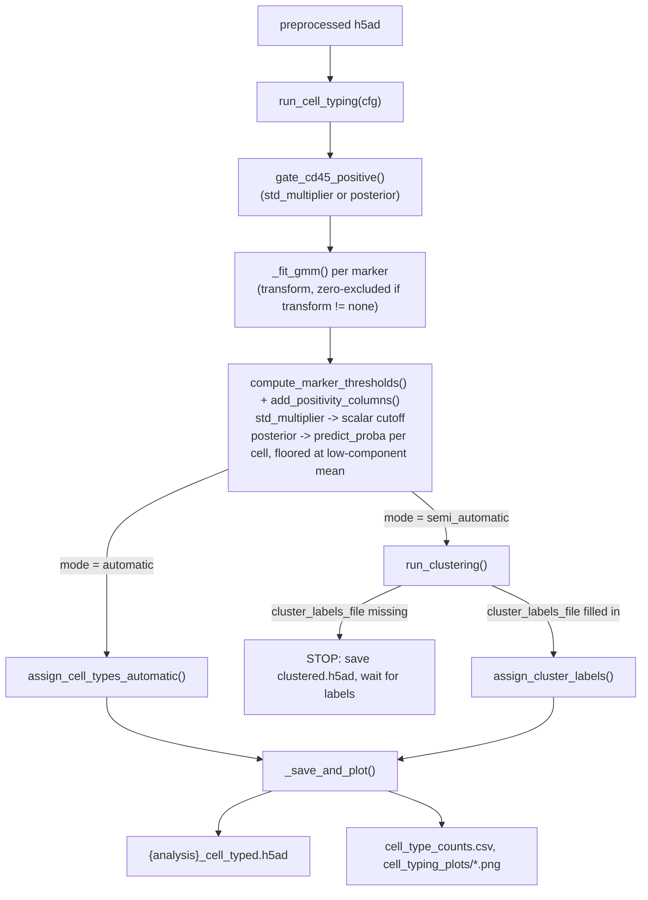

# `spatia/analysis/cell_typing.py`

**Pipeline position:** Step 4. `preprocessing` → **cell_typing** → `triads` → `functional`/`survival`

## Purpose

Assigns a cell type to every cell, in one of two modes set by config:

- **`automatic`** — GMM-thresholds each marker to determine positivity, then scores each cell against rules in a `cell_type_definitions.yaml` file. No human input required.
- **`semi_automatic`** — GMM-thresholds each marker, then runs PCA → KNN → Leiden clustering. **Intentionally stops** after clustering if `cluster_labels_file` isn't filled in yet, so a human (or the agentic layer in `agentic.py`) can inspect UMAPs and assign cluster→cell-type labels. Re-running with a filled-in `cluster_labels_file` resumes and finishes.

## Entry point

```python
from spatia.analysis.cell_typing import run_cell_typing
run_cell_typing(cfg)
```

## Flow



## Key functions

| Function | Role |
|---|---|
| `_fit_gmm(values, ..., transform, yeojohnson_lambda)` | Fits a 2-component GMM once per marker on (optionally transformed) values; shared by both threshold modes so a marker's GMM is never fit twice. When `transform != "none"`, exact-zero raw values are excluded from the fit first — see Notes/risks. Returns the fitted GMM plus which component index is "low"/"high". |
| `_gmm_threshold_from_fit(fit, std_multiplier, ...)` | `std_multiplier` mode: threshold = mean of the "low" component + `std_multiplier` × its std, on the raw (inverse-transformed) scale. Bit-identical to the pre-2026-08-19 `_gmm_threshold` formula for `transform="none"`. |
| `_gmm_posterior_effective_threshold(fit, confidence_level, ...)` | `posterior` mode: numerically finds the raw-scale value where the posterior probability of positive-component membership first crosses `confidence_level`, for reporting only (not the actual per-cell decision — see `add_positivity_columns`). Grid search starts at the low component's own mean, not the data minimum — see Notes/risks for why. |
| `compute_marker_thresholds(adata, markers, std_multipliers, ..., threshold_mode, confidence_level, confidence_overrides)` | Runs `_fit_gmm` + the appropriate threshold function per marker. Returns `(thresholds, fit_info)` — `thresholds` is always a `{marker: float}` dict for backward-compatible reporting; `fit_info` carries the fitted GMM and mode/confidence needed by `add_positivity_columns`. |
| `add_positivity_columns(adata, thresholds, fit_info, transform, arcsinh_cofactor)` | Adds `<marker>_pos` (bool) and `<marker>_intensity` (0–3 tertile bins of positive cells) columns to `adata.obs`, all in one `pd.concat` to avoid DataFrame fragmentation. In `posterior` mode also adds `<marker>_posterior` (the raw per-cell probability) and applies a floor (see Notes/risks) so a cell can never be called positive below the negative component's own mean. |
| `gate_cd45_positive(adata, cd45_std_multiplier, ..., threshold_mode, confidence_level)` | Filters to CD45+ cells only (immune-cell gate); saves a threshold histogram. Can be skipped via config (`gmm.skip_cd45_gate`) for panels spanning immune + non-immune types. Now shares the same `threshold_mode`/`transform` machinery as per-marker thresholds, for consistency. |
| `assign_cell_types_automatic(adata, cell_type_definitions)` | Vectorized (no per-row Python loop) scoring of every cell against every rule in the definitions file: `required` (must all be positive), `required_any` (at least one), `excluded` (must all be negative), `preferred` (bonus points, breaks ties). Highest-scoring type wins; `"Unassigned"` if nothing matches. |
| `run_clustering(adata, n_neighbors=15, leiden_resolution=0.5, ...)` | Standard scanpy PCA → neighbors → UMAP → Leiden pipeline; saves UMAP plots + a `cluster_sizes.csv`. |
| `assign_cluster_labels(adata, cluster_labels)` | Maps each cell's Leiden cluster to a human- (or agent-) supplied label; unmapped clusters become `"Unassigned"` with a warning. |
| `run_cell_typing(cfg)` | Top-level dispatcher implementing the automatic/semi_automatic branching described above. |
| `_save_and_plot(...)` | Shared output logic: writes the cell-typed h5ad, cell-type count CSV/bar chart, UMAP-by-cell-type plot, and experiment_group-comparison plot/CSV if a `experiment_group` column exists. |

## Config keys

- `cell_typing.mode` — `"automatic"` or `"semi_automatic"`
- `cell_typing.input_file`, `.analysis_name`
- `cell_typing.markers.panel`, `.gating_only` (default `["CD45"]`)
- `cell_typing.gmm.cd45_std_multiplier`, `.default_std_multiplier`, `.per_marker_overrides`, `.n_components`, `.random_state`, `.n_init`, `.max_cells_gmm`, `.skip_cd45_gate`
- `cell_typing.gmm.transform` (default `"none"`) — `"none"` | `"arcsinh"` | `"log1p"` | `"yeojohnson"`; `.arcsinh_cofactor` (default `5.0`, only used by `"arcsinh"`)
- `cell_typing.gmm.threshold_mode` (default `"std_multiplier"`) — `"std_multiplier"` | `"posterior"`; `.confidence_level` (default `0.8`, only used by `"posterior"`); `.per_marker_confidence_overrides`
- `cell_typing.clustering.n_neighbors` (default 15), `.leiden_resolution` (default 0.5)
- `cell_typing.cell_type_definitions_file` (automatic mode)
- `cell_typing.cluster_labels_file` (semi_automatic mode — `null` on first run)

## Inputs / Outputs

- **In:** preprocessed h5ad (from `preprocessing.py`), `cell_type_definitions.yaml` (automatic) or `cluster_labels.yaml` (semi_automatic, phase 2)
- **Out:** `cell_typing_data/marker_thresholds.csv` (now one row per marker with `threshold`, `threshold_mode`, `transform`, `transform_lambda` columns — `transform_lambda` populated only for `"yeojohnson"`, blank otherwise), `{analysis}_clustered.h5ad` (semi_auto phase 1), `{analysis}_cell_typed.h5ad` (in `threshold_mode="posterior"`, gains a `<marker>_posterior` float column per marker alongside the existing `<marker>_pos` boolean), `cell_type_counts.csv`, `cell_type_by_experiment_group_pct.csv`; `cell_typing_plots/*.png`

## Dependencies

`scanpy` (optional — module degrades gracefully with a warning if missing, but `semi_automatic` mode and even `automatic` mode's `run_cell_typing` both hard-require it via `HAS_SCANPY` check), `scikit-learn` (`GaussianMixture`), `matplotlib`, `seaborn`.

## Notes / risks

- **Added 2026-09-10 — `markers.column_map` resolves marker names that don't match the real adata columns (confidence: high, verified against the actual CRC panel's data).** This panel's real h5ad/CSV columns are the CODEX export's full `"<name> - <description> (C<n>)"` strings (e.g. `"CD45 - hematopoietic cells (C14)"`), not the clean short names (`"CD45"`) used throughout `markers.panel`, `gating_only`, `gmm.per_marker_overrides`, and `cell_type_definitions.yaml`'s `*_pos` rules -- confirmed by diffing `crc_tma_full_pipeline.yaml`'s panel against a real `*_combined_all_experiment_groups.csv` header. Every marker was present in the data, just under this different name -- nothing was actually missing. `compute_marker_thresholds`, `add_positivity_columns`, and `gate_cd45_positive` (new `cd45_col` param) all now accept an optional `column_map: {short_name: real_column_name}`, resolved only at the point of indexing into `adata` -- every dict/column key (`thresholds`, `fit_info`, `<marker>_pos`) stays keyed by the SHORT name throughout, so `cell_type_definitions.yaml`'s existing rules keep working unchanged. A config with no `column_map` (the default, `{}`) resolves every marker to itself -- identical to prior behavior, zero risk to any other config (e.g. the LILRB2 mouse panel). Four of this panel's 55 mappings are a real name substitution, not just punctuation, and were resolved by elimination rather than an exact stated equivalence -- worth Afrouz's own eyes: `CK`->`Cytokeratin`, `GzmB`->`Granzyme B`, `ChromoA`->`Chromogranin A`, `CCR4`->`CD194` (CCR4 only appears in that column's description, `"CD194 - CCR4 chemokine R"`). Verified two ways: (1) every one of the 55 `column_map` values matched the real CSV header verbatim via a programmatic diff, zero transcription errors; (2) the resolution logic itself (`compute_marker_thresholds`/`add_positivity_columns`/`gate_cd45_positive`) was exercised end-to-end against a mock adata shaped like the real columns (sklearn/seaborn temporarily installed in the dev environment, then removed) -- confirmed markers resolve, `_pos` columns come out short-named, and the CD45-not-found warning reproduces exactly as expected when `column_map` is omitted, proving the fix actually closes the gap rather than just looking plausible.
- **Same date -- `cell_type_definitions_file` was empty in `crc_tma_full_pipeline.yaml`, guaranteed `FileNotFoundError` on any `automatic`-mode run (confidence: 100%, read directly from `run_cell_typing`'s `if not defs_file or not os.path.exists(defs_file): raise ...`).** Now set to `cell_type_definitions/crc_tma.yaml` -- the file `crc_tma_celltyping.yaml` already validated against expert labels (2026-07-01, `crc_accuracy_report.csv`). The other candidate in the repo, `spatia/cell_type_definitions.yaml`, is NOT a safe default for this dataset: its rules reference mouse markers (`B220`, `Ly-6C`, `Ly6g`, `NKP46`, `SIGLEC F`) that don't exist anywhere in this CRC panel -- it's the LILRB2 mouse study's definitions file, wrong species entirely. Pointing there would have made `cell_typing` run without crashing, while silently producing near-empty or meaningless cell-type calls.
- **Same date -- `cell_typing.input_file` was also empty, a third independent crash cause on the same run (confidence: 100%, confirmed by Afrouz's actual JupyterHub traceback: `ValueError: Reading with filekey ... write/..h5ad does not exist`, from `sc.read(input_file)`).** Root cause is architectural, not a typo: this is a TMA, so `preprocessing.py`'s `extract_tissue_identifier()` gives each core (reg069, reg070, ...) its own `tissue_id`, and `run_preprocessing()` writes one h5ad per tissue_id -- never a single cohort-wide file. `cell_typing.py`'s `input_file` is one hardcoded path (`sc.read(input_file)`, no glob/loop), so it needs a single file spanning every core. `pool_tissues_for_celltyping.py` (already written, previously undocumented as a required step for this config -- see [pool_tissues_for_celltyping.md](pool_tissues_for_celltyping.md)) concatenates every core's h5ad into one cohort-level file via `anndata.concat`. `input_file` now points at `combined_processed_data/cohort_pooled.h5ad`, with the exact pooling command that must be run first left in the yaml comment above it. **This is a methodological choice, not just a plumbing fix (confidence: high on the mechanics, a judgment call on whether it's the right call for TMA cores specifically):** pooling fits GMM thresholds jointly across every core/patient, which is standard practice for a TMA cohort study and avoids each core getting its own independent (and noisier, since a single core has fewer cells) threshold calibration -- but it also assumes staining/imaging is comparable enough across cores that one joint threshold per marker is appropriate. If any core is a clear staining outlier, joint pooling could pull its cells toward the wrong side of a threshold rather than being calibrated separately. Worth a quick look at how many distinct cores `pool_tissues_for_celltyping.py` reports finding, and whether it prints any marker-panel mismatches across them, before trusting the pooled result.

- **Two threshold modes available: `std_multiplier` (default) and `posterior` (confidence: high).** `std_multiplier` only looks at the negative component's mean/std; `posterior` uses both components' full shape (mean, std, and relative population size) via `GaussianMixture.predict_proba` — the more statistically complete way to decide positivity, particularly when the positive population is more spread out than the negative one. Config-only switch (`gmm.threshold_mode`); `std_multiplier` remains the default so no existing config's output changes unless you opt in.
- **Posterior probability isn't always monotonic in raw intensity when the two GMM components have unequal variance — guarded, not just noted (confidence: high).** The broader component's tail decays more slowly, so at extreme values far below *both* component means, the posterior of belonging to the wider (usually positive) component can tick back up — a real mathematical property, not a bug. The fix is a floor: `add_positivity_columns` and `gate_cd45_positive`'s `posterior` branch both require the raw value to be at or above the negative component's own mean, in addition to a high posterior, before calling a cell positive. `_gmm_posterior_effective_threshold`'s grid search (the reported scalar threshold only) applies the same floor.
- **`gmm.transform` gains `"yeojohnson"`, a data-driven alternative to the fixed-shape `"arcsinh"`/`"log1p"` (confidence: high).** Fits an actual power-transform parameter (lambda) per marker via `scipy.stats.yeojohnson` instead of assuming one fixed shape works for every marker; the fitted lambda is logged and saved to `marker_thresholds.csv`. Well-defined for zero and negative values too (unlike `log1p`).
- **Important: a transform alone does not fix true zero-inflation — exact zeros are now excluded from the GMM fit whenever a transform is used (confidence: high).** `experiments/crc_tma_celltyping.yaml`'s Q16 config comment documents that `arcsinh`/`log1p` were tried against real CRC data and made accuracy *worse* (19.0% → 10.8% and → 8.9% respectively): a genuine point mass at exactly zero survives any monotonic transform unchanged (every transform maps 0 → 0), so the GMM's "low" component still collapses onto it. The fix, now implemented in `_fit_gmm`: whenever `transform != "none"`, exact-zero values are excluded from the GMM fit (still classified as negative automatically, since the resulting threshold stays well above zero). **This has not yet been re-validated against real CRC data** — `experiments/crc_tma_celltyping.yaml` is deliberately left at `transform: "none"` / `threshold_mode: "std_multiplier"` (the validated 19.0%-accuracy baseline) rather than auto-switched, since that number feeds the paper directly. Re-running `compare_expert_vs_auto.py` with `transform: "arcsinh"` or `"yeojohnson"` now that the root cause has a real fix is the natural next step.
- **Documented, intentional asymmetry in CD45 gating strictness (confidence: high — explicitly called out in the module docstring).** `semi_automatic` historically used `cd45_std_multiplier=8` (tight gate), `automatic` used `3` (permissive). This is now an explicit config value rather than a hidden default, which is good practice — but it's worth double-checking your current config actually sets these deliberately per experiment rather than inheriting a stale default, since the two modes are not directly comparable without matching this parameter.
- **`assign_cell_types_automatic` first-match-wins via `>` not `>=` (confidence: medium).** When two cell-type rules tie in score, whichever was processed first in `cell_type_definitions` dict iteration order keeps the assignment (`update_mask = cell_scores > scores`, strict greater-than). Dict order in YAML is insertion order, so this is deterministic, but the tie-breaking behavior isn't documented — if two cell types are meant to be mutually exclusive but a cell matches both equally, the "winner" depends on YAML ordering, not domain logic.
- **GMM `n_init=1` default risks a bad local optimum (confidence: medium).** `n_init=1` (single restart) trades reproducibility/speed for a chance of an unstable fit on noisy markers, especially with `random_state` fixed — the same "unlucky" fit will recur deterministically. If a marker's threshold ever looks visibly wrong, bumping `gmm.n_init` before assuming a data problem is a fast diagnostic.
- **The "intentional stop" in semi_automatic mode is easy to trip over programmatically (confidence: medium).** `run_cell_typing` just `return`s (no exception, no explicit status) after Phase 1 clustering when labels aren't ready. Anything orchestrating this (e.g. `run_pipeline.py`) needs to distinguish "step ran fine but stopped early on purpose" from "step actually finished" — worth confirming `run_pipeline.py`'s validation step (`validate_cell_typing` in `validation.py`) is the sole source of truth for that distinction, since `run_cell_typing` itself gives no return value to check.
