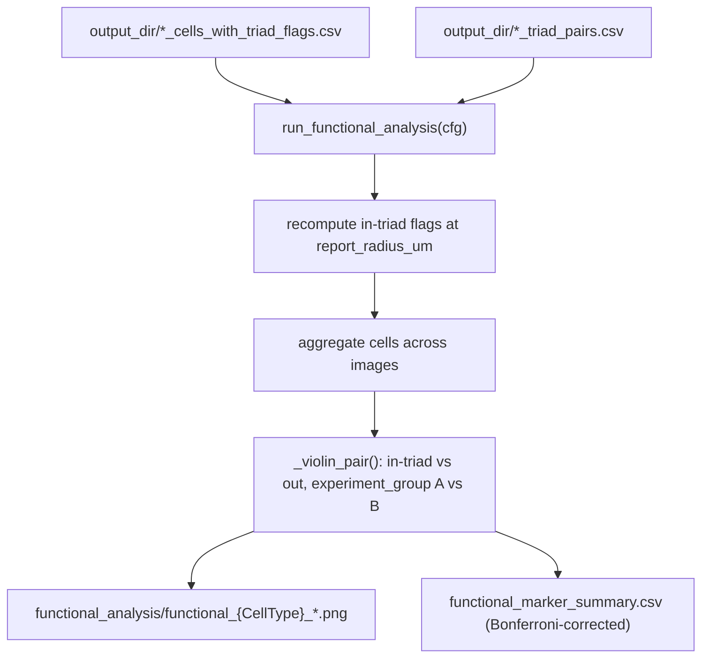

# `spatia/analysis/functional.py`

**Pipeline position:** Step 6a (optional, parallel to `survival`). `triads` → **functional**

## Purpose

Standalone functional-marker analysis step. Reads the per-image outputs already written by the `triads` step (`*_cells_with_triad_flags.csv`, `*_triad_pairs.csv`), recomputes in-triad membership at a (typically tighter) **functional reporting radius**, and for each configured cell type in the triad (anchor/partner1/partner2) compares marker expression two ways: (1) in-triad vs. not-in-triad cells (pooled across experiment_groups), and (2) experiment_group A vs. experiment_group B within in-triad cells only. Uses Mann-Whitney U tests with Bonferroni correction across all tests run. Each role can use its own marker panel (e.g. exhaustion markers on a T-cell partner, maturation markers on a DC anchor) via optional per-role marker overrides — see Config keys.

## Entry point

```python
from spatia.analysis.functional import run_functional_analysis
run_functional_analysis(cfg)   # run after the triads step
```

## Flow



## Key functions

| Function | Role |
|---|---|
| `_get_experiment_group(image_id, image_experiment_group_map, experiment_groups)` | Same experiment_group-lookup logic mirrored from `triads.py`. |
| `_violin_pair(ax, vals_a, vals_b, label_a, label_b, color_a, color_b, title)` | Draws a two-group violin plot with a Mann-Whitney U p-value and significance stars annotated; handles empty/small groups gracefully (returns `nan` p-value rather than erroring if either group has <3 values). |
| `run_functional_analysis(cfg)` | Main entry: discovers all `*_cells_with_triad_flags.csv`, re-derives in-triad flags at `report_radius_um` from the paired `*_triad_pairs.csv`, aggregates across images, then for each of anchor/partner1/partner2 runs both comparisons (in-triad vs out; experiment_group A vs B) per configured marker — using that role's own marker override if set, else the shared `markers` list — saving plots and a combined summary CSV with Bonferroni-corrected significance. |

## Config keys

- `experiment.name`, `.experiment_groups`, `.image_experiment_group_map`
- `paths.output_dir`
- `analysis.triad.anchor_type`/`.partner_type_1`/`.partner_type_2` and their `_name` display variants — read independently from the same `analysis.triad` config block `triads.py` uses. Note: `triads.py` itself no longer reads its `_name` variants (removed), but `functional.py` still does — they control this step's output filenames and the `cell_type` column in `functional_marker_summary.csv`, so don't remove them from a config that runs this step.
- `analysis.functional.enabled` (must be `true` to run)
- `analysis.functional.report_radius_um` (default `20.0`) — can be tighter than the triads step's detection radius
- `analysis.functional.markers` — `{display_name: column_name}` mapping, the **shared/default** marker set (column must exist in the cell CSVs, which requires marker-intensity columns to have been kept upstream during data prep — e.g. `prepare_crc_data.py`'s `KEEP_INTENSITIES=True`)
- `analysis.functional.markers_anchor` / `.markers_partner1` / `.markers_partner2` (all optional) — same `{display_name: column_name}` shape, per-role overrides. A role with no override falls back to `markers`. At least one of `markers`/`markers_anchor`/`markers_partner1`/`markers_partner2` must be non-empty or the step exits with nothing to run.

## Inputs / Outputs

- **In:** `{output_dir}/*_cells_with_triad_flags.csv`, `{output_dir}/*_triad_pairs.csv` (both from `triads.py`)
- **Out:** `{output_dir}/functional_analysis/functional_{CellType}_intriad_vs_out.png`, `functional_{CellType}_experiment_group_compare.png`, `functional_marker_summary.csv`

## Dependencies

`scipy.stats.mannwhitneyu`, `matplotlib`, `pandas`, `numpy`.

## Notes / risks

- **No skip-if-already-processed caching, by design — unlike `triads.py` (confidence: high).** The detection cost already happened in `triads.py` and is cached there. This step's actual work (Mann-Whitney U tests, violin plots, `functional_marker_summary.csv`) is a test statistic over the full pooled cohort, not per-image — there's no valid way to cache a "partial" p-value per image and merge it in. Adding a new image correctly costs a full re-pool + re-test every run, which is cheap (CSV reads + pandas concat, no KD-tree).
- **Missing marker columns are reported, not fatal (confidence: high).** If configured marker columns aren't present in the cell CSVs, the step prints which ones are missing and a reminder that the data-prep step must keep marker-intensity columns, then skips that cell type rather than failing the run. A misconfiguration silently produces a smaller `functional_marker_summary.csv` instead of an error — worth checking the row count against the number of (cell type × marker × comparison) combinations you expect.
- **Bonferroni correction is across *all* tests in the run, not per family (confidence: medium, methodological note).** `bonf_alpha = 0.05 / max(n_tests, 1)` is computed once over the full `all_summary` table — every cell-type × marker × comparison combination shares one correction. Conservative, but adding more markers to the config makes it statistically harder for any single existing marker to stay significant. Worth deciding if that's the intended multiple-testing scope.
- **A corrupted `*_triad_pairs.csv` fails loudly (confidence: high).** Prints the real read error and explicitly treats the image as having no in-triad cells, rather than silently reporting "0 in-triad cells" with no explanation.
- **Missing `analysis.triad.anchor_type`/`.partner_type_1`/`.partner_type_2` prints a warning up front (confidence: high).** Unlike `triads.py` (which has an exploratory permutation-search fallback when these are unset), `functional.py` has none — leaving them unset means every role finds 0 cells, so the warning fires before that happens rather than after.
