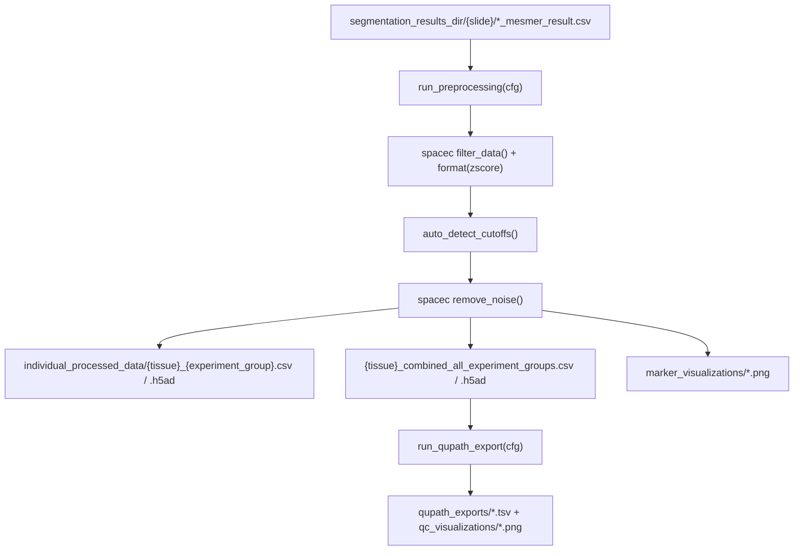

# `spatia/analysis/preprocessing.py`

**Pipeline position:** Step 3. `segmentation` → **preprocessing** → `cell_typing` → `triads` → `functional`/`survival`

## Purpose

Config-driven preprocessing of segmented spatial-proteomics data: QC filtering (cell size + DAPI), z-score normalization, automatic noise-cutoff detection (via `kneed`'s knee-point detection), and noise removal — using the `spacec` package's `filter_data`/`format`/`remove_noise`/`make_anndata` helpers. Also includes an optional second export step (`run_qupath_export`) that produces per-image QuPath TSVs and QC visualizations classifying every raw cell as Included/Excluded-and-why.

Ported from `04-0_preprocessing.ipynb`.

## Entry points

```python
from spatia.analysis.preprocessing import run_preprocessing, run_qupath_export
run_preprocessing(cfg)     # main pipeline
run_qupath_export(cfg)     # optional QC export, run after run_preprocessing
```

## Flow



## Key functions

| Function | Role |
|---|---|
| `extract_tissue_identifier(image_id, experiment_groups)` | Strips experiment_group labels and `_x1234_y5678` coordinate blocks from an image ID to get a stable tissue ID (used to group replicate images of the same tissue). |
| `detect_experiment_group(image_id, experiment_groups)` | Detects which experiment_group an image belongs to via prefix → suffix → unambiguous-substring match, in that priority order; returns `"Unknown"` if ambiguous or no match. |
| `_get_last_marker_col(df, last_marker)` | Finds the column index that separates marker columns from metadata columns — needed because `spacec`'s `remove_noise`/`make_anndata` split on a column index, not names. Falls back to the rightmost non-metadata column if `last_marker` isn't specified/found. |
| `auto_detect_cutoffs(df, col_num, cut_off=0.01, count_bin=50)` | Knee-detection (via `KneeLocator`) on histograms of per-cell marker count/sum to pick noise-removal thresholds automatically, with percentile fallback if the knee detector fails or lands below a sanity floor. |
| `run_preprocessing(cfg)` | Main pipeline: discovers `*_mesmer_result.csv` per slide folder → filter → normalize → detect noise cutoffs → remove noise → save per-experiment_group + combined h5ad/CSV → generate marker overlay visualizations → write processing stats CSV. Tees all stdout to a timestamped log file via `_DualLogger`, restored in a `finally` block. Returns `processing_errors` (per-image failures, aggregated) alongside `processing_stats`. |
| `run_qupath_export(cfg)` | Re-derives QC thresholds, classifies every raw (pre-filter) cell as `Included`/`Excl_SmallArea`/`Excl_LowDAPI`/`Excl_SmallArea_LowDAPI`/`Excl_Noise` by matching (x,y) coordinates back to the processed output, writes per-image QuPath TSVs + 3 QC panel images each. |

## Config keys

- `experiment.groups`
- `paths.segmentation_results_dir` — input (produced by `segmentation.py`)
- `paths.output_dir` — base output
- `preprocessing.last_marker` (e.g. `"SIGLEC F"`) — anchor for marker/metadata column split
- `preprocessing.qc_filter.size_percentile` (default `1`), `.dapi_percentile` (default `1`)
- `preprocessing.noise.cut_off` (default `0.01`), `.count_bin` (default `50`)

## Inputs / Outputs

- **In:** `{segmentation_results_dir}/{slide}/*_mesmer_result.csv`, matching `*_seg_output.pickle` for overlays
- **Out:** `combined_processed_data/individual_processed_data/{tissue}_{experiment_group}.{csv,h5ad}`, `..._combined_all_experiment_groups.{csv,h5ad}`, `marker_visualizations/*.png`, `processing_logs/*.txt` + `*.csv`; `qupath_exports/*.tsv`, `qupath_exports/qc_visualizations/*.png`
- **`run_preprocessing(cfg)` return dict:** `all_processed_tissues`, `processing_stats`, `processing_errors` (list of `{"file", "image_id", "error"}` for images that failed — see Notes/risks), `output_dir`

## Dependencies

`spacec`, `kneed`, `matplotlib`, `pandas`, `numpy`.

## Notes / risks

- **`sys.stdout` reassignment for logging is exception-safe (confidence: high).** `run_preprocessing` redirects `sys.stdout` to a `_DualLogger` for the duration of the run inside a `try/finally` — the restore happens in the `finally` block, so it runs even if an exception escapes the per-image `try/except` (e.g. a bad `segmentation_results_dir`, or an error in the save/visualization sections after the main loop).
- **`_classify_cells` in `run_qupath_export` is a Python `for` loop over every raw cell (confidence: high).** For large tissues this is O(n) pure-Python row-by-row work, unlike the vectorized approach used in `cell_typing.assign_cell_types_automatic`. Likely fine at current data sizes but would be the first thing to optimize if `run_qupath_export` becomes slow on bigger cohorts.
- **Column-index-based marker/metadata split has two loud-failure checks (confidence: medium).** `_get_last_marker_col` is a workaround for `spacec`'s API needing a column index rather than names, which is inherently a bit fragile — a marker panel that reorders columns, or a change to `spacec`'s expected ordering, could split markers from metadata wrong. Two checks surface that instead of failing silently: (1) if a configured `last_marker` isn't found in the columns, falling back to the rightmost non-metadata column prints a warning naming which column it picked; (2) after the split, if any column past the chosen boundary isn't in `METADATA_COLS` (looks like a marker, not metadata), a warning names it. Neither check raises — both are advisory — but a run that hits either warning is worth a manual look at panel column order.
- **Per-image failures are aggregated, not just printed (confidence: high).** The broad `except Exception` per image is still there — consistent with the rest of the pipeline (`segmentation.py`, `tif_conversion.py`: catch, log, continue, since one bad image shouldn't stop the batch) — but each failure is also appended to a `processing_errors` list (`{"file", "image_id", "error"}`), returned alongside `processing_stats`, and summarized in an unconditional one-line print every run, the same pattern `segmentation.py`'s `run_cell_segmentation` uses.
