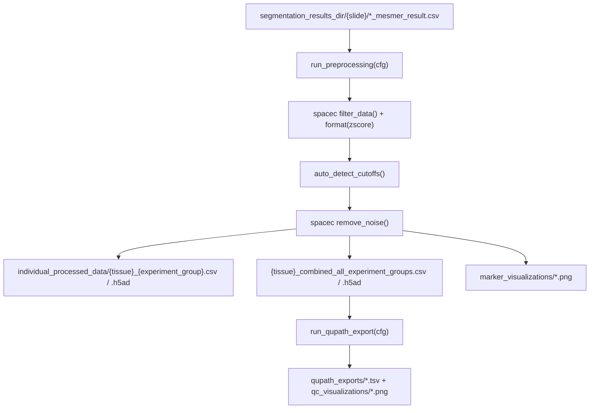

# `spatia/analysis/preprocessing.py`

**Pipeline position:** Step 3. `segmentation` → **preprocessing** → `cell_typing` → `triads` → `functional`/`survival`

## Purpose

Config-driven preprocessing of segmented spatial-proteomics data: QC filtering (cell size + DAPI), z-score normalization, automatic noise-cutoff detection (via `kneed`'s knee-point detection), and noise removal — using the `spacec` package's `filter_data`/`format`/`remove_noise`/`make_anndata` helpers. Also includes an optional second export step (`run_qupath_export`) that produces per-image QuPath TSVs and QC visualizations classifying every raw cell as Included/Excluded-and-why.

Ported from `04-0_preprocessing.ipynb`.

## Entry points

```python
from spatia.analysis.preprocessing import run_preprocessing, run_qupath_export
run_preprocessing(cfg)     # main pipeline
run_qupath_export(cfg)     # optional QC export, run after run_preprocessing
```

## Flow



## Key functions

| Function | Role |
|---|---|
| `extract_tissue_identifier(image_id, experiment_groups)` | Strips experiment_group labels and `_x1234_y5678` coordinate blocks from an image ID to get a stable tissue ID (used to group replicate images of the same tissue). |
| `detect_experiment_group(image_id, experiment_groups)` | Detects which experiment_group an image belongs to via prefix → suffix → unambiguous-substring match, in that priority order; returns `"Unknown"` if ambiguous or no match. |
| `_get_last_marker_col(df, last_marker)` | Finds the column index that separates marker columns from metadata columns — needed because `spacec`'s `remove_noise`/`make_anndata` split on a column index, not names. Falls back to the rightmost non-metadata column if `last_marker` isn't specified/found. |
| `auto_detect_cutoffs(df, col_num, cut_off=0.01, count_bin=50)` | Knee-detection (via `KneeLocator`) on histograms of per-cell marker count/sum to pick noise-removal thresholds automatically, with percentile fallback if the knee detector fails or lands below a sanity floor. |
| `run_preprocessing(cfg)` | Main pipeline: discovers `*_mesmer_result.csv` per slide folder → filter → normalize → detect noise cutoffs → remove noise → save per-experiment_group + combined h5ad/CSV → generate marker overlay visualizations → write processing stats CSV → **auto-generate the QC summary report** (`preprocessing_summary.generate_summary_report(cfg)`, non-fatal; added 2026-09-09, see Notes/risks and `docs/generate_preprocessing_summary.md`). Tees all stdout to a timestamped log file via `_DualLogger`, restored in a `finally` block. Returns `processing_errors` (per-image failures, aggregated) alongside `processing_stats`. Prints `[idx/n_total]` progress with an elapsed/ETA estimate per image (added 2026-09-09; see Notes/risks). |
| `run_qupath_export(cfg)` | Re-derives QC thresholds, classifies every raw (pre-filter) cell as `Included`/`Excl_SmallArea`/`Excl_LowDAPI`/`Excl_SmallArea_LowDAPI`/`Excl_Noise` by matching (x,y) coordinates back to the processed output, writes per-image QuPath TSVs + 3 QC panel images each. |

## Config keys

- `experiment.groups`
- `paths.segmentation_results_dir` — input (produced by `segmentation.py`)
- `paths.output_dir` — base output
- `preprocessing.last_marker` (e.g. `"SIGLEC F"`, or `"auto"` for the panel's actual last channel) - anchor for marker/metadata column split. Resolved via `channels.resolve_column()` against the real CSV columns (same as `nuclei_channel`) as of 2026-09-09, not matched literally - see Notes/risks. Omit entirely to keep the old behavior (rightmost non-metadata column, with a warning).
- `preprocessing.nuclei_channel` (default `"auto"`) — same resolution style as `segmentation.nuclei_channel`:
  `"auto"` picks the column matching `channels._NUCLEAR_RE` (e.g. `"HOECHST1 (C1)"`), or give an exact/unique
  substring column name. Added 2026-09-09; see Notes/risks below.
- `preprocessing.qc_filter.size_percentile` (default `1`), `.dapi_percentile` (default `1`)
- `preprocessing.noise.cut_off` (default `0.01`), `.count_bin` (default `50`)

## Inputs / Outputs

- **In:** `{segmentation_results_dir}/{slide}/*_mesmer_result.csv`, matching `*_seg_output.pickle` for overlays
- **Out:** `combined_processed_data/individual_processed_data/{tissue}_{experiment_group}.{csv,h5ad}`, `..._combined_all_experiment_groups.{csv,h5ad}`, `marker_visualizations/*.png`, `processing_logs/*.txt` + `*.csv`, `combined_processed_data/summary_report/*` (auto-generated, non-fatal -- see Notes/risks); `qupath_exports/*.tsv`, `qupath_exports/qc_visualizations/*.png`
- **`run_preprocessing(cfg)` return dict:** `all_processed_tissues`, `processing_stats`, `processing_errors` (list of `{"file", "image_id", "error"}` for images that failed — see Notes/risks), `output_dir`

## Dependencies

`spacec`, `kneed`, `matplotlib`, `pandas`, `numpy`.

## Notes / risks

- **`sys.stdout` reassignment for logging is exception-safe (confidence: high).** `run_preprocessing` redirects `sys.stdout` to a `_DualLogger` for the duration of the run inside a `try/finally` — the restore happens in the `finally` block, so it runs even if an exception escapes the per-image `try/except` (e.g. a bad `segmentation_results_dir`, or an error in the save/visualization sections after the main loop).
- **`_classify_cells` in `run_qupath_export` is a Python `for` loop over every raw cell (confidence: high).** For large tissues this is O(n) pure-Python row-by-row work, unlike the vectorized approach used in `cell_typing.assign_cell_types_automatic`. Likely fine at current data sizes but would be the first thing to optimize if `run_qupath_export` becomes slow on bigger cohorts.
- **Column-index-based marker/metadata split has two loud-failure checks (confidence: medium).** `_get_last_marker_col` is a workaround for `spacec`'s API needing a column index rather than names, which is inherently a bit fragile — a marker panel that reorders columns, or a change to `spacec`'s expected ordering, could split markers from metadata wrong. Two checks surface that instead of failing silently: (1) if a configured `last_marker` isn't found in the columns, falling back to the rightmost non-metadata column prints a warning naming which column it picked; (2) after the split, if any column past the chosen boundary isn't in `METADATA_COLS` (looks like a marker, not metadata), a warning names it. Neither check raises — both are advisory — but a run that hits either warning is worth a manual look at panel column order.
- **Per-image failures are aggregated, not just printed (confidence: high).** The broad `except Exception` per image is still there — consistent with the rest of the pipeline (`segmentation.py`, `tif_conversion.py`: catch, log, continue, since one bad image shouldn't stop the batch) — but each failure is also appended to a `processing_errors` list (`{"file", "image_id", "error"}`), returned alongside `processing_stats`, and summarized in an unconditional one-line print every run, the same pattern `segmentation.py`'s `run_cell_segmentation` uses.
- **Fixed 2026-09-09 — hardcoded `"DAPI"` column name broke 100% of preprocessing on real CRC data (confidence: high).** This module previously read `df["DAPI"]` directly (QC filter, `sp.pp.filter_data`'s `nuc_marker`, `list_keep`, the marker/metadata split, and every `run_qupath_export` DAPI reference) instead of resolving the nuclear column the way `segmentation.py` already resolves `nuclei_channel: "auto"`. This CRC panel's nuclear stain column is named `"HOECHST1 (C1)"`, not `"DAPI"` — `df["DAPI"]` raised `KeyError` on every one of the 138 real segmented cores, a 100% preprocessing failure with segmentation itself fully OK. Fixed by adding `channels.resolve_column()` (a `resolve_channel()` analog that matches against a flat list of DataFrame column names, since preprocessing reads already-exported CSVs and has no raw-stack `StackInfo` to resolve against) and threading the resolved column through every function that used to hardcode `"DAPI"` — `_get_last_marker_col`, `_classify_cells`, the QC filter, normalization's `list_keep`, the marker-viz `METADATA` set, and `run_qupath_export`'s TSV/plotting code. New config key: `preprocessing.nuclei_channel` (default `"auto"`).
- **Fixed 2026-09-09 - `last_marker` was matched literally against columns, silently correct only by coincidence (confidence: high).** `preprocessing.last_marker: "DRAQ5"` never matched the real column `"DRAQ5 (C92)"`; `_get_last_marker_col` printed a warning and fell back to the rightmost non-metadata column, which happened to be right here only because DRAQ5 genuinely is the last acquisition channel. On a panel where the configured last marker is NOT the rightmost column, that same fallback would silently pick the wrong marker/metadata boundary instead of erroring - no crash, just a quietly wrong split. `last_marker` is now resolved via `resolve_column()` (same exact/prefix/substring matching as `nuclei_channel`, plus `"auto"` support via `auto_position="last"`, mirroring `resolve_channel()`'s own `last_marker` `"auto"` - always the panel's actual last channel) before being handed to `_get_last_marker_col`, so a wrong or ambiguous value now raises instead of falling back silently. The rightmost-column fallback still applies, unchanged, when `last_marker` is omitted entirely.
- **Corrected same-day (2026-09-09) — the first `resolve_column()` cut of `"auto"` was itself wrong on real data (confidence: high).** The first version matched `"auto"` by finding the unique column matching `_NUCLEAR_RE` across all columns — but this is a 23-cycle CODEX panel, and CODEX re-images the nuclear stain once per cycle, so **24** columns legitimately look nuclear (`HOECHST1`-`HOECHST23` + `DRAQ5`), not one. Every one of the 138 cores failed a second time with `'auto' ... is ambiguous -- 24 columns look nuclear`. Fixed by having `run_preprocessing`/`run_qupath_export` read the acquisition panel file (`paths.channel_file`, the same file segmentation used) via `channels.read_panel()` once per run and pass it to `resolve_column()` as `panel_names`; `"auto"` now resolves to `panel_names[0]` — the exact same value `resolve_channel()` (and therefore segmentation itself) resolves for `nuclei_channel: "auto"`, since that function's `"auto"`/`nuclei_channel` branch always returns index 0 regardless of cycle count. This keeps preprocessing's notion of "auto" in lockstep with whatever segmentation actually used, instead of guessing from column names alone. If `panel_names` isn't available (channel_file missing/unreadable), `resolve_column()` falls back to the old unique-`_NUCLEAR_RE`-match behavior, which is still correct for a single-cycle (non-CODEX) panel but will raise the same ambiguity error on a multi-cycle one. Logic verified against the real 24-column list and the real panel order from this run's traceback; the actual Seadragon re-run was still pending at commit time.
- **Added 2026-09-09 -- auto-generates the QC summary report at the end of every run (confidence: high, see `docs/generate_preprocessing_summary.md` for full detail).** Previously the report (tissue/group/removal-reasons/marker-level QC across the whole run) was a separate manual script the user had to remember to run. It's now called from the tail end of `run_preprocessing()` itself -- `generate_summary_report(cfg)`, imported from the new `spatia/analysis/preprocessing_summary.py` module -- wrapped in a local `try/except Exception` so a bug in report generation is printed as a warning and never fails the `preprocessing` step or blocks downstream steps (`cell_typing`, `triads`, ...). The old standalone script `generate_preprocessing_summary.py` at the repo root still exists, now as a thin CLI around the same function, for cheaply re-rendering the report without re-running (often hours-long) image processing.
- **Added 2026-09-09 — per-image progress/ETA reporting (confidence: high).** `run_preprocessing()` had no progress visibility during a long run — unlike `segmentation.py`'s `run_cell_segmentation()`, which already prints `[idx/n_total]` plus elapsed/ETA per image. Added the same instrumentation here: since this loop is nested (`for slide_folder ... for csv_file ...`), `n_total` is computed with a one-time pre-scan across all slide folders before the main loop starts, and a single `idx` counter increments across both loop levels (not derived from either `enumerate()` alone). Already-processed images (the `_processed_files_exist()` skip branch) count toward `n_already_done` so the ETA average isn't skewed by instant skips, same reasoning as segmentation.py.
- **Fixed 2026-09-09 — 3rd occurrence of the macOS AppleDouble sidecar bug (confidence: high).** `run_preprocessing` and `run_qupath_export` both discovered CSVs with `f.endswith("mesmer_result.csv")`, which also matches AppleDouble resource-fork files like `._reg004_X01_Y01_Z07_mesmer_result.csv` (binary metadata sidecars macOS creates when data is copied/browsed over HFS+/APFS) and threw a UTF-8 decode error trying to `pd.read_csv` one. Same bug class already fixed in `segmentation.py::_find_masked_tifs()` (2026-09-03) and `validation.py::validate_segmentation()` (2026-09-08); fixed here the same way — `and not f.startswith("._")` on both file-discovery list comprehensions.
