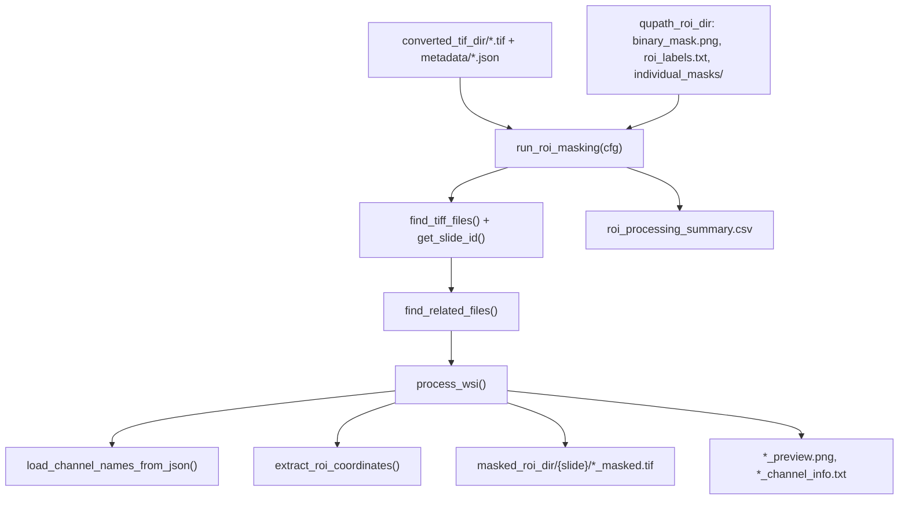

# `spatia/analysis/roi_masking.py`

**Pipeline position:** Step 1. `tif_conversion` → **roi_masking** → `segmentation` → `preprocessing` → ...

## Purpose

Crops and masks region-of-interest (ROI) sub-images out of whole-slide/whole-core multiplexed TIFFs, using binary masks exported from QuPath (manual ROI workflow or automatic TMA-dearray script). Produces one masked multichannel TIFF per ROI, ready for segmentation.

Ported from `02_masked_tif.ipynb`. Notably, the original notebook prompted interactively for experiment_group prefixes; this version reads `experiment.groups` from config instead so it can run headlessly.

## Entry point

```python
from spatia.analysis.roi_masking import run_roi_masking
run_roi_masking(cfg)
```

## Flow



## Key functions

| Function | Role |
|---|---|
| `find_tiff_files(directory)` | Lists `.tif`/`.tiff` in a directory. |
| `load_channel_names_from_json(tiff_path, metadata_dir)` | Reads channel names from the JSON written by `tif_conversion`, trying several known schemas (`channel_names`, `channels`, OME, `panel`, `markers`, `ome_xml`). |
| `get_slide_id(filename, experiment_groups)` | Derives a stable slide ID by stripping experiment_group prefix + coordinate suffix from a filename. |
| `find_related_files(slide_id, masks_dir)` | Locates `{slide_id}_binary_mask.png`, `{slide_id}_roi_labels.txt`, and `individual_masks/{slide_id}/` for a slide, with glob fallbacks if exact names don't match. |
| `extract_roi_coordinates(roi_name, roi_df=None)` | Parses `x{x}_y{y}_w{w}_h{h}` from the ROI filename, or falls back to a lookup in the ROI label table. |
| `process_wsi(...)` | Per-slide worker: crops every ROI, applies the whole-tissue binary mask *and* the individual ROI mask, writes a multichannel TIFF + preview PNG + channel-info TXT per ROI. |
| `run_roi_masking(cfg)` | Orchestrates: finds TIFFs, matches each to its QuPath masks, calls `process_wsi`, writes `roi_processing_summary.csv`. |

## Config keys

- `experiment.groups` (reused from elsewhere in config)
- `paths.converted_tif_dir` — input; defaults to `<output_dir>/converted_tif/`
- `paths.qupath_roi_dir` — **required**; output of the QuPath ROI/TMA export
- `paths.masked_roi_dir` — output; defaults to `<output_dir>/masked_rois/`

## Inputs / Outputs

- **In:** converted TIFFs + `metadata/*.json`; QuPath `{slide}_binary_mask.png`, `{slide}_roi_labels.txt`, `individual_masks/{slide}/{experiment_group}_*.png`
- **Out:** `masked_roi_dir/{slide_id}/{experiment_group}_{slide_id}_x{x}_y{y}_w{w}_h{h}_masked.tif` (+ `_preview.png`, `_channel_info.txt`), `masked_roi_dir/roi_processing_summary.csv`

## Dependencies

`tifffile`, `imageio`, `scikit-image` (`transform`, `io`), `Pillow` (with `MAX_IMAGE_PIXELS = None` to allow huge images), `matplotlib`.

## Notes / risks

- **Per-channel exception swallowing inside the crop loop (confidence: high).** In `process_wsi`, each channel's crop is wrapped in its own `try/except` that just prints and continues — a channel that fails to read leaves that slice as zeros in `roi_output` rather than aborting the ROI. A partially-black channel in the output TIFF would look like real (very low) signal downstream unless someone notices the printed error. Worth deciding if this should hard-fail instead.
- **Coordinate parsing has two independent code paths that can disagree (confidence: medium).** `extract_roi_coordinates` first tries a regex on the ROI filename, then falls back to the ROI label table — if both exist but disagree (e.g. stale filenames vs. updated label table), the regex silently wins with no warning.
- **Memory usage on whole-slide images (confidence: medium).** `Image.MAX_IMAGE_PIXELS = None` disables Pillow's decompression-bomb protection, which is necessary for legitimate whole-slide images but also means a corrupted/oversized file won't be caught early — it'll just consume memory until something else fails.
- **`get_slide_id` regex logic is intricate (confidence: low‑medium).** The prefix-stripping loop has an early `return` nested three loops deep; for filenames that don't match any experiment_group prefix, it falls through to a second regex on `_x\d+_y\d+`. Worth a couple of unit tests against your real filename conventions if slide IDs ever look wrong.
