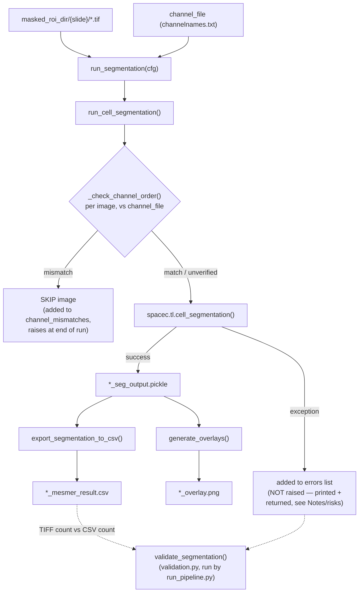

# `spatia/analysis/segmentation.py`

**Pipeline position:** Step 2. `tif_conversion` → `roi_masking` → **segmentation** → `preprocessing` → ...

## Purpose

Runs cell segmentation (Mesmer or Cellpose, via the `spacec` package) on masked ROI TIFFs, exports per-cell measurements to CSV in the exact filename/shape `preprocessing.py` expects (`*_mesmer_result.csv`), and generates QC overlay images. This module is what "closes the loop" so the pipeline can start from raw images instead of assuming pre-segmented CSVs already exist.


## Entry point

```python
from spatia.analysis.segmentation import run_segmentation
run_segmentation(cfg)
```

## Flow



## Key functions

| Function | Role |
|---|---|
| `run_cell_segmentation(processed_rois_dir, channel_file_path, output_dir, seg_method="mesmer", ..., channel_check=True)` | Walks masked ROI TIFFs, checks each one's own channel order against `channel_file_path` (see below), calls `spacec.tl.cell_segmentation` per file that passes, pickles the raw seg output as `*_seg_output.pickle`. Idempotent — skips files with an existing pickle. **Returns `{"outputs": {...}, "errors": [...]}`** — `errors` is `[{"file", "error"}, ...]` for any image whose `spacec` call raised; these are *not* auto-raised (unlike channel mismatches) but are always summarized in the printed output and checked afterward by `validate_segmentation()`. |
| `_read_channel_file(channel_file_path)` | Parses `channelnames.txt` — one channel name per line, in stack order. |
| `_read_tiff_channel_labels(tiff_path)` | Per-image channel order, as written by `roi_masking.py`. Prefers the TIFF's own embedded ImageJ `Labels` metadata; falls back to the sidecar `..._channel_info.txt` next to it. Returns `None` if neither exists. Special-cases single-channel images — see Notes/risks. |
| `_check_channel_order(tiff_path, expected_channels)` | Compares an image's own channel order (via the function above) against `channel_file_path`'s order. Returns `(True, msg)` on match, `(False, msg)` on a count or name/order mismatch, `(None, msg)` if there's nothing to check against (proceeds unverified, doesn't block). |
| `export_segmentation_to_csv(output_dir)` | Converts every `*_seg_output.pickle` into `*_mesmer_result.csv` via `skimage.measure.regionprops_table` (label, centroid, area, eccentricity, perimeter, axis lengths) plus per-channel mean intensity. |
| `generate_overlays(output_dir, ...)` | Calls `spacec.pl.show_masks` to save `<roi>_overlay.png` QC images. |
| `run_segmentation(cfg)` | Orchestrates all steps above from config. |

## Config keys

- `paths.masked_roi_dir` — input; defaults to `<output_dir>/masked_rois/`
- `paths.channel_file` — **required**; path to `channelnames.txt`
- `paths.segmentation_results_dir` — **required**; output — the same directory `preprocessing.run_preprocessing()` reads from
- `segmentation.seg_method` (default `"mesmer"`)
- `segmentation.nuclei_channel` (default `"DAPI"`)
- `segmentation.membrane_channel_list` (default `["CD45"]`)
- `segmentation.compartment` (default `"whole-cell"`)
- `segmentation.input_format` (default `"Multichannel"`)
- `segmentation.resize_factor` (default `1`)
- `segmentation.size_cutoff` (default `0`)
- `segmentation.generate_overlays` (default `True`)
- `segmentation.channel_check` (default `True`) — verify each image's own channel order against `channel_file` before segmenting it; see Notes/risks below

## Inputs / Outputs

- **In:** `masked_roi_dir/{slide}/*.tif` (from `roi_masking`), `channel_file` (channel-name mapping)
- **Out:** `segmentation_results_dir/{slide}/*_seg_output.pickle`, `*_mesmer_result.csv`, `*_overlay.png`
- **`run_segmentation(cfg)` return dict:** `segmentation_outputs`, `segmentation_errors` (list of `{"file", "error"}` for images that failed segmentation — see Notes/risks), `csv_files`, `overlay_files`, `output_dir`

## Dependencies

`spacec` (heavy — pulls in torch/tensorflow via Mesmer/Cellpose backends), `scikit-image`, `matplotlib`.

## Notes / risks

- **Per-image channel-order validation (confidence: high).** `_check_channel_order()` compares each image's *own* channel order — read from the ImageJ `Labels` metadata `roi_masking.py` embeds in every masked TIFF, or its `..._channel_info.txt` sidecar as a fallback — against `channel_file_path` before segmenting it. `spacec` maps channel names onto the stack positionally with no error of its own, so without this check, images that don't share the batch's channel count/order (different scan batches, panel revisions, scanner export quirks) would be silently mislabeled. A mismatched image is skipped rather than segmented with wrong labels, and `run_cell_segmentation` raises a `RuntimeError` at the end summarizing every mismatch found, so a mismatch can't pass silently. Set `segmentation.channel_check: false` to disable this check.
  - **Residual limitation (confidence: high, by design, not a bug).** This only catches mismatches for images that actually have per-image channel metadata. Masked ROIs produced by an older run of `roi_masking.py`, or by any tool other than this pipeline's own `roi_masking.py`, won't have the embedded `Labels` or sidecar file to check against — those proceed unverified, since the check has nothing to compare against. If you have a backlog of pre-existing masked ROIs you're not sure about, the safest move is a one-off manual channel-order audit rather than assuming this check covers them.
  - **Single-channel images need special handling in `_read_tiff_channel_labels()` (confidence: high).** `tifffile` round-trips a single-element `Labels` list (e.g. `["DAPI"]`) as a bare string (`"DAPI"`) rather than a length-1 list. `_read_tiff_channel_labels()` checks `isinstance(labels, str)` before wrapping it in a list — without that guard, `list("DAPI")` would silently explode into `['D', 'A', 'P', 'I']`, a false 4-channel reading that breaks channel-count comparison for any real single-channel masked ROI (e.g. a DAPI-only panel).

- **Per-file segmentation failures are aggregated and summarized, but deliberately not auto-raised (confidence: high).** `run_cell_segmentation` collects every per-image failure into an `errors` list (`{"file", "error"}`) and returns `{"outputs": ..., "errors": ...}` — `run_segmentation(cfg)`'s own return dict passes this through as `segmentation_errors`. An unconditional one-line summary prints every run (`"Segmentation summary: N succeeded, M failed, ..."`), visible whether or not anything went wrong. The function deliberately does not raise on this, unlike the channel-mismatch check: a one-off `spacec`/Mesmer crash on a single image (OOM, a corrupt tile) is treated the same way the rest of the codebase treats per-image failures elsewhere (`preprocessing.py`, `tif_conversion.py`: catch, log, continue). A channel mismatch is a *correctness* bug (the output would be actively wrong if segmentation proceeded); a generic exception is a *coverage* gap (one fewer image) — the two failure modes get different responses by design. The coverage gap is instead caught by `validate_segmentation()` in `validation.py` (see that doc), which compares masked-ROI-TIFF count against produced-CSV count on disk and fails validation on a shortfall — `run_pipeline.py` halts on a failed validation, so a silent partial failure stops the pipeline before `preprocessing` runs on an incomplete image set, without `segmentation.py` itself needing to decide how many failures is too many.
- **Channel intensity extraction assumes exact array-shape match (confidence: medium).** In `export_segmentation_to_csv`, a channel's intensity is only extracted `if ch_data.shape == mask.shape` — if `spacec` ever returns a channel at a different resolution than the mask (e.g. due to `resize_factor`), that channel is silently dropped from the CSV with no column, not even a NaN column. Something to check for after any run where `resize_factor != 1`.
