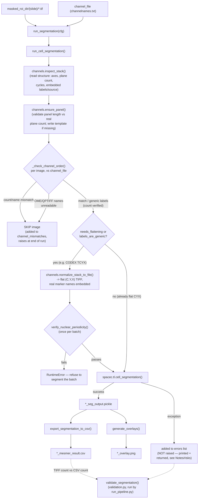

# `spatia/analysis/segmentation.py`

**Pipeline position:** Step 2. `tif_conversion` → `roi_masking` → **segmentation** → `preprocessing` → ...

**Updated 2026-09-04** — see [`docs/spatia_analysis_channels.md`](spatia_analysis_channels.md) for the new structure-detection/normalization module this file now depends on, and the changelog block at the top of `segmentation.py` itself for the full incident this fixed (all real CRC TMA cores rejected as "channel mismatch" on 2026-09-03).

## Purpose

Runs cell segmentation (Mesmer or Cellpose, via the `spacec` package) on masked ROI TIFFs, exports per-cell measurements to CSV in the exact filename/shape `preprocessing.py` expects (`*_mesmer_result.csv`), and generates QC overlay images. This module is what "closes the loop" so the pipeline can start from raw images instead of assuming pre-segmented CSVs already exist.

As of 2026-09-04, this module also normalizes CODEX/PhenoCycler-style raw acquisitions (ImageJ hyperstacks where cycles and channels are separate axes) into flat, honestly-labeled TIFFs before handing them to `spacec` — see `spatia/analysis/channels.py`. `spacec` reads the file path it's given directly and always treats axis 0 as the channel axis; on an un-normalized hyperstack that means it silently mis-slices the array (this is what produced `IndexError: index 23 is out of bounds for axis 0 with size 23` on a perfectly good file, `reg021_X01_Y01_Z08.tif`, on 2026-09-03).


## Entry point

```python
from spatia.analysis.segmentation import run_segmentation
run_segmentation(cfg)
```

## Flow



Normalized copies are deleted right after their image is segmented unless `keep_normalized: true` — see Config keys below.

## Key functions

| Function | Role |
|---|---|
| `run_cell_segmentation(processed_rois_dir, channel_file_path, output_dir, seg_method="mesmer", ..., channel_check=True)` | Walks masked ROI TIFFs, checks each one's own channel order against `channel_file_path` (see below), calls `spacec.tl.cell_segmentation` per file that passes, pickles the raw seg output as `*_seg_output.pickle`. Idempotent — skips files with an existing pickle. **Returns `{"outputs": {...}, "errors": [...]}`** — `errors` is `[{"file", "error"}, ...]` for any image whose `spacec` call raised; these are *not* auto-raised (unlike channel mismatches) but are always summarized in the printed output and checked afterward by `validate_segmentation()`. |
| `_read_channel_file(channel_file_path)` | Parses `channelnames.txt` — one channel name per line, in stack order. |
| `_read_tiff_channel_labels(tiff_path)` | Per-image channel order, as written by `roi_masking.py`. Prefers the TIFF's own embedded ImageJ `Labels` metadata; falls back to the sidecar `..._channel_info.txt` next to it. Returns `None` if neither exists. Special-cases single-channel images — see Notes/risks. |
| `_check_channel_order(tiff_path, expected_channels, info=None)` | **Rewritten 2026-09-04.** Dispatches on what the image actually carries, via `channels.StackInfo`: real embedded names → compare name-for-name as before; generic/absent labels (raw CODEX) → compare **plane count** instead, since names were never comparable; a format that normally carries names but couldn't be read (OME-TIFF/QPTIFF) → `(False, msg)`, refusing to guess. Returns `(True, msg)` on match, `(False, msg)` on a real mismatch, `(None, msg)` if generic labels but count matches (proceeds, doesn't block). |
| `export_segmentation_to_csv(output_dir)` | Converts every `*_seg_output.pickle` into `*_mesmer_result.csv` via `skimage.measure.regionprops_table` (label, centroid, area, eccentricity, perimeter, axis lengths) plus per-channel mean intensity. |
| `generate_overlays(output_dir, ...)` | Calls `spacec.pl.show_masks` to save `<roi>_overlay.png` QC images. |
| `run_segmentation(cfg)` | Orchestrates all steps above from config. Return dict now also includes the *resolved* `nuclei_channel` / `membrane_channel_list` / `channel_names` (see Inputs/Outputs) — needed because the config may say `"auto"` or a short name, not the literal panel string. |

## Config keys

- `paths.masked_roi_dir` — input; defaults to `<output_dir>/masked_rois/`
- `paths.channel_file` — **required unless `auto_panel_template: true`**; path to `channelnames.txt`
- `paths.segmentation_results_dir` — **required**; output — the same directory `preprocessing.run_preprocessing()` reads from
- `segmentation.seg_method` (default `"mesmer"`)
- `segmentation.nuclei_channel` (default `"auto"` as of 2026-09-04, was `"DAPI"`) — `"auto"` resolves to channel 1 of cycle 1 (the CODEX/PhenoCycler nuclear convention); a short name (`"CD45"`) resolves against the full panel entry via `channels.resolve_channel()`; ambiguous short names raise rather than guessing — see `channels.py` docs
- `segmentation.membrane_channel_list` (default `["CD45"]`) — same short-name/`"auto"` resolution as above
- `segmentation.compartment` (default `"whole-cell"`)
- `segmentation.input_format` (default `"Multichannel"`)
- `segmentation.resize_factor` (default `1`)
- `segmentation.size_cutoff` (default `0`)
- `segmentation.generate_overlays` (default `True`)
- `segmentation.channel_check` (default `True`) — verify each image's own channel order (or plane count, for generically-labeled acquisitions) against `channel_file` before segmenting it; see Notes/risks below
- `segmentation.normalized_dir` **(new 2026-09-04)** — where flattened/relabeled copies of hyperstack images are written; defaults to `<segmentation_results_dir>/_normalized`. `paths.converted_tif_dir` is used as a fallback if set.
- `segmentation.keep_normalized` **(new 2026-09-04, default `False`)** — a normalized copy is the same size as its source (~508 MB per CRC core). Left `False`, each is deleted right after its image is segmented, so peak extra disk is one file rather than a second copy of the dataset.
- `segmentation.auto_panel_template` **(new 2026-09-04, default `True`)** — if `channel_file` doesn't exist, write a positional placeholder panel (`"cyc01_ch1"`, ...) sized from the first image instead of hard-failing, so the run's mechanics can be smoke-tested. The printed warning is not decorative — those names are not real marker identity.

## Inputs / Outputs

- **In:** `masked_roi_dir/{slide}/*.tif` (from `roi_masking`, or raw CODEX hyperstacks as of 2026-09-04), `channel_file` (channel-name mapping)
- **Out:** `segmentation_results_dir/{slide}/*_seg_output.pickle`, `*_mesmer_result.csv`, `*_overlay.png`; `normalized_dir/{slide}/*.tif` (transient — deleted per-image unless `keep_normalized: true`)
- **`run_segmentation(cfg)` return dict:** `segmentation_outputs`, `segmentation_errors` (list of `{"file", "error"}` for images that failed segmentation — see Notes/risks), `csv_files`, `overlay_files`, `output_dir`, and **new 2026-09-04**: `nuclei_channel` / `membrane_channel_list` (the *resolved* panel entries, not the literal config value — e.g. `"auto"` resolves to `"HOECHST1"`), `channel_names` (the full resolved panel used for the run)

## Dependencies

`spacec` (heavy — pulls in torch/tensorflow via Mesmer/Cellpose backends), `scikit-image`, `matplotlib`, `spatia.analysis.channels` (new 2026-09-04, in-repo — no new external dependency).

## Notes / risks

- **Per-image channel validation, revised 2026-09-04 (confidence: high — this replaced a check that was actively wrong for a whole class of real input).** The original design assumed every masked ROI's embedded `Labels` would carry real marker names (true for `roi_masking.py` output) and compared them name-for-name against `channel_file_path`. That assumption broke on 2026-09-03: raw CODEX/PhenoCycler acquisitions embed scanner placeholders (`"ch1".."ch4"`, repeating once per cycle) with **no marker identity at all**, so the name comparison rejected all 137 real CRC TMA cores as "mismatched" — nothing was actually wrong with them. `_check_channel_order()` now dispatches on what the image demonstrably carries (`channels.StackInfo`): real names → name-for-name as before; generic or absent labels → **plane count** against the panel (the comparison that actually catches a truncated acquisition or a panel from the wrong experiment); a format that normally carries names but couldn't be read (OME-TIFF/QPTIFF) → fails loud rather than falling through to the generic path, since that file may already have real, different names that a positional panel application would silently overwrite. `channel_check` still defaults to `True` and a mismatch still skips the image and raises a summarizing `RuntimeError` at the end — the check got more accurate, not weaker.
  - **New: nuclear-periodicity verification (confidence: medium-high — validated on synthetic data + one real core by hand this session, not yet on a full production run).** For CODEX-style acquisitions, flattening the hyperstack to a flat channel stack is *assumed* cycle-major (all 4 channels of cycle 1, then all 4 of cycle 2, ...). If that assumption were wrong for some acquisition variant, every marker after channel 4 would carry the wrong name with no error — the single most dangerous failure mode in this whole change. `channels.verify_nuclear_periodicity()` checks this on pixels, not metadata: in CODEX, channel 1 of every cycle re-images the same nuclei, so those planes must correlate (r ≥ 0.5 threshold; the real TMA_A core checked by hand this session came back at r = 0.87–0.92 across all 23 nuclear positions). Runs once per batch; a failure halts the entire run rather than proceeding on a possibly-scrambled panel.
  - **Residual limitation (confidence: high, by design, not a bug).** Images with genuinely no channel metadata at all (pre-existing masked ROIs from an older `roi_masking.py` run, or a hand-built TIFF) still proceed unverified on names — but as of 2026-09-04 they are still verified on **plane count**, which was not true before. A backlog of pre-existing masked ROIs you're not fully sure about is still worth a one-off manual audit rather than assuming plane-count agreement is sufficient proof of correct order.
  - **Single-channel images need special handling in `_read_tiff_channel_labels()` (confidence: high).** `tifffile` round-trips a single-element `Labels` list (e.g. `["DAPI"]`) as a bare string (`"DAPI"`) rather than a length-1 list. `_read_tiff_channel_labels()` checks `isinstance(labels, str)` before wrapping it in a list — without that guard, `list("DAPI")` would silently explode into `['D', 'A', 'P', 'I']`, a false 4-channel reading that breaks channel-count comparison for any real single-channel masked ROI (e.g. a DAPI-only panel).

- **Normalization disk cost (confidence: high — new 2026-09-04).** Each hyperstack image is flattened to a same-size flat TIFF before segmenting (~508 MB per CRC core). With `keep_normalized: false` (default), that copy is deleted immediately after its own image is segmented, so peak *extra* disk at any moment is one file, not a second copy of the ~72 GB four-folder dataset. Setting `keep_normalized: true` — useful for inspecting the flattened output, or to let a re-run skip the flatten step — means budgeting for a full second copy of whatever fraction of the dataset gets segmented.

- **Per-file segmentation failures are aggregated and summarized, but deliberately not auto-raised (confidence: high).** `run_cell_segmentation` collects every per-image failure into an `errors` list (`{"file", "error"}`) and returns `{"outputs": ..., "errors": ...}` — `run_segmentation(cfg)`'s own return dict passes this through as `segmentation_errors`. An unconditional one-line summary prints every run (`"Segmentation summary: N succeeded, M failed, ..."`), visible whether or not anything went wrong. The function deliberately does not raise on this, unlike the channel-mismatch check: a one-off `spacec`/Mesmer crash on a single image (OOM, a corrupt tile) is treated the same way the rest of the codebase treats per-image failures elsewhere (`preprocessing.py`, `tif_conversion.py`: catch, log, continue). A channel mismatch is a *correctness* bug (the output would be actively wrong if segmentation proceeded); a generic exception is a *coverage* gap (one fewer image) — the two failure modes get different responses by design. The coverage gap is instead caught by `validate_segmentation()` in `validation.py` (see that doc), which compares masked-ROI-TIFF count against produced-CSV count on disk and fails validation on a shortfall — `run_pipeline.py` halts on a failed validation, so a silent partial failure stops the pipeline before `preprocessing` runs on an incomplete image set, without `segmentation.py` itself needing to decide how many failures is too many.
- **Channel intensity extraction assumes exact array-shape match (confidence: medium).** In `export_segmentation_to_csv`, a channel's intensity is only extracted `if ch_data.shape == mask.shape` — if `spacec` ever returns a channel at a different resolution than the mask (e.g. due to `resize_factor`), that channel is silently dropped from the CSV with no column, not even a NaN column. Something to check for after any run where `resize_factor != 1`.
