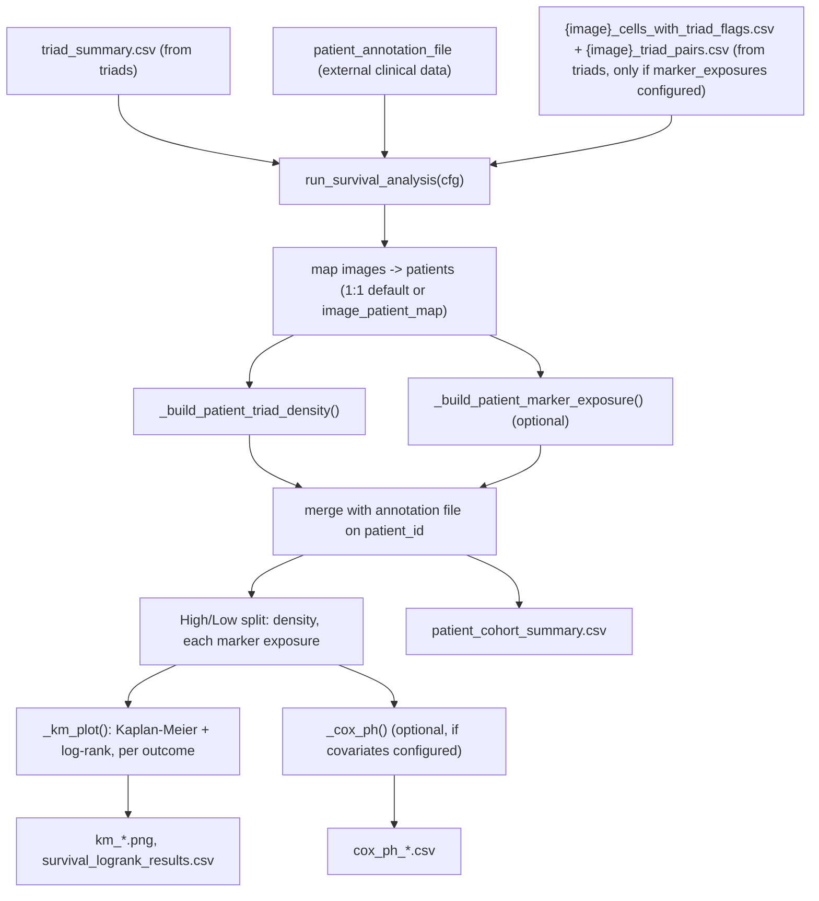

# `spatia/analysis/survival.py`

**Pipeline position:** Step 6b (optional, parallel to `functional`; if `marker_exposures` is configured, must run after `functional` has also completed since it reads the same per-image files). `triads` → `functional` → **survival**

## Purpose

Correlates per-patient (subject) triad density — and, optionally, per-patient functional-marker exposure — with clinical outcomes (Kaplan-Meier + log-rank, plus optional multivariate Cox PH). Dataset-agnostic: no hardcoded annotation-file column names, image→patient mapping, or group-code map — all config-driven (see Config keys below).

## Entry point

```python
from spatia.analysis.survival import run_survival_analysis
run_survival_analysis(cfg)   # run after triads (and functional, if marker_exposures is set)
```

## Image → patient/subject mapping

- **Default: 1:1** — `image_id` *is* the patient/subject ID. Works out of the box for any cohort where each processed image is one subject (e.g. a WSI cohort like PirB, one image per animal).
- **Optional override: `analysis.survival.image_patient_map`** — `{image_id: patient_id}`, for cohorts where multiple images belong to one patient (e.g. a TMA with several cores per patient). Same override pattern as `experiment.image_experiment_group_map` used elsewhere in this pipeline.

## Flow



## Key functions

| Function | Role |
|---|---|
| `_map_image_to_patient(image_id, image_patient_map)` | 1:1 by default; `image_patient_map` overrides for multi-image-per-patient cohorts. |
| `_normalize_code(x)` | Normalizes a code so `1`, `1.0`, `"1"`, `"1.0"` all compare equal — avoids forcing everything to `int` (which broke on non-numeric patient/group IDs in the previous version). |
| `_build_patient_triad_density(triad_summary, all_image_ids, image_patient_map, area_per_image_um2)` | Aggregates per-image triad counts (including 0-triad images) to patient level via the image→patient mapping, computes triads/mm² using a flat per-image area constant. |
| `_compute_in_triad_ids(output_dir, image_id, report_radius_um)` | Reads `*_triad_pairs.csv`, filters to `report_radius_um`, returns the set of cell IDs in any triad — mirrors `functional.py`'s own in-triad recompute logic so a "marker exposure" number here means the same thing `functional.py`'s numbers do. |
| `_build_patient_marker_exposure(output_dir, all_image_ids, image_patient_map, marker_exposures_cfg, report_radius_um)` | For each configured marker exposure, computes a per-image mean marker intensity (optionally restricted to in-triad cells of a configured `cell_type`), then aggregates to patient level as a cell-count-weighted mean across that patient's images. Returns `None` if `marker_exposures` isn't configured. |
| `_load_annotation(annot_file, patient_id_col, group_col, group_code_map, experiment_groups)` | Loads the external annotation file. Keeps **every** column (no hardcoded clinical-field allowlist); standardizes `patient_id` to a string key; adds `experiment_group_label` if `group_col` is configured (explicit `group_code_map`, or a positional guess from `experiment.groups` with a printed warning). |
| `_km_plot(df, duration_col, event_col, censor_is_one, group_col, title, save_path)` | Kaplan-Meier curves for the groups in `group_col` + log-rank test if exactly 2 groups. Generic — no longer assumes `"High"`/`"Low"` are the only possible labels. |
| `_cox_ph(patient_df, duration_col, event_col, censor_is_one, covariate_cols, save_path)` | Multivariate Cox proportional-hazards regression (`lifelines.CoxPHFitter`) across the configured covariates. **New this session** — long promised in the module docstring, never implemented until now. Off by default; only runs if `analysis.survival.covariates` is non-empty. Categorical covariates are one-hot encoded. Skips (with a printed reason) if there are too few complete cases relative to the number of covariates, or if the fit fails. |
| `_add_split(df, value_col, split_col, split_by, pos_label, neg_label)` | Shared median/threshold split logic, reused for both the density split and every configured marker-exposure split — median-degenerates-to-presence/absence fallback preserved from the original design. |
| `run_survival_analysis(cfg)` | Orchestrator: builds the patient-level table (density + optional marker exposures + annotation), splits on density and each marker exposure, runs KM + log-rank for every configured outcome × every split (density, each marker exposure, experiment_group), and optional Cox PH per outcome. |

## Config keys

- `experiment.name`, `.groups`
- `paths.output_dir`, `.input_dir`
- `analysis.survival.enabled` (must be `true`)
- `analysis.survival.patient_annotation_file` — **required**; external clinical/outcome data. Outcome data cannot be derived from imaging alone, so this file is always needed regardless of dataset.
- `analysis.survival.patient_id_col` (default `"patient_id"`) — column in the annotation file identifying each patient/subject
- `analysis.survival.image_patient_map` (optional, default `{}` = 1:1) — either an inline `{image_id: patient_id}` dict, or a string path to a JSON file with that shape (for TMA-scale cohorts where inlining 100+ entries in the YAML would be unwieldy — see `build_image_patient_map.py` / `docs/build_image_patient_map.md`, which generates that file from a TMA-style annotation column)
- `analysis.survival.group_col` (optional) — annotation-file column for an experiment_group KM split
- `analysis.survival.group_code_map` (optional) — `{code: experiment_group_label}`; falls back to a positional guess from `experiment.groups` if unset
- `analysis.survival.area_per_image_um2` (default `1,000,000.0`) — flat per-image area constant (see Notes/risks)
- `analysis.survival.split_by` — `"median"` or a numeric triads/mm² threshold (also used for marker-exposure splits)
- `analysis.survival.censor_is_one` (default `True`) — whether `event_col=1` means censored (`True`) or means the event happened (`False`)
- `analysis.survival.outcomes` (optional list, defaults to OS/DFS) — `[{name, duration_col, event_col}, ...]`; fully config-driven, not hardcoded to exactly OS/DFS
- `analysis.survival.marker_exposures` (optional list) — `[{name, cell_type, marker_col, in_triad_only}, ...]`; per-patient marker covariates re-aggregated from `triads.py`'s per-image cell files
- `analysis.survival.report_radius_um` (default `20.0`) — only used if `marker_exposures` is set; should match `analysis.functional.report_radius_um` for consistent numbers
- `analysis.survival.covariates` (optional list of column names from the built patient table) — enables Cox PH per outcome if non-empty

## Inputs / Outputs

- **In:** `{output_dir}/triad_summary.csv` (from `triads.py`); `patient_annotation_file` (external); `{output_dir}/{image_id}_cells_with_triad_flags.csv` + `{output_dir}/{image_id}_triad_pairs.csv` (from `triads.py`, only if `marker_exposures` is configured)
- **Out:** `{output_dir}/survival/patient_cohort_summary.csv` (one row per patient: density, marker exposures, splits, merged annotation columns), `km_{duration_col}_density.png`, `km_{duration_col}_{marker_exposure_name}.png` (one per configured marker exposure), `km_{duration_col}_experiment_group.png`, `survival_logrank_results.csv`, `cox_ph_{duration_col}.csv` (only if `covariates` configured)

## Dependencies

`lifelines` (`KaplanMeierFitter`, `logrank_test`, `CoxPHFitter`), `matplotlib`, `pandas`, `numpy`.

## Notes / risks

- **Marker exposure requires per-image files from `triads.py`, not `functional_marker_summary.csv` (confidence: high, by design).** That summary file is already pooled cohort-wide with no per-patient breakdown, so it can't supply per-patient covariates. This module re-aggregates the same per-cell files `functional.py` reads, the same way `functional.py` does (same in-triad recompute at `report_radius_um`), just grouped by patient instead of pooled.
- **Area-per-image is a single flat constant (confidence: high, known limitation).** `triads.py` has a 3-tier per-image measured-area fallback (`imaging.roi_labels_dir`) that this module doesn't reuse yet. For cohorts with meaningfully variable per-image tissue area, this will bias density for patients whose images are smaller/larger than average.
- **Cox PH skips itself rather than fitting on too little data (confidence: high).** Requires `analysis.survival.covariates` to be explicitly set. Skips with a printed reason if there are fewer than `max(10, 3 × n_covariates)` complete cases, or if the underlying `lifelines` fit raises (e.g. non-convertible data, perfect separation).
- **No multiple-testing correction across log-rank tests (confidence: low-medium).** With `marker_exposures` configured, the number of log-rank tests grows (one per outcome × (density + each marker exposure + experiment_group)) — no Bonferroni-style correction is applied, unlike `functional.py`. Worth considering if this feeds a publication with several configured marker exposures.
