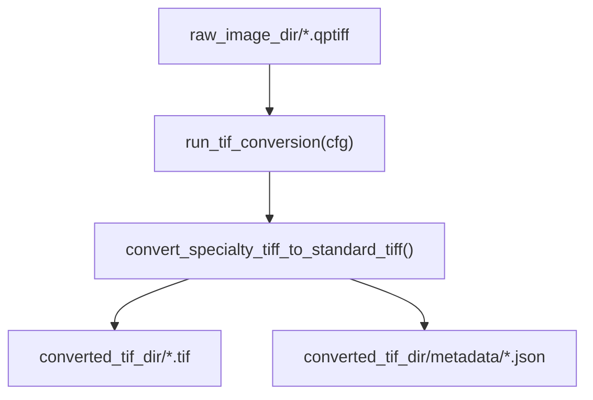

# `spatia/analysis/tif_conversion.py`

**Pipeline position:** Step 0 (first step). Raw scanner output → standard TIFF.
`raw QPTIFF/OME-TIFF` → **tif_conversion** → `roi_masking` → `segmentation` → `preprocessing` → `cell_typing` → `triads` → `functional` / `survival`

## Purpose

Converts specialty TIFF formats (QPTIFF, OME-TIFF) produced by slide scanners into standard multi-page TIFFs that downstream steps (`roi_masking`, `segmentation`) can read with common tools. Preserves per-file metadata (OME-XML, TIFF tags) alongside each converted file as JSON, since that metadata is otherwise lost in the format conversion.


## Entry point

```python
from spatia.analysis.tif_conversion import run_tif_conversion
run_tif_conversion(cfg)   # cfg = yaml.safe_load(open("config.yaml"))
```

## Flow



## Key functions

| Function | Role |
|---|---|
| `convert_specialty_tiff_to_standard_tiff(input_dir, output_dir, image_format=".qptiff", preserve_metadata=True, overwrite=False, verbose=True)` | Core conversion loop. Reads every file matching `image_format` in `input_dir`, writes `<name>.tif` + `<name>_metadata.json` to `output_dir`/`output_dir/metadata`. Skips a file if both outputs already exist (idempotent). |
| `run_tif_conversion(cfg)` | Config-driven wrapper. Reads `paths.raw_image_dir` / `paths.converted_tif_dir`, and `tif_conversion.*` options; calls the core function; raises if nothing matched. |

## Config keys

- `paths.raw_image_dir` (required) — directory of raw `.qptiff`/OME-TIFF files
- `paths.converted_tif_dir` (optional) — defaults to `<output_dir>/converted_tif/`
- `tif_conversion.image_format` (default `.qptiff`)
- `tif_conversion.preserve_metadata` (default `True`)
- `tif_conversion.overwrite` (default `False`)
- `tif_conversion.verbose` (default `True`)

## Inputs / Outputs

- **In:** `{raw_image_dir}/*.qptiff` (or configured extension)
- **Out:** `{converted_tif_dir}/*.tif`, `{converted_tif_dir}/metadata/*_metadata.json`

## Dependencies

`tifffile`, stdlib `xml.etree.ElementTree`, `json`, `os`.

## Notes / risks

- **Silent metadata loss on non-OME files (confidence: high).** Metadata extraction branches on `tif.is_ome`; for plain QPTIFF without OME-XML, only raw TIFF tags are captured — channel names may not survive. Downstream (`roi_masking.load_channel_names_from_json`) already has fallbacks for this, so it's handled, but worth knowing the metadata JSON isn't guaranteed complete.
- **Broad `except Exception` per file (confidence: high).** A single corrupt input file is caught and reported in the `errors` dict rather than crashing the run — good for batch robustness, but means a systematic conversion bug (e.g. wrong `image_format`) could quietly produce an `errors` dict of size N instead of failing fast. `run_tif_conversion` does only check for the "zero files matched" case, not "all files errored."
- **No content validation on the standard TIFF written (confidence: medium).** The function trusts `tif.asarray()` + `tifffile.imwrite` round-trips faithfully; there's no check that image shape/dtype the segmentation step later expects. If this step silently reshapes something odd (e.g. RGB vs multichannel detection via `image.shape[-1] == 3`), a genuinely multichannel image with exactly 3 channels would be misclassified as RGB. Narrow edge case, but real for panels with exactly 3 markers.
