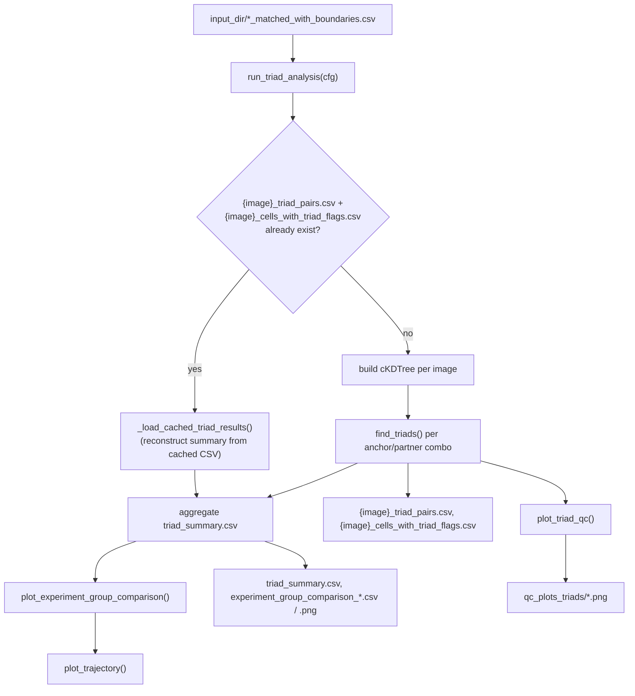

# `spatia/analysis/triads.py`

**Pipeline position:** Step 5. `cell_typing` → **triads** → `functional` / `survival`. The pipeline's namesake output.

## Purpose

Detects "triads" — an anchor cell type with both partner types simultaneously nearby within a configurable radius (e.g. DC–CD4–CD8 priming triads) — across all images in an experiment, entirely config-driven. Produces per-image triad tables, QC overlay plots, cross-experiment_group comparison plots, and a distance-accumulation trajectory analysis.

## Entry point

```python
from spatia.analysis.triads import run_triad_analysis
run_triad_analysis(cfg)
```

## Flow



## Key functions

| Function | Role |
|---|---|
| `_get_experiment_group_areas(cfg)` | Flattens `imaging.experiment_group_areas_um2` — handles both flat and timepoint-nested config shapes, summing across timepoints for the latter. This is the **fallback** area source; superseded per-image when `imaging.roi_labels_dir` is set (see below). |
| `_get_experiment_group(image_id, image_experiment_group_map, experiment_groups)` | Experiment group lookup: explicit map → prefix match → `"Unknown"`. |
| `_load_roi_areas(roi_labels_dir, mpp, annotation_class=None)` | Reads every `*_roi_labels.txt` from the QuPath ROI-extraction script, sums `Area_px2` per image (optionally filtered to one `Class`), converts to µm² using the pipeline's own `microns_per_pixel` (not QuPath's internal calibration). |
| `_resolve_image_areas(image_ids, roi_areas_by_qupath_name, image_id_map=None)` | Matches each `image_id` to a QuPath image name: exact → normalized (lowercase, alphanumeric-only) → explicit `imaging.image_id_map` override. Returns matched/unmatched. |
| `_resolve_per_image_group_areas(...)` | Orchestrates the 3-tier per-image area resolution (measured → group-average impute → NaN/excluded) and prints a per-image audit line; returns the final `{experiment_group: area_um2}` used for density. |
| `find_triads(df, anchor_type, partner1_type, partner2_type, radius_px, tree, microns_per_pixel)` | Core detection. For every anchor cell, uses a `cKDTree.query_ball_point` (parallelized, `workers=-1`) to find all neighbors within radius, then records **every** partner1×partner2 combination within range — not just nearest pairs — as separate triad rows. |
| `plot_triad_qc(df, triad_df, image_id, combo_label, save_path, radius_um, report_radius_um=None)` | Two-panel QC image: left = all cells colored by type with triad anchors starred; right = only triad-participant cells with connecting lines, filtered to the tighter `report_radius_um` if set. |
| `plot_trajectory(...)` | Cumulative triad count/density vs. distance threshold, per experiment_group — shows how sensitive the triad count is to the chosen radius. |
| `plot_experiment_group_comparison(...)` | Bar charts of triad counts/density and mean pairwise distances by experiment_group and combo; writes summary CSVs; calls `plot_trajectory`. |
| `_load_cached_triad_results(image_id, output_dir, radius_um, radius_px)` | Reconstructs the per-combo summary rows an image would have produced, from its already-written `{image_id}_triad_pairs.csv` — via `groupby` on `[experiment_group, anchor_type, partner1_type, partner2_type, triad_combo_label]` — without re-running `find_triads()`. Backs the skip-if-already-processed cache below. |
| `run_triad_analysis(cfg)` | Main orchestrator: for each `*_matched_with_boundaries.csv` in `input_dir`, **skips detection and loads cached results (via `_load_cached_triad_results`) if that image's `{image_id}_triad_pairs.csv` and `{image_id}_cells_with_triad_flags.csv` already exist in `output_dir`**; otherwise builds a KD-tree, runs `find_triads` for the configured (or all-permutations, if anchor/partner types aren't set) combo(s), and writes those two files. Either way, the image's results (fresh or cached) feed into the final aggregation: `triad_summary.csv` and cross-experiment_group comparison outputs are always rebuilt from every image's data, so adding one new image to a cohort only re-detects that image, not the whole cohort, while the aggregate outputs still reflect everyone. |

## Config keys

- `experiment.name`, `.experiment_groups`, `.image_experiment_group_map`
- `imaging.microns_per_pixel`, `.experiment_group_areas_um2` (flat or timepoint-nested; static fallback area source)
- `imaging.roi_labels_dir` (optional — directory of `*_roi_labels.txt` from the QuPath ROI-extraction script; activates per-image measured area)
- `imaging.area_annotation_class` (optional — if set, only annotations with this `Class` count toward area; if unset, all annotations in the file are summed)
- `imaging.image_id_map` (optional — `{qupath_image_name: image_id}`, for cases where QuPath's project image name doesn't match the `image_id` derived from `*_matched_with_boundaries.csv` filenames even after normalization)
- `paths.input_dir`, `.output_dir`
- `analysis.triad.radius_um` (search radius), `.anchor_type`, `.partner_type_1`, `.partner_type_2` (if omitted, all 3-way permutations of observed cell types are tried — can be expensive), `.matched_only` (default `True`), `.min_triad_size` (default `1`), `.report_radius_um` (tighter reporting threshold, defaults to `radius_um`), `.trajectory_min_um`

### Per-image tissue area (optional, for triads/mm² density)

By default, `imaging.experiment_group_areas_um2` is a single hand-entered constant per `experiment_group` — fine when all images in a group have near-identical area (e.g. uniform TMA cores), but wrong when area varies image-to-image (e.g. WSI). Setting `imaging.roi_labels_dir` switches to per-image measured area, resolved with a 3-tier fallback for each image:

1. **Measured** — a matching `*_roi_labels.txt` file has an `Area_px2` column; used directly (converted to µm² via `microns_per_pixel²`).
2. **Imputed** — no match, but `experiment_group_areas_um2` has a constant for that image's group → `constant / n_images_in_that_group_this_run` (spreads the group total evenly across the images actually present).
3. **Excluded** — neither exists → that image's area is `NaN` and it's dropped from the group's area total. Its triads are **not** dropped from the count, so that group's density will be a slight overestimate — a warning is printed for every image that hits this tier.

Every image's resolved area and which tier produced it is printed during the run (`[SPATIA] Area  {image_id}: ... (measured|imputed|NaN)`), so density-number provenance is auditable from the run log alone.

## Inputs / Outputs

- **In:** `{input_dir}/*_matched_with_boundaries.csv` (cell-typed data with `centroid_x/y`, `cell_type`, optionally `matched`). `triads.py` itself does not create this file — it only reads whatever's already in `input_dir`. For a new dataset, generate it with `prepare_matched_cells.py`: a CLI script that converts your raw per-cell data (CSV/TSV or `.h5ad`) into this filename/column format, with optional flags to relabel experiment groups or merge cell-type names. See `docs/prepare_matched_cells.md` for usage.

  Optionally `{roi_labels_dir}/*_roi_labels.txt` (from the QuPath ROI-extraction script, if per-image area is in use)
- **Out:** `{output_dir}/{image_id}_triad_pairs.csv`, `{image_id}_cells_with_triad_flags.csv`, `triad_summary.csv`, `experiment_group_comparison_counts.csv`, `experiment_group_comparison_counts_density.png`, `experiment_group_comparison_distances_um.png`, `experiment_group_comparison_distances.csv`, `trajectory_triads_by_distance.png`, `qc_plots_triads/*.png`

## Dependencies

`scipy.spatial.cKDTree`, `itertools.combinations`/`permutations`, `matplotlib`, `pandas`, `numpy`.

## Notes / risks

- **Skip-if-already-processed caching (confidence: high).** Mirrors the pattern `tif_conversion.py`/`roi_masking.py`/`segmentation.py`/`preprocessing.py` already use: if an image's `{image_id}_triad_pairs.csv` and `{image_id}_cells_with_triad_flags.csv` already exist in `output_dir`, results are reloaded via `_load_cached_triad_results` instead of rerunning `find_triads` — adding one new image to a cohort only pays detection cost for that image. Two limitations: (1) **no staleness check** against the source `*_matched_with_boundaries.csv` — edit an image's input after processing it and you must delete its two cached output files yourself to force reprocessing; (2) **images with zero triads are never cached** (their per-image files are only written when triads are found), so a zero-triad image is harmlessly reprocessed every run.
- **No-anchor/partner config triggers full permutation search (confidence: high, by design).** If `anchor_type`/`partner_type_1`/`partner_type_2` aren't all set, every 3-permutation of every observed cell type combination is tried per image (`3 * C(n,3)` calls to `find_triads` for `n` cell types) — hundreds of KD-tree queries per image for a 15+ cell-type panel. A warning prints when this fallback path is taken.
- **Multi-encoding CSV read only retries on `UnicodeDecodeError` (confidence: high).** Real parsing errors (malformed CSV, wrong delimiter, etc.) fail immediately with their actual error rather than being silently retried under every encoding and reported as a generic "could not read."
- **Normalized image-name matching (`_normalize_name`) could theoretically collide two genuinely different images (confidence: low-probability but real, not guarded).** Normalization strips everything but lowercase letters/digits, so e.g. `"CLR-reg-01"` and `"CLR_REG01"` match — usually the intended fuzzy match, but two *different* images whose names differ only in punctuation/case could collide onto the same normalized form with no warning. Worth adding a collision check if this ever bites.
